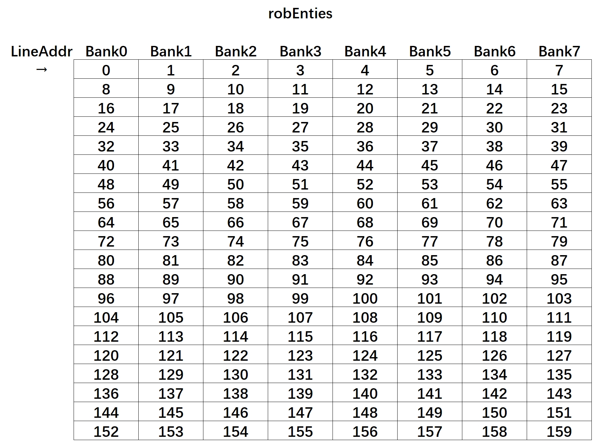

# XiangShan CtrlBlock 设计文档

- 版本：V2R2
- 状态：OK
- 日期：2025/01/20
- commit：[xxx](https://github.com/OpenXiangShan/XiangShan/tree/xxx)

## 术语说明

Table: 术语说明

| 缩写 | 全称               | 描述                      |
| ---- | ------------------ | ------------------------- |
| rob  | Reorder Buffer     | 重排序缓存                |
| rab  | Rename Buffer      | 重命名缓存                |
| -    | Redirect           | ctrlblock发来的重定向信息 |
| -    | Walk               | 重定向发生后的回滚过程    |
| snpt | Snapshot           | ctrlblock发来的快照信息   |
| wfi  | Wait For Interrupt | 等待中断                  |

## 子模块列表

Table: 子模块列表

| 子模块              | 描述                                                      |
| ------------------- | --------------------------------------------------------- |
| RobEnqPtrWrapper    | 维护 rob 的入队指针                                       |
| NewRobDeqPtrWrapper | 维护 rob 的出队指针                                       |
| Rab                 | 维护 commit 或 walk 时各个 rat 的状态，和 rename 模块交互 |
| VTypeBuffer         | 维护 Vtype 的类似 Rab 的结构，和 decode 模块交互          |
| ExceptionGen        | 异常产生模块                                              |
| SnapshotGenerator   | 快照产生模块                                              |

## 设计规格

- 支持指令写回和提交
- 支持指令重定向
- 支持中断处理
- 支持 Rob 压缩
- 支持快照
- 支持异常处理
- 支持向量访存先写回再处理异常并设置 vstart
- Rob支持每周期至多 commit/walk 8 个 entry
- Rab支持每周期至多 commit/walk 6 个 entry

## 功能

Rob 模块包括：RobEnqPtrWrapper 负责入队指针，NewRobDeqPtrWrapper 负责出队指针，Rab 负责维护 commit 或 walk 时各个 rat 的状态，VTypeBuffer 负责维护 Vtype 的状态，ExceptionGen 负责产生异常，SnapshotGenerator 负责产生快照。

Rob 模块主体是一个循环队列，项数为 160，指针包含 1 比特 flag 和 8 比特 value，当 value 的值从最大值加 1 的时候，flag 会反转，以此来区分指令的顺序。当队列空的时候，enqptr === deqptr，flag 和 value 均相等，当队列满时，enqptr.value === deqptr.value，enqptr.flag =/= deqptr.flag，value 相等 flag 不等。每个RobEntry包含的信号见下表。

Table: RobEntry 信号列表

| 信号名           | 描述                                                   |
| ---------------- | ------------------------------------------------------ |
| isVset           | 是否为Vset指令                                         |
| commitType       | 指令的提交类型                                         |
| isHls            | 是否为虚拟化 load/store 指令                           |
| wflags           | 是否写 fcsr 的 fflags                                  |
| ftqIdx           | ftq 的指针，用于读取 pcMem                             |
| ftqOffset        | ftq 的偏移，用于计算得到 pc                            |
| traceBlockInPipe | trace 在流水线中的数据，包括 iretire、ilastsize、itype |
| instrSize        | Rob压缩的指令条数                                      |
| fpWen            | 用于更新 csr 的 FS                                     |
| isRVC            | 是否为压缩指令                                         |
| dirtyVs          | 用于更新 csr 的 VS                                     |
| realDestSize     | 指令写目的寄存器的个数                                 |
| stdWritebacked   | store 指令是否写回                                     |
| uopNum           | 需要写回的 uop 个数                                    |

Rob采用分8个Bank读的设计，根据 robidx 的低 3 比特分 bank，例如 robBanks0 包含的 robidx（十进制）: 0 8 16 24 32 ...，robBanks1 包含的 robidx（十进制）: 1 9 17 25 33 ...，每 8 个 entry 为一个 Line，0-7，8-15，16-23 ...，每个 Bank 有 20 个 Entry，一共有 20 个 Line。分 Bank 示意图如下。



使用独热的 Line 指针（20 bit）来读取 RobEntry 数据，从 8 个 Bank 中读出当前 Line 和下一 Line 的数据（共 16 个 Entry），经过当拍的写回信息更新后，从两个 Line 中选一个 Line 写到 8 个 robDeqGroup 寄存器中（如果第一个 Line 的指令当拍全部提交就选第二个 Line），指令提交时从 8 个 robDeqGroup 中读数据进行提交。hasCommitted（8 bit）表示当前行每一条指令是否已经提交，作为其它指令是否可以提交的条件之一，allCommitted 表示当前行全部提交，是切换行指针的控制信号，allCommitted 为 1 时，选读出的第二行数据，也就是后 8 个数据更新后写入到 robDeqGroup。


Rob 入队，Rob 可以接受指令时会将 io_enq_canAccept 拉高，此时 Dispatch 可以向 Rob 发送指令，最多发送 6 条。Rob 收到指令后要更新 enqptr，根据入队请求计算 dispatchNum 然后分配 enqptr，如果没有发生 redirect ，会将 enqptr 更新为 enqptr + dispatchNum，如果发生了redirect信号，则根据 redirect 指令的 robidx 设置 enqptr（和 redirect 的 level 有关）。入队的时候，如果指令需要进行 move 消除，会直接将 writebackd 信号拉高，不需要写回就可以提交，如果译码的时候指令产生异常，指令会在 rename 阶段将 numWB 置 0，指令不会分派给 IQ，进入 Rob 就标记为写回了，特别注意的是向量访存指令需要等 uop 全部写回才能处理异常。allocatePtrVec 是分配的 6 个 enqPtr，分配条件是指令有效并且是第一条 uop（译码或者经过 rob 压缩得到的 firstUop 信号）。canEnqueue（6 bit）是每一条指令能进入 Rob 的条件：指令有效并且是第一条 uop 并且 rob 可以接收。uopNum 记录了 rob 压缩了多少条指令（对应 rob 压缩）或者多少个 uop（对应向量指令拆分）的，入队的时候更新 uopNum，之后每写回一个 uop（同一拍也可以写回多个uop）uopNum减一。对于 store 指令，uopNum 置 1，stdWritebacked 拉低，std 的 uop 不计入 uopNum，它写回时会将 stdWritebacked 拉高。

Rob 写回，Exu 写回 rob 的控制信号会在 ctrlBlock 里打一拍，由于 Rob 压缩会导致多个 Exu 写回相同的 robidx，在 ctrlBlock 里打一拍的同时，会进行 Rob 压缩的计算，每个 Exu 会统计所有可能压缩到一起的 Exu （某些 Exu 之间不可能存在压缩关系，所以不必浪费面积和时序全部统计）中写回的 robidx 和自己相同的个数，通过 io 里的 writebackNums 传给 Rob。


Rob 提交，出队指针位置的指令在 Rob 状态机处于 idle 状态时、指令有效、uop 全部写回、blockCommit 拉低的时候提交。当出队位置的指令存在异常的时候，blockCommit 会拉高阻止指令提交，直到异常处理完成后该指令才可以被提交。commitValidThisLine 表示 deqptr 所在的那一行的 8 个 entry 是否可提交，判断方式为该 entry 有效并且该 entry 所有 uop 都已经写回并且此时 rob 没有使能中断并且出队指令中没有异常并且出队指令中没有需要 reply 的指令并且没有被比他更老的指令阻塞提交并且它本身没有提交过。注意 allowOnlyOneCommit 情况，当出队的 8 个 Entry 中有发生异常的指令或者使能中断时，rob 每周期只允许提交一条指令。

Rob 出队，Rob会将提交后的指令出队，统计提交 Entry 的数量，将 deqptr 的值加上提交 Entry 的数量，更新出队指针，把出队 Entry 的 valid 置低。

Rob 状态机，有 s_idle 和 s_walk 两种状态，状态的更新主要和 redirect 有关。s_idle：正常状态，可提交指令，redirect 之后至少两拍 walk 状态后才能回到 idle 状态。s_walk：walk 状态，不可以提交指令，等待各模块 walk 结束恢复到 s_idle 状态，状态机切换代码如下。

```
  /**
   * state changes
   * (1) redirect: switch to s_walk
   * (2) walk: when walking comes to the end, switch to s_idle
   */
  state_next := Mux(
    io.redirect.valid || RegNext(io.redirect.valid), s_walk,
    Mux(
      state === s_walk && walkFinished && rab.io.status.walkEnd && vtypeBuffer.io.status.walkEnd, s_idle,
      state
    )
  )
```

Rob 重定向和快照，Rob在 redirect valid的当拍不会提交指令，根据 walk 的起始地址切换 Rob 的读指针，walk 的起始地址来源有两个：snapshot，deqptr，walk 的起始地址会从中选择比发出 redirect 指令更老的并且最近的位置。Rob 中 snapshot 保存的信息是一组 robidx，保存的 robidx 的值在入队的第一条的 robidx 的基础上，+0，+1，+2，+3，+4，+5，+6，+7，共 8 个 robidx。Rob 的 snapshot 会受 ctrlblock 里面的 snapshot 控制，下图为 walkPtr 的选择示例。


walkPtr 的更新：如果 redirect 有效时，如果 io_snpt_useSnpt 为 1 时根据 io_snpt_snptSelect 选择对应的快照，io_snpt_useSnpt 为 0 时选择 deqPtr，注意 walkptr 要对齐到 bank0 的地址；如果 redirect 无效并且 rob 处于 walk 状态并且没有 walk 结束，walkptr 每周期增加 8；其它条件walkptr 不更新。lastWalkPtr 是 walk 的终点，根据 redirect 的指令刷不刷自己确定，刷自己 lastWalkPtr 是 redirect 的 robidx - 1，不刷自己 lastWalkPtr 是 redirect 的 robidx。donotNeedWalk 机制，在 walk 的第一拍 8 个 entry 中，比发出 redirect 的 robidx 更老的指令是不需要 walk 的。walk结束的判断，walkPtrTrue > lastWalkPtr 时 walkFinished 为1，walkPtrTrue 是不考虑 Bank 地址对齐的 walkPtr，walkFinished 为 1 时把结束 walk 的信息传给 rab 和 vtypeBuffer。shouldWalkVec 表示 8 个 entry 是否应该 walk，判断条件是比 lastWalkPtr 更老的指令，结合 donotNeedWalk 最终判断是否要 walk。

Redirect 有效时，当拍 rob 不可以提交指令，walk 指针更新到 walk 的起点（快照恢复或者出队位置），注意 walk 的起始地址只能是 Bank0 中 entry 对应的 robidx，记录 walk 的终点位置 lastWalkPtr；下一拍状态机变为 walk 状态，更新读 Bank 的指针到 walk 指针相应的位置，将 robEntry 中在 redirect 后面的指令的 valid 置为 0；下下拍从 8 个 robDeqGroup 中取需要 walk 的信息传给 rab（realDestSize），VTypeBuffer（isVset）。处于 walk 状态时,每拍 walk 8 个 rob 的 entry，将 8 个 entry 中的 realDestSize 累加后传给rab，将 isVset 累加后传给 VTypeBuffer，rob walk 到 lastWalkPtr 时停止 rob 自己的 walk，但是要等到 rab 和 VTypeBuffer 都 walk 结束 rob 才能恢复 idele 状态。Rab 每周期最多 walk 6 个 Entry。VTypeBuffer 每个周期最多 walk 8 个 Entry。

Rob 异常处理，由于产生异常指令之后的所有指令都不会执行，Rob 只需要保存最老的异常，通过 Rob 异常生成模块实现该功能。Rob 内部只需对正在提交的指令进行异常的判断。Rob 的异常生成模块中，enq 信号（和 Rob 入队信号同拍）负责传入来自 frontend 和 decode 产生异常信息，对应最多 6 条指令，wb 信号负责传入功能单元写回的异常信息，（csr + fence + load + store + vload + vstore），需要输出最老的指令对应的异常信息。其中current信号保存了当前的异常信息。enq 传入的指令是有序的，因此只需要使用 priorityMux 就可以得到最老的异常，wb 传入的指令是乱序的，需要使用比较robidx的方法来选出最老的异常。异常处理模块会分组选最老的指令，第一拍在各个组选出最老的，第二拍从第一拍结果中选最老的指令。在第二拍得到的最老的异常信息与 current 进行比较，如果 current 更年轻，则将 current 更新为第二拍得到的最老的异常信息。特别的，对于向量访存写回的异常，它们的 robidx 相同但是 uop 有很多个，此时不仅需要比较最老的 robidx，还要对比异常要置的 vstart，保留 vstart 小的异常信息。

Rob 中断处理，中断和异常处方式相似。中断来自 CSR 模块，对于需要发出 flushPipe 和 replayInst 的指令，目前也进入 exceptionGen 中处理。Rob 处理它们的方式都是先发一个 flushOut 给 ctrlBlock，ctrlBlock 会回一个 redirect 来刷流水线。区别是分支跳转失败和访存违例产生的 redirect 获取 target 比较快，直接从 pcMem 读到一个 pc 再结合 ftqOffset 计算出 target 发给前端；对于中断和异常，需要先把信息发给 CSR, CSR 返回对应的 target 再发给前端。中断目前只会在 deqPtr 是非 load、store、fence、csr 、vset 的指令时才会响应。

当 wfi_enable 信号拉高时（来自 CSR 寄存器，*wait-for-interrupt enable*），当 wfi 指令入队 Rob 的时候会将 hasWFI 置为1，hasWFI 会把 blockCommit 置为 1，阻塞 rob 的提交从而起到暂停流水线等待中断的作用。当 csr 收到中断时，会将 io_csr_wfiEvent 拉高，hasWFI 置为 0（或者超时 1M cycle 没等到中断也会置 0），然后 Rob 可以正常提交指令。

## 总体设计

### 整体框图

### 接口列表

见接口文档

## 模块设计

### 二级模块

#### 功能

#### 整体框图

#### 接口列表

见接口文档
