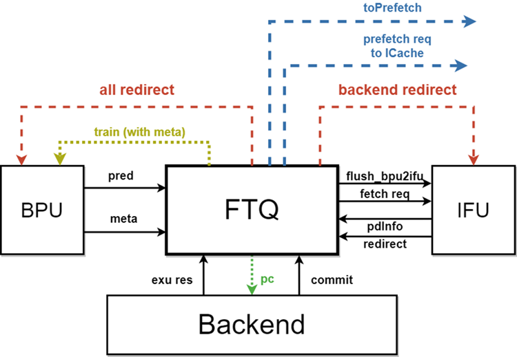

# 昆明湖 FTQ 模块文档

## 术语说明

表 1.1 术语说明

| **缩写** | **全称**            | **描述**     |
| -------- | ------------------- | ------------ |
| CRU      | Clock Reset Unit    | 时钟复位单元 |
| FTQ      | Fetch Target Queue  | 取指目标队列 |
| FTB      | Fetch Target Buffer | 取指目标缓冲 |

## 功能描述

### 功能概述

FTQ 是分支预测和取指单元之间的缓冲队列，它的主要职能是暂存 BPU 预测的取指目标，并根据这些取指目标给 IFU 发送取指请求。它的另一重要职能是暂存 BPU 各个预测器的预测信息，在指令提交后把这些信息送回 BPU 用作预测器的训练，因此它需要维护指令从预测到提交的完整的生命周期。

- 支持暂存 BPU 预测的取指目标，并向 IFU 发送取指请求
- 支持暂存 BPU 的预测信息，并送回 BPU 训练
- 支持重定向恢复
- 支持向 ICache 发送预取请求

### 暂存 BPU 预测的取指目标，并向 IFU 发送取指请求

#### 暂存 BPU 预测的取指目标

##### 存储 PC 的结构

BPU 的一次预测会经历三个流水级，每一个流水级都会产生新的预测内容。FTQ 接收来自 BPU 每个流水级的预测结果，并且后面的流水级的结果会覆盖前面流水级的结果。

指令以预测块为单位，从 BPU 发出，进入 FTQ，同时 bpuPtr 指针加一，初始化对应 FTQ 项的各种状态，把各种预测信息写入存储结构；如果预测块来自 BPU 覆盖预测逻辑，则恢复 bpuPtr 和 ifuPtr。

BPU 预测的取值目标被 FTQ 暂存于 ftq_pc_mem 中：

- ftq\_pc\_mem:寄存器堆实现，为存储与指令地址相关的信息，包括如下的域：
  - startAddr 预测块起始地址。
  - nextLineAddr 预测块下一个缓存行的起始地址。
  - isNextMask 预测块每一条可能的指令起始位置是否在按预测宽度对齐的下一个区域内。isNextMask 有 16bit，每个 bit 表示相对起始地址的 2byte*n 位置是否跨 cacheline，表示的是每个位置的性质。
  - fallThruError 预测出的下一个顺序取指地址是否存在错误。

每一个域都各自存在自己的寄存器（例如 data_0_startAddr）里，并没有拼接后存进同一个 Reg 里。

##### 计算 PC 的方式

每次从 ICache 取指都会取一个或两个 CacheLineSize（64Bytes）长度的缓存行指令数据，是否取两个由预测块是否跨缓存行决定。

而每个预测块的长度为 PredictWidth（16）个压缩指令的长度（32Bytes）。每个缓存行的长度为每个预测块长度的两倍，所以每个预测块的 startAddr 要么在当前缓存行的前半部分（startAddr[5]=0），要么在当前缓存行的后半部分（startAddr[5]=1）。

如果 startAddr[5]=0，那么当前预测块必然不会跨缓存行，那么此时预测指令 pc={startAddr[38,6],startAddr[5,1]+offset,1'b0}。

如果 startAddr[5]=1，那么当前预测块可能会出现跨缓存行的情况。此时：

- 如果 isNextMask(offset)=0，表示当前预测指令 pc 未跨缓存行，那么此时预测指令 pc={startAddr[38,6],startAddr[5,1]+offset,1'b0}。
- 如果 isNextMask(offset)=1，表示当前预测指令 pc 跨越了缓存行，那么此时预测指令 pc={nextLineAddr[38,6],startAddr[5,1]+offset,1'b0}。

#### 向 IFU 发送取指请求

FTQ 向 IFU 发出取指请求，ifuPtr 指针加一，等待预译码信息写回。

IFU 写回的预译码信息被 FTQ 暂存于 ftq_pd_mem 中：

- ftq\_pd\_mem:寄存器堆实现，存储取指单元返回的预测块内的各条指令的译码信息，包括如下的域：
  - brMask 每条指令是否是条件分支指令。
  - jmpInfo 预测块末尾无条件跳转指令的信息，包括它是否存在、是 jal 还是 jalr、是否是 call 或 ret 指令。
  - jmpOffset 预测块末尾无条件跳转指令的位置。
  - jalTarget 预测块末尾 jal 的跳转地址。
  - rvcMask 每条指令是否是压缩指令。

### 暂存 BPU 的预测信息，并送回 BPU 训练

#### 暂存 BPU 的预测信息

BPU 传给 FTQ 的预测信息除了会暂存到上文提到的 ftq_pc_mem 中，还有部分信息会存储到 ftq_redirect_sram、ftq_pc_mem 和 ftb_entry_mem 中。

- ftq\_redirect\_sram:SRAM实现，存储那些在重定向时需要恢复的预测信息，主要包括和 RAS 和分支历史相关的信息。分为 3 个 bank，每个 bank 的深度×宽度为 64×236。
- ftq\_meta\_1r\_sram:SRAM实现，存储其余的 BPU 预测信息。SRAM 的深度×宽度为 64×256。
- ftb_entry_mem:寄存器堆实现，存储预测时 FTB 项的必要信息，用于提交后训练新的 FTB 项。为什么要存 ftb_entry 呢？因为更新的时候 ftb_entry 需要在原来的基础上继续修改，为了不重新读一遍 ftb，所以这里将 ftb_entry 存在 ftb_entry_mem 中。

FTQ 中的各个 sram/mem 的具体实现机制见下表：

|                  | 写入时机（正向写入）                            | 更新时机（反向更新，比如重定向等）                                                                                                                                                                                    | 读出时机                                                                                          | 写入的数据内容                                                                                                                                                                                                                                                                                                                                                                                                                                                                                    | 更新的数据内容 |
| ---------------- | ----------------------------------------------- | --------------------------------------------------------------------------------------------------------------------------------------------------------------------------------------------------------------------- | ------------------------------------------------------------------------------------------------- | ------------------------------------------------------------------------------------------------------------------------------------------------------------------------------------------------------------------------------------------------------------------------------------------------------------------------------------------------------------------------------------------------------------------------------------------------------------------------------------------------- | -------------- |
| ftq_pc_mem       | BPU 流水级的 S1 阶段，创建新的预测 entry 时写入 | 不存在（目前的设计是 FTQ 汇总重定向发到 BPU 和 IFU，等 bpu 再把重定向到新地址的预测块重新入队的时候在 ftq_pc_mem 写入新的块，ftq_pc_mem 的项是表示当前预测块的地址，而不包括 target，所以不需要更新预测出错的那个块） | 读数据每个时钟周期都会存进 Reg。如果 IFU 不需要从 bypass 中读取数据，Reg 数据直连给 Icache 和 IFU | startAddr：预测块起始地址 nextLineAddr：预测块下一个缓存行的起始地址 isNextMask：预测块每一条可能的指令起始位置是否在按 预测宽度对齐的下一个区域内（① 如果 isNextMask(offset) = 0，表示当前预测指令 pc 未跨缓存行，那么此时预测指令 pc = {startAddr[38, 6], startAddr[5, 1] + offset, 1'b0}。② 如果 isNextMask(offset) = 1，表示当前预测指令 pc 跨越了缓存行，那么此时预测指令 pc = {nextLineAddr[38,6], startAddr[5, 1] + offset, 1'b0}。）fallThruError：预测出的下一个顺序取指地址是否存在错误 | 无             |
| ftq_meta_1r_sram | BPU 流水级的 S3 阶段                            |                                                                                                                                                                                                                       | FTQ 项中的指令能够 commit 的时候，将 meta 数据读出，发送给 bpu 训练                               | 写入的数据包 含了 4 个预测器的预测信息                                                                                                                                                                                                                                                                                                                                                                                                                                                            |                |
| ftb_entry_mem    | BPU 流水级的 S3 阶段                            |                                                                                                                                                                                                                       | 1.backend 重定向 2.ifu 写回预译码信息 3.ifu 预译码检测出错误发送重定向                            | BrSlot: brSlot_offset/lower/tarStat/sharing/validTailSlot: tailSlot_offset/lower/tarStat/sharing/validpftAddr,carry,isCall,isRet,isJalr……                                                                                                                                                                                                                                                                                                                                                         |                |
| ftq_pd_mem       | IFU 阶段 F3 流水的下一拍                        |                                                                                                                                                                                                                       | 一直在读 commPtr 作为地址对应的数据，赋值给 ftbEntryGen                                           | rvcMaskbrMaskjmpInfojmpOffsetjalTarget                                                                                                                                                                                                                                                                                                                                                                                                                                                            |                |

#### 送回 BPU 训练

指令在后端提交时会通知 FTQ 此指令已经提交。当 FTQ 项中所有的有效指令都已在后端提交，commPtr 指针加一，从存储结构中读出相应的信息，送给 BPU 进行训练。

在昆明湖 V2 版本中，使用 `commitStateQueue` 来记录一个 FTQ 项中指令提交的状态。注意，由于这一设计并不完备，且违背 BPU 的更新初衷，在 V3 中已经联合后端将这一机制全部删除。

`commitStateQueue` 的每一位记录了 FTQ entry 中的指令是否被提交。

由于 V2 的后端会在 ROB 中重新压缩 FTQ entry，因此并不能保证提交一个 entry 中的每条指令，甚至不能保证每一个 entry 都有指令提交。判断一个 entry 是否被提交有如下几种可能：

- `robCommPtr` 在 `commPtr` 之前。也就是说，后端已经开始提交之后 entry 的指令，在 `robCommPtr` 指向的 entry 之前的 entry 一定都已经提交完成
- `commitStateQueue` 中最后一条指令被提交。entry 的最后一条指令被提交意味着这一 entry 已经全部被提交

在此以外，还必须要考虑到，后端存在 flush itself 的 redirect 请求，这意味着这条指令自身也需要重新执行，这包括异常、load replay 等情况。在这种情况下，这一 entry 不应当被提交以更新 BPU，否则会导致 BPU 准确率显著下降。

### 重定向恢复

每次预测后，RAS 的栈顶项和栈指针都会存入 FTQ 的 ftq_redirect_sram，同时使用的 BPU 全局历史会存入 FTQ，用于误预测恢复。

#### 预译码检测出预测错误

FTQ 向 IFU 发出取指请求后，IFU 会向 FTQ 写回预译码信息，ifuWbPtr 指针加一。如果预译码检测出了预测错误，则向 BPU 发送相应的重定向请求。FTQ 根据重定向信号中的 ftqIdx 恢复 bpuPtr 和 ifuPtr。

#### 后端检测出误预测

如果指令在后端执行时检测出误预测，则通知 FTQ，FTQ 给 IFU 和 BPU 发送对应的重定向请求，同时 FTQ 根据重定向信号中的 ftqIdx 恢复 bpuPtr、ifuPtr 和 ifuWbPtr。

为了实现提前一拍读出在 ftq 中存储的重定向数据，减少 redirect 损失，后端会向 ftq 提前一拍（相对正式的后端 redirect 信号）传送 ftqIdxAhead 信号和 ftqIdxSelOH 信号。但是提前一拍后端无法及时得到准确的 ftqIdx，需要在 4 个 Alu 通路中进行仲裁，但是仲裁结果在正式的后端 redirect 信号有效时才能得到，所以 FTQ 得到的提前一拍 redirect 的 ftqIdx 信号需要四个通路都读。

- io.fromBackend.ftqIdxAhead：7 个 FtqIdx。表示需要重定向的预测块在 ftq 中存储的索引。有 7 个是因为后端在最终仲裁前有 7 个可能产生 redirect 信号的通路，分别是 Jump*1、Alu*4、LdReplay*1、Exception*1，但是其中只有 Alu*4 产生的 redirect 信号我们会提前读，所以 ftqIdxAhead 实际用到的只有 4 个 FtqIdx。
- Io.fromBackend.ftqIdxSelOH：4 位独热码+valid，表示 4 条通路的 ftqIdxAhead 有效与否，高有效。

### 向 ICache 发送预取请求

由于 BPU 基本无阻塞，它经常能走到 IFU 的前面，于是 FTQ 中实现了将 BPU 提供的还没发到 IFU 的取指请求用作指令预取，直接向指令缓存发送预取请求。

## 整体框图

## 接口时序

1. BPU 到 FTQ 接口时序

上图示意了 BPU 到 FTQ 的预测结果接口时序。当对应的握手信号 io_fromBpu_resp_valid 和 io_fromBpu_resp_ready 同时为高时，BPU 三个流水级的预测结果在流水线内 1、2、3 阶段分别输入至 FTQ。

若 BPU 后面流水级的预测结果与之前流水级不一致，则对应的 redirect 信号 io_fromBpu_resp_bits_s2_hasRedirect_4 或 io_fromBpu_resp_bits_s3_hasRedirect_4 会被拉高，表明需要刷新预测流水线。

## 职能描述

FTQ 是分支预测和取指单元之间的缓冲队列，它的主要职能是暂存 BPU 预测的取指目标，并根据这些取指目标给 IFU 发送取指请求。它的另一重要职能是暂存 BPU 各个预测器的预测信息，在指令提交后把这些信息送回 BPU 用作预测器的训练，因此它需要维护指令从预测到提交的完整的生命周期。由于后端存储 PC 的开销较大，当后端需要指令 PC 的时候，会到 FTQ 读取。

## 内部结构

FTQ 共 64 项，是一个队列结构，但队列中每一项的内容是根据其自身特点存储在不同的存储结构中的。这些存储结构主要包括以下几
种：

- ftq_pc_mem: 寄存器堆实现，存储与指令地址相关的信息，包括如下的域
  - startAddr 预测块起始地址
  - nextLineAddr 预测块下一个缓存行的起始地址
  - isNextMask 预测块每一条可能的指令起始位置是否在按预测宽度对齐的下一个区域内
  - fallThruError 预测出的下一个顺序取指地址是否存在错误
- ftq_pd_mem: 寄存器堆实现，存储取指单元返回的预测块内的各条指令的译码信息，包括如下的域
  - brMask 每条指令是否是条件分支指令
  - jmpInfo 预测块末尾无条件跳转指令的信息，包括它是否存在、是 jal 还是 jalr 、是否是 call 或 ret 指令
  - jmpOffset 预测块末尾无条件跳转指令的位置
  - jalTarget 预测块末尾 jal 的跳转地址
  - rvcMask 每条指令是否是压缩指令
- ftq_redirect_sram: SRAM 实现，存储那些在重定向时需要恢复的预测信息，主要包括和 RAS 和分支历史相关的信息
- ftq_meta_1r_sram: SRAM 实现，存储其余的 BPU 预测信息
- ftb_entry_mem: 寄存器堆实现，存储预测时 FTB 项的必要信息，用于提交后训练新的 FTB 项

另外还有一些例如队列指针、队列中各项的状态之类的信息用寄存器实现。

## 指令在 FTQ 中的生存周期

指令以[预测块](https://docs.xiangshan.cc/zh-cn/latest/frontend/bp/#pred-block)为单位，从 BPU 预测后便送进 FTQ，直到指令所在的预测块中的所有指令全部在后端提交完成，FTQ 才会在存储结构中完全释放该预测块所对应的项。这个过程中发生的事如下：

1. 预测块从 BPU 发出，进入 FTQ， bpuPtr 指针加一，初始化对应 FTQ 项的各种状态，把各种预测信息写入存储结构；如果预测块来自 BPU 覆盖预测逻辑，则恢复 bpuPtr 和 ifuPtr
2. FTQ 向 IFU 发出取指请求， ifuPtr 指针加一，等待预译码信息写回
3. IFU 写回预译码信息， ifuWbPtr 指针加一，如果预译码检测出了预测错误，则给 BPU 发送相应的重定向请求，恢复 bpuPtr 和 ifuPtr
4. 指令进入后端执行，如果后端检测出了误预测，则通知 FTQ，给 IFU 和 BPU 发送重定向请求，恢复 bpuPtr 、 ifuPtr 和 ifuWbPtr
5. 指令在后端提交，通知 FTQ，等 FTQ 项中所有的有效指令都已提交， commPtr 指针加一，从存储结构中读出相应的信息，送给 BPU 进行训练

预测块 n 内指令的生存周期会涉及到 FTQ 中的 bpuPtr 、 ifuPtr 、 ifuWbPtr 和 commPtr 四个指针，当 bpuPtr 开始指向 n+1 时，预测块内的指令进入生存周期，当 commPtr 指向 n+1 后，预测块内的指令完成生存周期。

## FTQ 的其它功能

由于 BPU 基本无阻塞，它经常能走到 IFU 的前面，于是 BPU 提供的这些还没发到 IFU 的取指请求就可以用作指令预取，FTQ 中实现了这部分逻辑，直接给指令缓存发送预取请求
