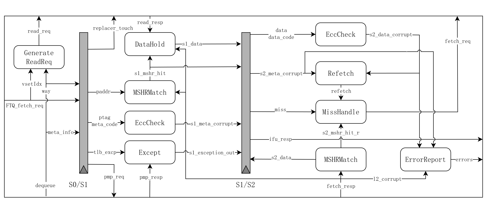

# MainPipe 子模块文档

MainPipe 为 ICache 的主流水，为 2 级流水设计，负责从 DataArray 中读取数据、PMP 检查、ECC 检查、缺失处理，并且将结果返回给 IFU。

## S0 流水级

在 S0 流水级，从 WayLookup 获取元数据，包括路命中信息和 ITLB 查询结果，访问 DataArray 的单路，如果 DataArray 正在被写或 WayLookup 中没有有效表项，流水线就会阻塞。每次重定向后，FTQ 中同一个请求被同时发送到 MainPipe 和 IPrefetchPipe 中，MainPipe 始终需要等待 IPrefetchPipe 将请求的查询信息写入 WayLookup 后才能向下走，导致了 1 拍重定向延迟，当预取超过取指时，该延迟就会被覆盖。

## S1 流水级

1. 更新 replacer，向 replacer 发送 touch 请求。
2. PMP 检查，发送 PMP 请求，在当拍收到响应，将结果寄存到下一流水级进行处理。
   - 需要指出，IPrefetchPipe s1 流水级也会进行 PMP 检查，和此处的检查实际上是完全一样的，分别检查只是为了优化时序（避免 `ITLB(reg) -> ITLB.resp -> PMP.req -> PMP.resp -> WayLookup.write -> bypass -> WayLookup.read -> MainPipe s1(reg)` 的超长组合逻辑路径）
3. 接收 DataArray 返回的 data 和 code 并寄存，同时监听 MSHR 的响应，当 DataArray 和 MSHR 的响应同时有效时，后者的优先级更高。

## S2 流水级

1. DataArray ECC 校验，对 S1 流水级寄存的 code 进行校验。如果校验出错，就将错误报告给 BEU。
2. MetaArray ECC 校验，IPrefetchPipe 读出 MetaArray 的数据后会直接进行校验，并将校验结果随命中信息一起入队 WayLookup 并随 MainPipe 流水到达 S2 级，在此处随 DataArray 的 ECC 校验结果一起报告给 BEU。
3. Tilelink 错误处理，当监听到 MissUnit 响应的数据 corrupt 为高时（即 L2 cache 的响应数据出错），就将错误报告给 BEU。
4. 缺失处理，缺失时将请求发送至 MissUnit，同时对 MSHR 的响应进行监听，命中时寄存 MSHR 响应的数据，为了时序在下一拍才将数据发送到 IFU。
