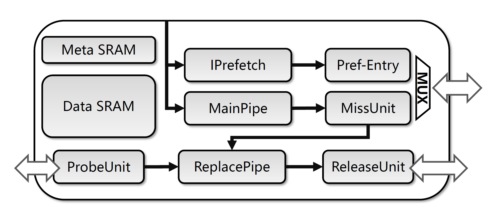

# 指令缓存（Instruction Cache）文档
<!-- 这个图需要重新画一下 -->

这一章描述香山处理器指令缓存的实现。

## 指令缓存配置
| 参数名称               | 参数描述                          |
| -----------           | ------------------------------------ |
| `nSet`                | 指令缓存 Set 数，默认为 256  |
| `nWays`               | 指令缓存每个 Set 的组相连路数，默认为 8 路 |
| `nTLBEntries`         | ITLB 的 PTE 项数，默认为 32 项 |
| `tagECC`              | Meta SRAM 的校验方式，南湖版本配置为奇偶校验 |
| `dataECC`             | Data SRAM 的校验方式，南湖版本配置为奇偶校验 |
| `replacer`            | 替换策略，默认为随机替换，南湖版本配置为 PLRU |
| `hasPrefetch`         | 指令预取开关，默认为关闭 |
| `nPrefetchEntries`    | 指令预取的 entry 数目，同时可支持的最大 cacheline 预取数，默认为4 |

## 控制逻辑
<!-- 指令缓存的主控制逻辑模块 MainPipe 的内部逻辑示意图： -->

指令缓存的主控制逻辑模块 MainPipe 由 3 级流水线构成：

- 在 `s0` 阶段从 FTQ 发送过包含两个 cacheline 的取指令请求，其中包含了每个请求是否有效的信号（不跨行的指令 packet 止只会发送一个 cacheline 的读请求），同时 MainPipe 一方面会把请求地址提取为缓存组索引（set index）发送给指令 Cache 的 [存储部分](#mem)，另一方面，这些请求会被发送给 ITLB 进行 [指令地址翻译](#tlb)
- 在 `s1` 阶段，存储 SRAM 返回一个组（Cache Set）一共 N 个路 (Cache Way) 的 cacheline 元数据和数据。同时 ITLB 返回请求对应的物理地址。接下来主控制逻辑截取物理地址并和 N 个路的 Cache tag 进行匹配，生成缓存命中（Cache hit）和缓存缺失（Cache miss）两种结果。另外还会根据替换算法的状态信息选出需要替换的 cacheline。
- 在 `s2` 阶段，hit 的请求直接返回数据给 IFU。而当发生 miss 的时候需要暂停流水线，并将请求发送给缺失处理单元 MissUnit。等到 MissUnit 充填完成并返回数据之后将数据返回给 IFU。
- 在 `s2` 阶段还会把 ITLB 翻译得到的物理地址发送给 PMP 模块进行访问权限的查询，如果权限错误会触发指令访问例外 (Instruction Access Fault)

<h2 id=itlb> 指令地址翻译 </h2>

由于指令缓存采用的是 VIPT（Virtual Index Physical Tag）的缓存方式，因此需要在地址 tag 比较之前先将虚拟地址翻译为物理地址。控制流水线的 `s0` 阶段，两个 cachline 请求的虚拟地址会同时发送到 ITLB 的查询端口，同时这一个时钟周期内 ITLB 返回虚地址是否命中的信号。命中则会在下一拍返回对应的物理地址。不命中则控制逻辑会阻塞 MainPipe 流水线，等待直到 ITLB 重填结束返回物理地址。

## 缓存 miss 处理

发生 miss 的请求会被移交给 MissUnit 向下游 L2 Cache 发送 Tilelink `Aquire` 请求，等到 MissUnit 收到对应数据的 `Grant` 请求之后，如果需要替换 cacheline，MissUnit 则会向 ReplacePipe 发送 Release 请求，ReplacePipe 会重新读一遍 SRAM 得到数据，然后发送给 ReleaseUnit 发起向 L2 Cache 的 `Release` 请求。最后 MissUnit 重填写 SRAM，等到重填结束后返回数据给 MainPipe，MainPipe 再把数据返回给 IFU。

miss 的 cacheline 可能发生在两个请求中的任何一个，因此 MissUnit 里设置了两个处理 miss 的 missEntry 项来提高并发度。

## 例外的处理
在 ICache 产生的例外主要包括两种：ITLB 报告的指令缺页例外（Instruction Page Fault）和 ITLB 和 PMP 报告的访问例外（Access Fault）。MainPipe 会把例外信息直接报告给 IFU，而请求的数据被视为无效。

<h2 id=imem> 存储部分 </h2>

指令 Cache 的存储逻辑主要分为了 Meta SRAM（存储每个 cacheline 的 tag 以及一致性状态）和 Data SRAM（存储每个 cacheline 的内容）。内部支持了奇偶校验码用以进行数据的校验，当校验发生错误的时候会给报总线错误并产生中断。Meta/Data SRAM 内部都分了奇偶 bank，虚地址空间中相邻的两个 cacheline 会被分别划分到不同的 bank 来实现一次两个 cacheline 的读取。

## 一致性支持

香山南湖架构的指令 Cache 实现了 Tilelink 定义的一致性协议。主要是通过增加了一条额外的流水线 ReplacePipe 来处理 Probe 和 Release 请求。

指令缓存的 ReplacePipe 由 4 级流水线构成：

- 在 `r0` 阶段接收从 ProbeUnit 发送过来的 Probe 请求和从 MissUnit 发送过来的 Release 请求，同时也会发起对 Meta/Data SRAM 的读取。因为这里的请求包含了虚拟地址和实际的物理地址，所以不需要做地址翻译。
- 在 `r1` 阶段，ReplacePipe 和 MainPipe 一样用物理地址对 SRAM 返回的一个 Set 的 N 路 cacheline 做地址匹配，产生 hit 和 miss 两种信号，这个信号仅仅对于 Probe 有效，因为 Release 的请求一定在 Cache 里。
- 在 `r2` 阶段，hit 的 Probe 请求将被 invalid 掉，同时会把这个请求发送给 ReleaseUnit 向 L2 发送 `ProbrResponse` 请求，这个 cacheline 的权限转变为 toN。miss 的请求不会做 invalid，并且会发送给 ReleaseUnit 向 L2 报告权限转变为 NToN（指令 Cache 里没有 Probe 要求的数据）。Release 请求也会被发送到 ReleaseUnit 向 L2 发送 `ReleaseData`。且只有 Release 请求被允许进入 `r3`
- 在 `r3` 阶段，ReplacePipe 向 MissUnit 报告被替换出去的块已经往下 Release 了，通知 MissUnit 可以进行重填。

## 指令预取

香山南湖架构实现了简单的`Fetch Directed Prefetching (FDP)`[^fdp],即让分支预测来指导指令预取，为此加入了指令预取器`IPrefetch`。具体的预取机制如下： 

* 取指目标队列中加入了一个预取指针，指针的位置在预测指针和取指令指针中间，预取指针读取当前指令packet的目标地址（如果跳转则为跳转目标，不跳转为顺序的下一个packet的起始地址），发送给预取器。
* 取器会完成地址翻译并访问指令缓存的Meta SRAM，如果发现该地址已经在指令缓存中，则当此预取请求被取消。如果不再则向`PrefetchEntry`申请分配一项，向`L2`缓存发送Tilelink `Hint`请求，把相应的缓存行预取到L2。
* 为了保证不重复向L2发送预取请求，预取器里记录了已发送的预取请求物理地址，任何请求在申请`PrefetchEntry`之前都会去查这个记录，如果发现和已发送的预取请求相同就会把当前预取请求取消掉。

## 引用
[^fdp]: Reinman G, Calder B, Austin T. Fetch directed instruction prefetching[C]//MICRO-32. Proceedings of the 32nd Annual ACM/IEEE International Symposium on Microarchitecture. IEEE, 1999: 16-27.