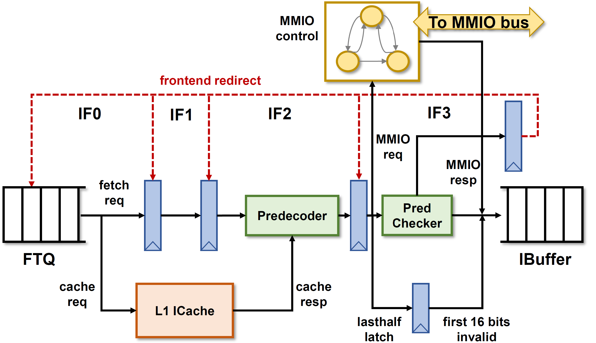

# 取指令单元（Instruction Fetch Unit）文档

这一章描述香山处理器取指单元（IFU）的实现，取指单元流水线如上图所示。

南湖架构的 IFU 采用了 4 级流水线的结构，相较于雁栖湖版本 IFU 的设计做了非常大的简化，这得益于采用分支预测 - 指令缓存解耦的取指令架构。

一个取指令请求从 FTQ 发出之后在 IFU 中经历了下面几个阶段：

- 从 FTQ 发送过来的取指令请求包含了一个 32Bytes 指令码 （称为一个指令 packet ） 的起始地址和下一个跳转目标的地址，
- 在 `IFU0` 阶段同时发送请求给 IFU 流水线和 ICache 模块。
- `IF1` 阶段会做一些简单计算（例如这个指令 packet 里每个 2 Bytes， 即每一条可能的指令的 PC ）。
- `IF2` 阶段等到指令缓存返回最多两个 Cacheline 的数据（因为可能存在这个 [指令 packet 跨行](#crossfetch) 的情况）之后，第一步先做指令切分，将在取指令地址之外的指令码抛弃得到有效范围的指令码。送入预译码器进行[预译码](#predecode)，同时将 16 bits 的压缩指令扩展为 32 bits 的指令。
- `IF3` 阶段首先会将预译码结果送到 [分支预测检查器](#predchecker) 里，发现错误就会在下一拍刷新 IFU 流水线并把信息发送给 FTQ 刷新预测器并重新取指令。未发现错误的缓存在指令缓冲队列（IBuffer）里等待译码。
- `IF3` 阶段还会根据地址翻译的结果向指令 MMIO 模块发起取指令请求，同时转变为 [MMIO 取指令模式](#mmiofetch)，指令一条一条顺序执行。
- IFU 控制逻辑还需要 [处理半条 RVI 指令](#half) 的情况。

<h2 id=predecode></h2>
## 预译码 

预译码器将经过切分的 16 个 16 bits 指令码进行译码，得到部分指令信息（是否是跳转指令、跳转指令类型以及是否是压缩指令等），对于跳转指令还会计算它的目标地址。主要是为了给 [分支预测检查器](#predchecker) 提供指令信息和正确的目标地址以及及时更新预测器中的指令信息。

另一方面，预译码器也会将压缩指令（如果这个 packet 里有的话）扩展为 32 bits 的长指令以便于后续简化译码逻辑。

<h2 id=predchecker></h2>
##  分支预测检查 

分支预测检查器在拿到指令的预译码信息之后主要针对以下几个错误检查：

- jump 指令预测不跳转的错误：针对 `jal` 和 `ret` 这两种种必定跳转的指令检查，如果这个 packet 的 [有效指令范围](#validinstr) 内有这两种指令，且预测为不跳转，则视为预测错误。
- 非跳转指令的预测错误：如果预测为跳转的指令不在有效指令范围内，或者在有效指令范围内但是不是一条跳转指令，则视为预测错误。
- 目标地址错误：对于可以通过指令码知道目标地址的跳转指令（除了 `jalr` 之外的跳转指令），如果在有效指令范围内且预测跳转并且跳转目标地址和正确地址不匹配，则视为预测错误。

在发现错误后，分支预测检查器挑选出指令顺序最靠前的预测错误指令，把错误信息（错误指令在 packet 里的位置、指令预译码信息、正确的目标地址）传递给 FTQ ，同时清空 IFU 流水线。IFU 等待 FTQ 重新发取指令请求。

<h2 id=crossfetch></h2>
##  跨行指令处理（Cross-Cacheline Fetch）

由于我们的指令 packet 包括了 32 Bytes 的指令码，相当于半个 cacheline（64 Bytes）的大小，如果这个 packet 的起始地址在后半个 cacheline 里，那么完全有可能发生 packet 的范围跨过两个 cacheline 的情况，因此在指令缓存支持一次取两个 cacheline 以保证这种情况下的指令吞吐。具体做法是当 FTQ 发现 packet 的起始地址在后半个 cacheline 里，就发起对指令缓存两个相邻 cacheline 的请求。

<h2 id=validinstr></h2>
##  有效指令范围 

一个取指令 packet 的有效范围由 FTQ 给出的起始地址和跳转指令的 index（如果有跳转的话）共同确定，如果这个 packet 没有跳转指令，则默认指令有效范围为起始地址开始的 256 bits。

有效指令范围可能被 IFU 的检查重新确定，主要包括：
* 分支预测检查发现有未预测跳转的 `jal` 和 `ret` 指令时，需要重新将有效指令范围缩短到第一条这样的跳转指令；
* 前一个 packet 有半条 RVI 的情况，紧随其后的这个 packet 的第一个 16 bits 不在有效指令范围内。
* MMIO 请求的 packet 的指令有效范围只有 32 bits

<h2 id=mmiofetch></h2>
## MMIO 取指令 

在 `IF3` 阶段，如果 ITLB 发现这个地址是 MMIO 空间的，IFU 就启动 MMIO 取指令模式，向指令 MMIO 模块发送请求，指令 MMIO 模块向 MMIO 总线发送 `Get` 请求 64 bits 的数据，等待总线返回后根据 IFU 的请求地址对数据进行裁剪，返回指令码。IFU 将指令码进行扩展之后发送给指令缓冲队列。同时，IFU 阻塞流水线，侦听 ROB 的 commit 信号，直到指令执行完后发送前端重定向取下一条指令。

MMIO 请求每次只取一条指令，因此在这种模式下处理器的指令执行速度会变得非常慢。

<h2 id=half></h2>
##  半条 RVI 指令的处理 

当一个指令 packet 在 `IF3` 阶段发现它的最后 2 Bytes 是一条 RVI 指令的前半部分时，我们把这条 RVI 指令算在这个 packet 里，同时我们取两个 cacheline 的机制保证后半部分是一定可以被取到的，因此我们只需要在发生这种情况的时候置一个标识位，当下一个 packet 来的时候把第一个个 2 Bytes 排除在指令的有效范围之外即可。

--8<-- "docs/frontend/abbreviations.md"