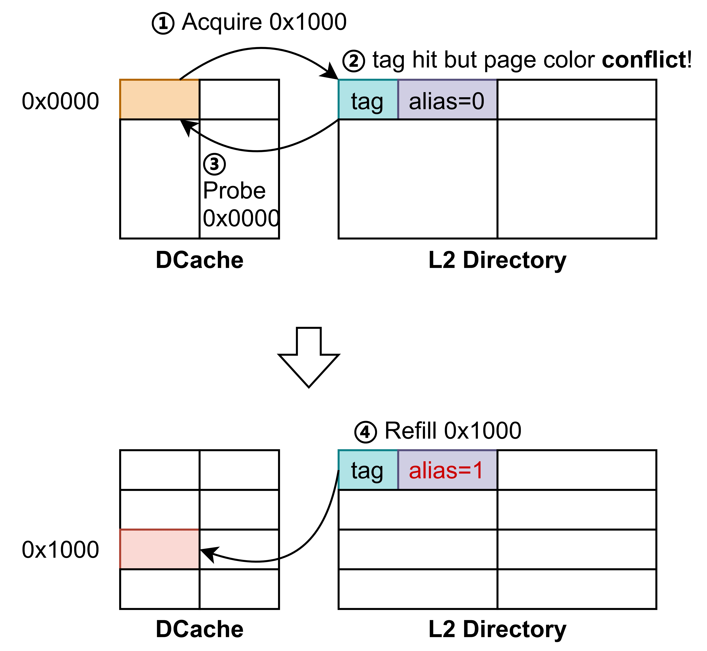

# Cache 别名问题

由于在 NanHu 架构中，DCache 和 ICache 都是采用 128KB 的 8 路组相联结构，cache 索引和块偏移所占 bit 数已经超过了页偏移 (4K 页的页偏移为 12 bits)，由此引入了 cache 别名问题：当两个虚页映射到同一个物理页时，两个虚页的别名位 (alias bits) 很有可能是不一样的，如果不做额外处理的话，通过VIPT索引 (Virtual Index Ptysical Tag) 后这两个虚页会位于 cache 不同的 set，导致同一个物理页在 cache 中缓存了两份，造成一些一致性错误。

为了让 L1 Cache 继续沿用 VIPT，XiangShan 的缓存系统采用硬件方式解决 cache 别名问题。具体的解决方式是由 L2 Cache 保证一个物理块在上层的一个 VIPT cache 中最多只有一种别名位。

下面举一个例子说明 L2 如何解决 cache 别名问题。如下图所示，DCache 中有有一个虚地址为0x0000 的块，虚地址 0x0000 和 0x1000 映射到了同一个物理地址，且这两个地址的别名是不一样的；此时 DCache 向 L2 Acquire 了地址为 0x1000 的块，并在 Acquire 请求的 user 域中记录了别名 (0x1)，L2 在读目录后发现请求命中，但是 Acquire 的别名 (0x1) 和 L2 记录的 DCache 在该物理地址的别名 (0x0) 不同，于是 L2 会发起一个 Probe 子请求，并在 Probe 的 data 域中记录要 probe 下来的别名 (0x0)；Probe 子请求完成后，L2 再将这个块返回给 DCache，并将 L2 client directory 中的别名改为 (0x1)。

