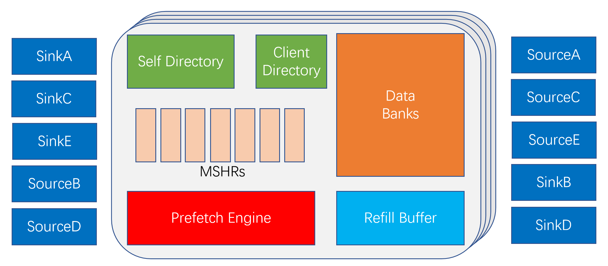

# L2/L3 Cache总体架构

XiangShan-NanHu版本L2/L3 Cache(huancun)是参考[block-inclusive-cache-sifive](https://github.com/sifive/block-inclusivecache-sifive)设计的non-inclusive cache(inclusive directory, non-inclusive data)。

huancun以Tilelink为一致性总线协议，并可以通过添加自定义Tilelink user-bit解决在L1 Cache大于32KB时产生的[cache alias问题](./cache_alias.md)。

huancun的总体结构如下图所示：

其中[预取器](./prefetch.md)采用了BOP算法，可通过参数进行配置或裁减。

Sink/Source\*相关模块为Tilelink[通道控制模块](./channels.md)，负责与标准Tilelink接口进行交互，将对应请求转换为
cache内部信号。

在[目录组织](./directory.md)上，huancun将上层数据与本层数据的目录分开存储，
Self Directory/Client Directory分别为当前层级cache data所对应的目录和上层cache data所对应的目录。

每个slice内部的[MSHR](./mshr.md)数量可配，负责具体的任务管理。

[DataBanks](./data.md)负责存储具体数据，可以通过参数配置bank数量从而提升读写并行度。

[RefillBuffer](./refill_buffer.md)可以直接将refill数据bypass到上层cache而不需要经过SRAM写入。

## huancun的总体工作流程为：

1.[通道控制模块](./channels.md)接受Tilelink请求，将其转换为cache内部请求。

2.[MSHR Alloc模块](./alloc.md)为内部请求分配一个[MSHR](./mshr.md)。

3.[MSHR](./mshr.md)根据不同请求的需求发起不同的任务，任务类型包括data读写、向上下层cache发送新请求或返回响应、触发或更新预取器。

4.当一个请求所需的操作在[MSHR](./mshr.md)中全部完成时，[MSHR](./mshr.md)被释放，等待接收新的请求。
