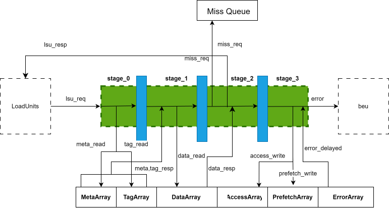

# Load 访存流水线 LoadPipe

## 功能描述

用流水线控制Load请求的处理，与Load访存流水线紧耦合，经过4级流水线读出目标数据或返回miss/replay响应

### 特征 1：LoadPipe 各级流水线功能：

* Stage 0: 接收 LoadUnit 中流水线计算得到的虚拟地址：根据地址读tag 和 meta ;
* Stage 1: 获得对应的 tag 和 meta 的查询结果；从LoadUnit接收物理地址，进行tag比较判断是否命中；根据地址读data；检查l2_error；
* Stage 2: 获得对应data结果；如果load miss则向MissQueue发送miss请求，尝试分配MSHR项；向LoadUnit返回load请求的响应；校验tag_error；
* Stage 3: 更新替换算法状态；向bus error unit上报1-bit ecc校验错误（包括dcache发现的data错误，dcache发现的tag错误，以及从L2获取数据块时已经存在的错误）。

## 整体框图

LoadPipe整体架构如[@fig:DCache-LoadPipe]所示。

{#fig:DCache-LoadPipe}

## 接口时序

### 请求接口时序实例

如[@fig:DCache-LoadPipe-Timing]所示，req1第一拍被LoadPipe接收，读meta和tag；第二拍进行tag比较判断miss；第三拍向lsu返回响应，lsu_resp_miss拉高表示没有命中，暂时无法返回数据，同时向MissQueue发出miss请求；第四拍检查报告是否有ecc错误。req2和req3紧接着req1发出，同样在stage_0被接收，读meta和tag；第二拍发现命中，发出data读请求；第三拍获得data，向lsu返回带load数据的响应；第四拍更新PLRU，报告ecc错误。

{#fig:DCache-LoadPipe-Timing}
