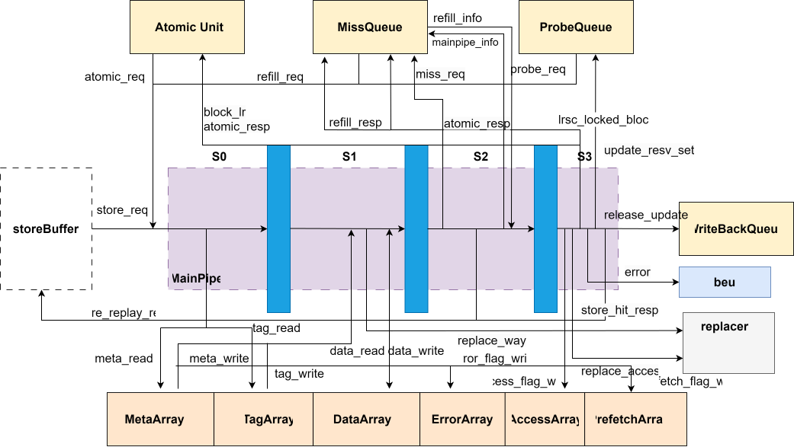
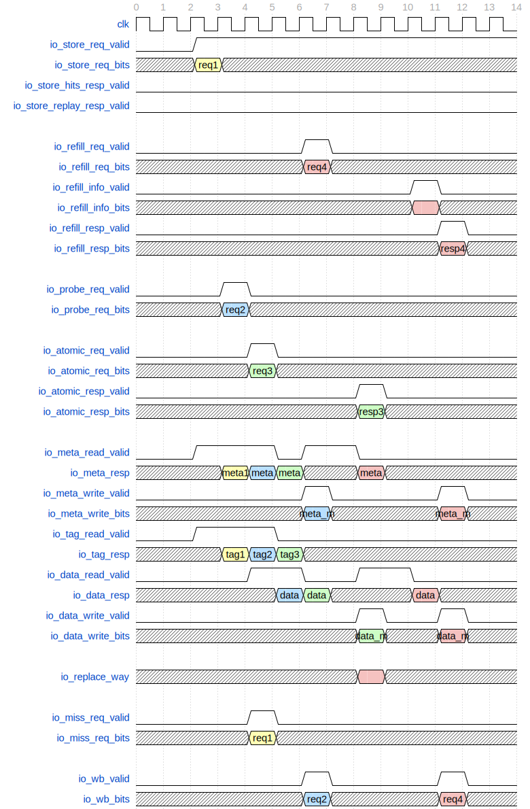

# 主流水线 MainPipe

## 功能描述

用流水线控制Store, Probe, Refill以及原子操作的执行（即所有需要争用WritebackQueue向下层cache发起请求/写回数据的指令）。

### 特性 1：MainPipe 各级流水线完成的功能：

  * Stage 0：仲裁传入的MainPipe请求,选出优先级最高者；根据请求信息判断请求所需的资源是否就位；发出 tag, meta 读请求
  * Stage 1：获得 tag, meta 读请求的结果；进行 tag 匹配检查, 判断是否命中；如果需要替换, 获得 PLRU 提供的替换选择结果；根据读出的 meta 进行权限检查；提前判断是否需要执行 MissQueue访问
  * Stage 2：获得读data的结果, 与要写入的数据拼合；如果 miss, 尝试将这次请求信息写入MissQueue；检查tag_error和l2_error
  * Stage 3：根据操作的结果, 更新 meta, data, tag；如果命中则向lsu返回store响应；如果指令需要向下层cache发起访问/写回数据, 则在这一级生成 WritebackQueue访问请求, 并尝试写WritebackQueue；检查data_error；对原子指令的特殊支持：AMO 指令在这一级停留两拍, 先完成 AMO 指令的运算操作, 再将结果写回到dcache并返回响应；LR/SC 指令会在这里设置/检查其reservation set。

### 特性 2：mainpipe争用和阻塞：

MainPipeline的争用存在以下优先级: probe_req > refill_req > store_req > atomic_req。一个请求只有在其所请求的资源全部就绪, 不存在 set 冲突, 且没有比它优先级更高的请求的情况下才会被接受. 来自committed store buffer的写请求由于时序原因, 拥有单独的检查逻辑。

### 特征 3: set阻塞逻辑：

确保并行执行的指令不会同时访问到同一个set中的不同行，以维护数据一致性和正确性即防止s3（或者s1,s2）处理的数据还没写完，s0进来的数据没读对这类情况发生。在各个阶段valid有效的情况下，MainPipe的set冲突要比对 s0和s1的，s0和s1，s0和s2的地址索引是否一致，如果一致则是出发了set冲突。阻塞s0。

### 特征 4: meta更新

meta的更新在s3中进行，Main Pipe中四种不同类型的请求中都需要在MainPipe中更新对应cacheline的meta data。几种请求都通过端口meta_write进行更新，但具体的行为不同。

Probe请求在s3中根据请求中携带的probe_param参数生成需要写入的meta_coh，对应本次Probe请求希望进行的权限修改。

对于命中的Store和AMO请求，在s1获取对应数据块的coh，在s2生成本次访问后的new_coh，在s3中对比二者决定本次是否需要进行meta的写入，如果需要进行写入则更新为s2中生成的new_coh。

对于第一次请求时发生miss，后续由MissQueue回填重新进入MainPipe的请求，在s3中根据MissQueue回填请求中携带的Acquire相关的参数生成本次回填访问需要更新的miss_new_coh，进行meta的写入。

### 特征 5: AMO指令处理

AMO请求经过优先级的争用后进入MainPipe，在前两个流水级与其他几个类型指令的执行流程基本一致，在s1获的tag，meta读请求的结果，进行tag的匹配检查与meta的权限检查，判断是否amo_hit，决定该条AMO请求是否需要进入MissQueue。如果当前的AMO请求未命中缓存，则在s2阶段将这次请求信息写入 MissQueue；若本次AMO请求命中，则会在s2获取读data的结果，然后继续进入s3。进入s3后AMO指令会在这一级停留两拍，第一拍先执行AMO指令的运算操作，第二拍将对结果的修改更新写回dcache，向原子指令处理单元返回响应。

对于LR/SC指令，会在s3阶段设置/检查其reservation set，对lrsc_count的计数进行更新，维护执行的正确性，防止执行过程中被打断或死锁情况的出现。

### 特征 6: MainPipe写回

MainPipe的写回请求在s3发起，对于需要向下层L2 Cache发起访问/写回数据的指令，通过向WritebackQueue发起写回请求，后续经WritebackQueue处理后完成真正完成向L2 Cache的写入，MainPipe中需要进行写回的请求共三类。

对于MissQueue发回的refill请求，如果回填的数据需要替换的数据块当前在dcache中为一个有效的数据块（非Nothing），则该数据块需要被release到L2 Cache，在s3会被尝试写入wbq。

对于Probe请求，需要向下级缓存返回ProbeAck，因此需要向wbq写入请求；如果被Probe的数据块中含有脏数据的话，需要将其写回下级L2 Cache，回复ProbeAckData，也需要向wbq发送写回请求。

对于miss的AMO请求，需要进行写回操作的情形与refill的流程类似，miss的AMO请求在回填后重新进入MainPipe流水线，此时如果回填的数据块需要替换掉一个有效的数据块时，该数据块需要被release到下级cache中，会在s3生成向wbq的写回请求。

### 特征 7：MainPipe回填数据异常处理

当前所有的回填请求均由MissQueue接收到hint信号后向MainPipe提前发起，回填数据块在MainPipe处理请求至s2时通过refill_info前递获得。因此可能出现由于l2_hint与回填数据间隔异常的现象，导致请求进入s2后对应的MSHR并未能前传有效的回填数据，对于这种异常情况采取下面的两种处理措施。

为了保证回填的效率，减少replay的次数，在s2阶段允许额外一拍数据未到达的容错，当回填请求进入s2阶段后若检查refill_info无效（s2_req_miss_without_data），则可以额外阻塞一拍，等待下一拍回填数据到达进行后续流程。

若阻塞一拍后，仍未能收到有效的回填数据，则通过s2_replay_to_mq通知对应的MSHR进行refill_req的重发，当前请求退出MainPipe，不再进行后续的数据操作。

对于缓存别名和其他一些特殊的情况下，可能导致一次回填请求需要替换掉的Cacheline此时在一项有效的MSHR中，正在等待向L2 Acquire请求的响应。为了保证正确性与手册的规范，此时这条替换操作不能进行，对于该回填请求也通过s2_replay_to_mq通知对应的MSHR进行refill_req的重发，当前请求退出MainPipe，不再进行后续的数据操作。

## 整体框图

## 接口时序

### 请求接口时序实例

接口时序如下图所示，req1为store请求，第一拍读meta和tag，第二拍进行tag比较发现请求miss，根据替换算法选出要替换的路，第三拍将miss请求发送给miss queue，第四拍因为miss，不会向store buffer返回响应。req2为probe请求，第一拍读meta和tag，第二拍读data，第三拍获取probe数据块结果，第四拍根据probe命令更新meta，并向writeback queue发起wb请求，返回probeAck应答。req3是amo指令，第一拍读meta和tag，第二拍进行tag比较命中，发出data读请求，第三拍获得data结果，第四拍和第五拍都处于stage_3流水级，第四拍执行指令运算，第五拍发出data写操作更新原数据块内容，并向atomic unit返回响应。
req4为req1对应的refill请求，miss queue发来refill_req的第一拍读meta，由于此时req2正在进行meta写，而metaArray写优先于读，req4在stage_0停留一拍，下一拍才能成功握手；第三拍stage_1读data，同时获得 PLRU 提供的替换选择结果，由于此时req3正在进行data写，再在stage_1停留一拍；第五拍stage_2获取要被替换的数据块data，同时从MissQueue获得前递过来的回填数据；第六拍stage_3向writeback queue发起wb请求，尝试让替换块进入wb队列，同时将回填的数据写入存储单元，并向miss queue返回refill完成响应。

