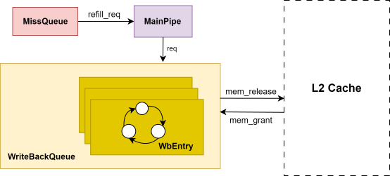

# 写回队列 WritebackQueue

## 功能描述

Writeback Queue包含18项WritebackEntry，负责通过TL-C的C通道向L2 Cache写回替换块(Release)，以及对Probe请求做出应答 (ProbeAck)。

### 特性 1：WritebackQueue空项分配与拒绝

为了时序考虑, 在wbq满的时候新请求会被拒绝; 而当wbq不满的时候所有请求都会被接收, 此时为新请求分配空项。当前版本中不再支持WritebackQueue中请求的合并。

### 特性 2：请求阻塞条件

TileLink 手册对并发事务的限制要求如果master有pending Grant(即还没有发送GrantAck), 则不能发送相同地址的Release. 因此所有 miss 请求在进入MissQueue时如果发现和WritebackQueue中某一项有相同地址, 则该miss请求会被阻塞.

## 整体框图

WritebackQueue整体架构如[@fig:DCache-WritebackQueue]所示。

{#fig:DCache-WritebackQueue}

## 接口时序

### 请求接口时序实例

[@fig:DCache-WritebackQueue-timing]展示了一个需要写回L2的请求在WritebackQueue上的接口时序。

{#fig:DCache-WritebackQueue-timing}

## WritebackEntry模块
### WritebackEntry状态机设计
状态设计：WritebackEntry中的状态机设计如[@tbl:WritebackEntry-state]和[@fig:DCache-WritebackEntry]所示:

Table: WritebackEntry状态寄存器含义 {#tbl:WritebackEntry-state}

| 状态             | 描述                                   |
|----------------|--------------------------------------|
| s_invalid      | 复位状态，该 WritebackEntry 为空项           |
| s_release_req  | 正在发送Release或者ProbeAck请求          |
| s_release_resp | 等待ReleaseAck请求                       |

{#fig:DCache-WritebackEntry}
