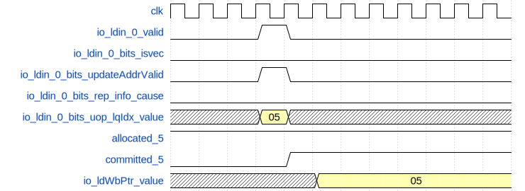

# Load 队列 VirtualLoadQueue

## 功能描述

Virtualloadqueue是一个队列，用于存储所有load指令的MicroOp，维护load指令之间的顺序，类似于load指令的ROB，其主要功能为跟踪Load指令执行状态。

Virtualloadqueue对于每一个 entry 中的 load 指令都有若干状态位来标识这个 load 处于什么状态：

* allocated：该项是否分配了load，用于确定load指令的生命周期。
* isvec：该指令是否是向量load指令。
* committed: 该项是否提交。

### 特性 1：入队

* 入队时机：在指令的 dispatch 阶段，会将 load 指令从 dispatch queue 发送到 load queue，Virtual Load Queue用于保存指令的信息。
* 流水线写回时机：load 从 iq 发出后，经过 load 流水线，到达流水线的 s3 时，将这条 load 的执行信息反馈给 load queue。
* 流水线写回的信息：包括dcache 是否命中，load 是否正常拿到了数据（包括 dcache miss 但是可以从 sbuffer 和 store queue forward 完整数据的情况），tlb是否miss，是否需要重发load。load 是否发生了异常，load 是否是 MMIO 空间的，是否是向量load，是否产生写后读违例、读后读违例，是否出现dcache的bank冲突。

### 特性 2：出队

* 出队时机：当被分配的entries（allocated为高）到达队头，同时allocated与committed都为1时，表示可以出队，如果是向量load，需要每个元素都committed。

## 整体框图
<!-- 请使用 svg -->

## 接口时序

### 接收入队请求时序实例

当io_enq_canAccept与io_enq_sqcanAccept为高时，表示可以接收派遣指令。当io_enq_req_*_valid为高时表示真实派遣指令到VirtualLoadQueue，派遣指令的信息为rob的位置、Virtualloadqueue的位置以及向量指令元素个数等。完成派遣后对应的allocated拉高，enqPtrExt根据派遣的req个数更新。

### 流水线writeback时序实例

当io_ldin_* _valid为高时表示load流水线的s3写回lq，具体内容为io_ldin_* _bits_*。allocated_5表示lq的第5项是否分配，当updateAddrValid，且没有replay时，committed_5在下一拍拉高。allocated和committed同时为高表示可以出队。每写回一个表项队尾指针+1。