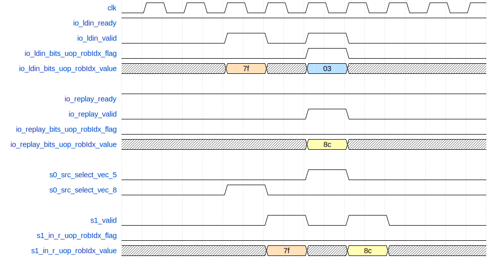

\newpage

# Load 指令执行单元 LoadUnit

## 功能描述

load指令流水线，接收load发射队列发送的load指令，在流水线中处理完成后将结果写回LoadQueue和ROB，用于指令提交以及唤醒后续依赖本条指令的其他指令。同时，LoadUnit需要给发射队列、Load/StoreQueue反馈一些必要的信息。LoadUnit支持128bits数据宽度。

### 特性 1：LoadUnit 各级流水线功能

* stage 0

    * 接收不同来源的请求，并做仲裁。

    * 得到仲裁的指令向tlb和dcache发送查询请求。

    * 流水线流给stage 1。

    仲裁的优先级从高到低列于下表。

    Table: LoadUnit请求优先级

    | stage 0请求来源                         | 优先级 |
    |---------------------------------------|----|
    | MisalignBuffer的load请求               | 高 |
    | dcache miss导致的loadQueueReplay重发    |   |
    | LoadUnit的快速重发                      |   |
    | uncache请求                            |   |
    | nc请求                                 |   |
    | LoadQueueReplay的其他重发               |   |
    | 高置信度的硬件预取请求                    |   |
    | 向量load请求                           |    |
    | 标量load/软件预取请求                   |    |
    | load pointchaising请求                |    |
    | 低置信度的硬件预取请求                   | 低 |

    目前昆明湖架构不支持load pointchaising。

* stage 1

    * 接收来自stage 0的请求。

    * s1_kill：当fast replay虚实地址匹配失败，l2l fwd失败，或redirect信号有效时，会将s1_kill信号置为true。

    * 可能向tlb或dcache追发kill信号。

    * 收到tlb的回复，根据物理地址查询dcache；对于hint的情况，一并发给dcache。

    * 向storequeue && sbuffer查询st-ld forward。

    * 接收storeunit请求，判断是否存在st-ld违例。

    * 检查是否发生异常。

    * 如果是nc指令，进行PBMT 检查

    * 如果是prf_i指令，向前端发送请求

* stage 2

    * 接收来自stage 1的请求。

    * 接收pmp检查的回复，判断是否发生异常；同时整合异常来源。

    * 接收dcache的回复信息，判断是否需要重发等。

    * 查询LoadQueue和StoreQueue是否发生ld-ld或st-ld违例

    * 向后端发送快速唤醒信号

    * 整合重发原因

    * 如果是nc指令，进行PMA & PMP检查

* stage 3

    * 接收来自stage 2的请求。

    * 向SMS预取器及L1预取器发送预取请求

    * 接收dcache返回的数据或前递的数据，进行拼接和选择

    * 接收uncache的load请求写回

    * 将完成的load请求写回后端

    * 将load指令的执行状态更新至LoadQueue中

    * 向后端发送重定向请求

### 特性 2: 支持向量load指令

* LoadUnit处理非对齐Load指令流程和标量类似，优先级低于标脸。特别的:

    * stage 0:

        * 接受vlSplit的执行请求，优先级高于标量请求,并且不需要计算虚拟地址

    * stage 1:

        * 计算vecVaddrOffset和vecTriggerMask

    * stage 3:

        * 不需要向后端发送feedback_slow响应

        * 向量load发起Writeback，通过vecldout发送给后端

### 特性 3: 支持MMIO load指令

* MMIO load指令只是为了唤醒依赖于该指令的消费者指令。

    * MMIO load指令在s0向后端发送唤醒请求

    * MMIO load在stage s3写回数据

### 特性 4: 支持Noncacheable load指令

* LoadUnit处理非对齐Load指令流程和标量类似，优先级高于标量请求。特别的, Noncacheable load指令将2次上流水线：

    * 第一次上流水线，判断指令NC属性

    * 第二次上流水线:

        * stage 0: 阶段判断出 NC 指令，无需进行 tlb 翻译。

        * stage 1: 发送前递请求到StoreQueue，

        * stage 2: 判断store数据前递情况（数据未准备好-重发处理，虚实地址不匹配-重定向 N 处理）。发送 RAR/RAW 违例请求，

        * stage 3: 判读违例情况（ldld vio-重定向，stld vio-重定向处理），如果RAR或RAW满/没有ready，需要LoadQueueUncache重发。如果不需要重发，则
        通过ldout写回。

* 不支持非对齐的Noncacheable load指令

* 支持从LoadQueueUncachce获得前递数据。

### 特性 5: 支持非对齐load指令

* 非对齐load指令将4次上流水线：

    * 第一次上流水线，判断是否是非对齐指令,如果是非对齐指令，则LoadMisaligneBuffer发送非对齐请求;

    * 第二次上流水线，执行拆分的第一条对齐的load指令，成功执行后，向LoadMisalignBuffer发送响应，否则从LoadMisalignBuffer里重发;

    * 第三次上流水线，执行拆分的第二条对齐的load指令,成功执行后，向LoadMisalignBuffer发送响应，否则从LoadMisialignBuffer里重发；

    * 第四次上流水线，在s0唤醒load指令之后的消费者，同时，load指令从LoadMisalignBuffer写回。

* Load处理非对齐Store指令流程和标量类似，特别的:

    * stage 0:

        * 接受来自LoadMisalignBuffer的勤求，优先级高于向量和标量请求,并且不需要计算虚拟地址

    * stage 3:

        * 如果不是来自于LoadMisalignBuffer的请求并且没有跨越16字节边界的非对齐请求，那么需要进入LoadMisalignBuffer处理, 通过io_misalign_buf接口，向LoadMisalignBuffer发送入队请求

        * 如果是来自与LoadMisalignBuffer的请求并且没有跨越16字节边界请求，则需要向LoadMisliagnBuffer发送重发或者写回响应,通过io_misalign_ldout接口，向LoadMisalignBuffer发送响应

        * 如果misalignNeedWakeUp == true, 则直接写回，否则需要进入LoadMisalignBuffer重发

### 特性 6: 支持预取请求

* LoadUnit接受两种预取请求

    * 高置信度预取(confidence > 0)

    * 低置信度预取(confidence == 0)

* 支持预取训练

    * stage s2:

        * 通过io_prefetch_train_l1训练L1预取

        * 通过io_prefetch_train训练SMS预取

## 整体框图

{#fig:LSU-LoadUnit}

## 接口时序

### LoadUnit接口时序实例

{#fig:LSU-LoadUnit-Timing}

load指令进入LoadUnit后，在stage 0 请求TLB和DCache，stage 1得到TLB返回的paddr，stage 2得到是否命中DCache。在stage 2进行RAW和RAR违例检查，stage 3通过io_lsq_ldin更新LoadQueue。在stage 3通过ldout写回。

### stage 0不同源仲裁时序实例

{#fig:LSU-LoadUnit-s0-arb}

图\ref{fig:LSU-LoadUnit-s0-arb}中示例了不同来源的load指令在stage 0的仲裁，第三个clk只有io_ldin_valid有效，且握手成功，在下一拍进入stage 1。第五个clk中io_ldin_valid和io_replay_valid同时有效，由于replay请求比标量load的优先级高，所以replay请求获得仲裁，进入stage 1。

\newpage
