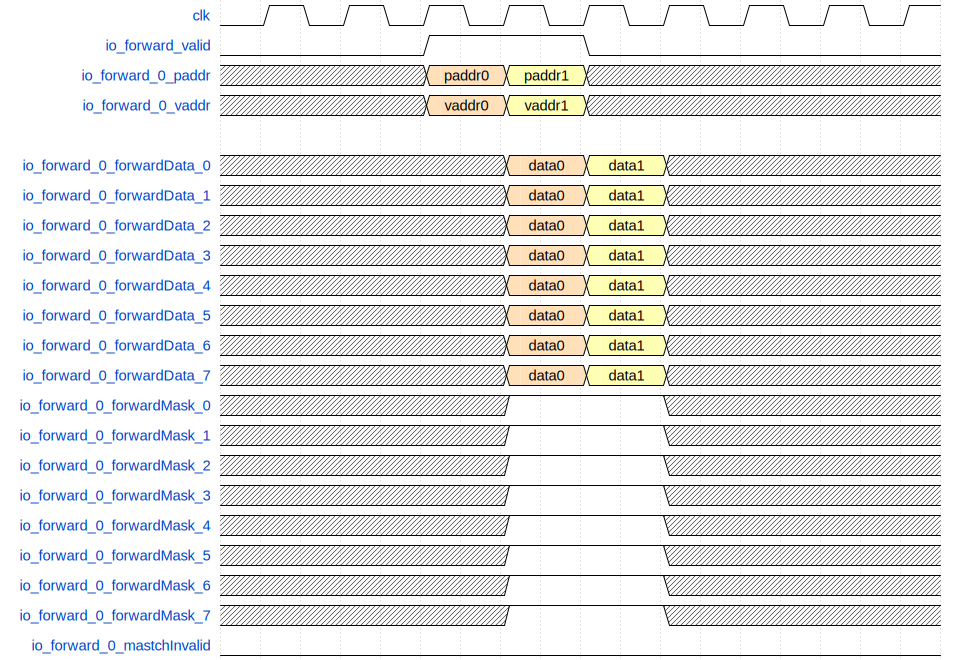

# Store 提交缓冲 SBuffer

## 功能描述

sbuffer 每一项是一个 cacheline，每个 cacheline 是 64 bytes，也就是 4 个 vwords，每个 vwords 是 16 bytes。

每一个 byte 使用一位的 mask 来指示当前有没有数据。

meta 信息包括 ptag，vtag，state，cohCount，missqReplayCount，具体功能为：

* ptag：物理地址 tag，物理地址中 cacheline 偏移的其他部分。

* vtag：虚拟地址 tag，虚拟地址中 cacheline 偏移的其他部分。

* state：状态，表示当前项处于什么状态。
    * state_valid：项是否有效。
    * state_inflight：项已经向 dcache 发送了写请求，还没有响应，或者 dcache 响应了但是 miss 了。
    * w_timeout：发给 dcache 的请求 miss 了，等待重发。
    * w_sameblock_inflight：有其他的项和本身这个项具有相同的 cache 块地址，其他的项已经 inflight 了，当前这个项刚刚被分配，需要等待其他项完成 dcache 的写回。

* cohCount：计数器，从 0 计数到 1M 之后将该项写到 dcache。

* missqReplayCount：计数器，之前发给 dcache 的请求发生过 miss，从 0 计数到 16 之后将该项重发给 dcache。

### 特性 1：sbuffer的入队逻辑

* 每一拍最多处理两个从 StoreQueue 发来的请求，然后检查请求是否需要分配新的 entry，如果两个都需要分配新的 entry 则按奇偶选出两个空闲项进行分配。

* 如果已经有相同 cacheline 的项就不需要分配新的项，直接合并到相同项内；如果这个相同的 cacheline 已经被发给 dcache 了( state_inflight 为 true )，就不能进行合并，需要重新分配一项，并且记录新分配的项依赖 inflight 的项( 设置 w_sameblock_inflight 为 true，waitInflightMask 为 inflight 项的 id )，记录依赖的目的是让 inflight 的项写到 dcache 之后才能让新的这一项写到 dcache，保证 store 的顺序。

* 设置这一项状态位为 valid。

* 请求进 sbuffer 进行合并时，如果这一项刚好被选为要写到 dcache 的项，就要阻塞 dcache 的写，等待合并完成再写。

### 特性 2：sbuffer的出队逻辑

* sbuffer 里的项写入 dcache 分被动和主动的情况。
    * 被动：sbuffer 中的项数量达到阈值，需要替换。
    * 主动：atomicsUnit 和 fenceUnit 发来的 flush sbuffer 信号，或者自身在做合并或者给 load 前递的时候发生了 tag 不匹配的情况，或者之前 miss 的请求重新发送。

* 出 sbuffer 分两拍，第一拍选择要写到 dcache 的项锁存，第二拍再给 dcache 发写请求。

### 特性 3：写 sbuffer data

请求到达 sbuffer 时，要么分配新的一项，要么合并到已有的项里面，写 data 和 mask 的时候分两拍，第一拍将请求锁存起来，第二拍根据请求的 mask 写入 ( sb, sh, sw, sd )，并将对应的 mask (表示某个 cache line 上的某一个 byte 是否 valid 的信号) 置位。

例如：S0请求到达sbuffer，S0做判断逻辑得到该请求可以合并到已有的一项中，该项为第2项，于是生成一个one hot写入编码为16'b0000000000000100，利用这个写入编码，产生对第2项的写入信号，将其锁存到S1，并把S0的写入地址(例如cache块内地址为0)，mask(例如sw，写入4个bytes)，数据锁存到S1。S1 根据S0锁存的信息，把第2项的第0个word的低4个byte的数据写信号拉高，写入对应的数据，把第2项的第0个word的低4个byte的mask写信号拉高，将其改为true。

### 特性 4：sbuffer的前递逻辑

* load 需要找在它之前的 store 的数据，而这个 store 有可能在 storequeue 里，有可能在 sbuffer 里，也有可能已经写入到了 cache 里。

* 当它在 sbuffer 里找的时候，比较现有项的 tag，有可能会找到匹配的项，这个项可能是还没有给 dcache 发请求的，也可能是已经给 dcache 发了请求的，还没有发的是最新的，所以还没有发的优先级更高，将匹配的 data 前递给 load。

如下图所示，前递查询请求与sbuffer的第0项与15项同时发生了匹配，而第0项的数据是最新的，第15项是旧的，于是前递结果中第0项的优先级高于第15项。

## 整体框图
<!-- 请使用 svg -->

## 接口时序

### 接收store指令写入时序实例

当io_in_*_valid与io_in_*_ready握手时，sbuffer接收到storeQueue的写请求，使用地址去做检查，要么新分配一项要么合并到已有一项中，利用io_in_*_bits的信息去更新项目。

### 写入到dcache时序实例

当io_dcache_req_ready和io_dcache_req_valid握手时，将io_dcache_req_bits_* 给到dcache，将请求传递过去让dcache处理。

### 前递请求时序实例

前递请求不需要ready信号，一旦io_forward_* _valid为高，就需要处理这个请求，利用请求的paddr和varddr来进行查询，数据和其他信息在io_forward_*_valid为高的下一拍有效。

