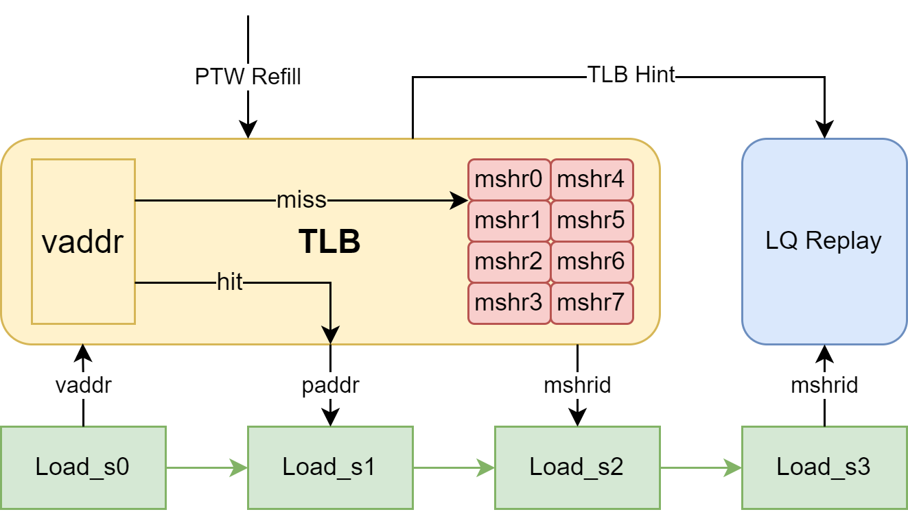
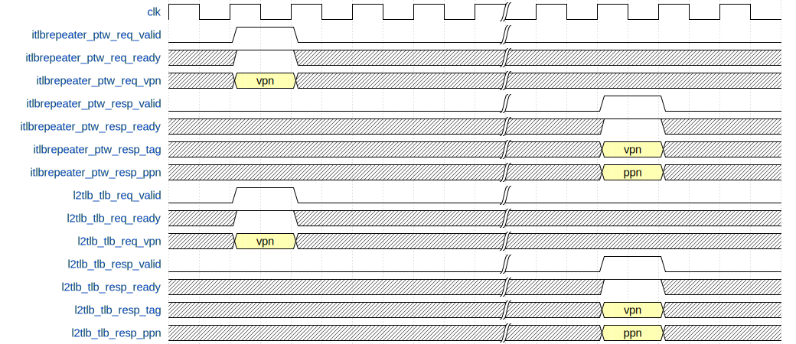
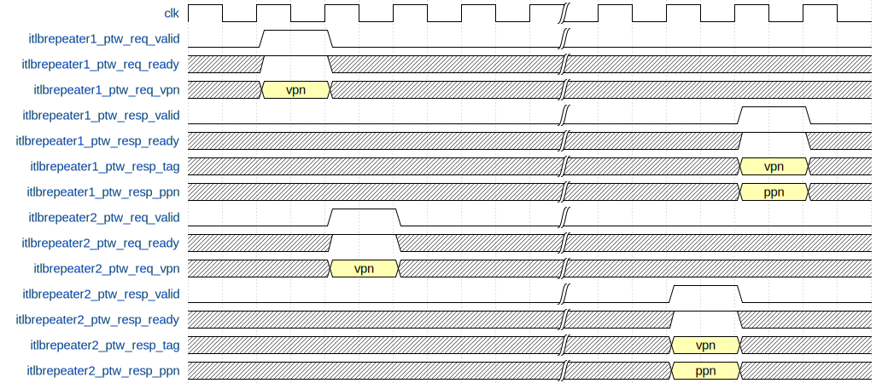

# 二级模块 Repeater

Repeater 包括如下模块：

* PTWFilter itlbRepeater1
* PTWRepeaterNB itlbRepeater2
* PTWRepeaterNB itlbRepeater3
* PTWNewFilter dtlbRepeater

## 设计规格

1. 支持在 L1 TLB 和 L2 TLB 之间传递 PTW 请求与回复
2. 支持过滤重复的请求
3. 支持 TLB Hint 机制

## 功能

### 向 L2 TLB 传输 L1 TLB 的 PTW 请求

在 L1 TLB 和 L2 TLB 之间有比较长的物理距离，会导致比较长的线延迟，因此需要通过 Repeater 模块在中间加拍。由于 ITLB 和 DTLB 均支持多个 outstanding 的请求，因此 repeater 会同时承担类似 MSHR 的功能，并过滤重复请求。Filter 可以过滤掉重复的请求，避免 L1 TLB 中出现重复项。Filter 的项数一定程度上决定了 L2 TLB 的并行度。（参见 5.1.1.2 节）

昆明湖架构中，L2 TLB 位于 memblock 模块中，但与 ITLB 和 DTLB 均有一定距离。香山的 MMU 包含三个 itlbRepeater 和一个 dtlbRepeater，起到在 L1 TLB 与 L2 TLB 之间加拍的效果，两级 Repeater 之间通过 valid-ready 信号进行交互。ITLB 将 PTW 请求以及虚拟页号发送给 itlbRepeater1，进行仲裁后发送给 itlbRepeater2，并发送给 itlbRepeater3，通过 itlbRepeater3 向 L2 TLB 传递 PTW 请求。L2 TLB 将 PTW 请求对应的虚拟页号，查找 L2 TLB 得到的物理页号、页表的权限位、页表等级、是否发生异常等信号返回给 itlbRepeater3、itlbRepeater2，通过 itlbRepeater1 最终返回给 ITLB。DTLB 与 dtlbRepeater 的交互和 ITLB 类似，dtlbRepeater 和 itlbRepeater1 是 Filter 模块，可以合并 L1 TLB 中重复的请求。由于昆明湖架构中 ITLB 和 DTLB 均为非阻塞式访问，因此这些 repeater 也均为阻塞式 Repeater。

### 过滤重复的请求

ITLB 和 DTLB 均包括多个通道，不同通道之间、同一通道之间的多次缺失请求都可能重复。如果我们只采用普通 Arbiter，每次只处理一个请求，那么其他访问 L1 TLB 的请求就会重发，继续得到 miss，并发送给 L2 TLB。这样会使 L2 TLB 的利用率不高，同时重发时也会占用处理器的资源。因此我们使用 Filter 模块，Filter 的本质是一个多进单出的队列，可以起到重复请求过滤的作用。

需要注意，在昆明湖架构中，dtlbrepeater 由 load entry、store entry、prefetch entry 三部分组成，来自于 load dtlb、store dtlb、prefetch dtlb 的请求会分别发送至三种 entry 进行处理。三种 entry 会使用循环仲裁器进行仲裁，将仲裁后的结果发送给 L2 TLB。另外，itlbrepeater 会对 ITLB 传入的所有请求进行检查，过滤重复的请求；但 dtlbrepeater 检查重复请求的粒度是 entry，只检查同一个 dtlb（load dtlb、store dtlb、prefetch dtlb）中的请求不会重复，但不同 dtlb 之间（例如 load dtlb 和 store dtlb）发送给 L2 TLB 的请求依然可能重复。

### 支持 TLB Hint 机制

当 TLB 命中时，不会对一条 load 指令的生命周期产生影响（第 0 拍 loadunit 查询 TLB，第 1 拍 TLB 返回结果）。当 TLB 缺失后，会继续查询 L2 TLB，以及内存中的页表，直至查询得到结果返回。但从一条 load 指令的生命周期出发，这条 load 指令查询 TLB 缺失后会进入 load replay queue 进行等待。只有这条 load 指令被 load replay queue 重发，且命中 TLB 查询得到物理地址后，才能根据物理地址做后续操作。

因此，一条 load 指令何时重发是缩短 load 执行时间的关键问题。如果 load 指令不能及时重发，即使 TLB 回填周期缩短，对访存的整体性能并不会有提升。因此，昆明湖架构实现了 TLB Hint 机制，针对性唤醒因 TLB miss 而需要重发的 load 指令。具体地，load_s0 阶段发送 vaddr 至 TLB，如果未命中，在 load_s1 阶段返回 miss 信息。同时，在 load_s1 阶段 TLB 会发送该条缺失信息至 dtlbrepeater，由 dtlbrepeater 进行处理。

Dtlbrepeater 处理会得到两种结果，返回 MSHRid 或 full 信号。在 dtlbrepeater 的 load entry 中，会首先检查新请求是否和现有项重复，如果和某个已有项重复，则将已有项的 MSHRid 返回。如果不和现有项重复，会检查是否有空余项，如果有空余项则返回 MSHRid，否则返回 full 信号。如果两个 load 通道同时发送给 dtlbrepeater 请求，且虚拟地址相同，则会以 loadunit(0) 的 MSHRid 为准。

在昆明湖架构中，所有因 TLB miss 而进入 load replay queue 的指令均只能等待唤醒重发，如果一条 load 指令在进入 load replay queue 后始终没有等待到唤醒信号，则会出现卡死情况。为了避免卡死，当 DTLB 向 dtlbrepeater 发送请求，dtlbrepeater 没有空余项接收时，需要返回 full 信号，表示 dtlbrepeater 已满，无法接收该条 load 指令对应的 PTW 请求，因此 load replay queue 不会接收到 Hint 信号，需要由 load replay queue 保证能够重发，而不会卡死。除这种情况外，当回填的项已经到达 dtlb 或 dtlbrepeater，但还未真正写入 dtlb 项时，也会给 loadunit 返回 full 信号，表示需要重发。

在 load_s2 阶段，dtlbrepeater 会返回 mshrid 信息至 loadunit，并在 load_s3 阶段写入 load replay queue。如果 MSHRid 有效，load replay queue 需要等待 PTW refill 信息命中 dtlbrepeater 中保存的 MSHRid，此时 dtlbrepeater 会像 load replay queue 发送唤醒（Hint）信息，表示该 MSHRid 已经重填，需要重发，此时可以命中 dtlb。另外，当某个 PTW refill 请求对应多个 MSHR entry 时（例如两个 vpn 在同一个 2M 空间内，PTW refill 的页表等级为 2MB 页），在这种情况下 dtlbrepeater 会向 load replay queue 发送 replay_all 信号，代表所有因 dtlb miss 而阻塞的 load 请求均需要被重发。由于这种情况很少，因此是一个几乎不损失性能的便捷方案。

## 整体框图

Repeater 的整体框图如图 5.2.2 所述，三个 itlbRepeater 和一个 dtlbRepeater，起到在 L1 TLB 与 L2 TLB 之间加拍的效果，两级 Repeater 之间通过 valid-ready 信号进行交互。Repeater 向上接受 ITLB 和 DTLB 的 PTW 请求，ITLB 和 DTLB 均为非阻塞式访问，因此这些 repeater 也均为阻塞式 Repeater。Repeater 向下向将 L1 TLB 的 PTW 请求发送给 L2 TLB。dtlbRepeater 和 itlbRepeater1 是 Filter 模块，可以合并 L1 TLB 中重复的请求。

除 itlbRepeater1 之外，剩下两级 itlbRepeater 的本质只是单纯的加拍。加拍的多少要根据物理距离决定。在香山的昆明湖架构中，L2 TLB 位于 Memblock 中，和 ITLB 所在的 Frontend 模块物理距离较远，因此选择在 Frontend 中增加两级 repeater，Memblock 中增加一级 Repeater。而 DTLB 位于 Memblock 中，和 L2 TLB 之间的距离较近，只需要一级 Repeater 即可满足时序的要求。

## 接口列表

参见接口列表文档。

## 接口时序

### Repeater1 与 L1 TLB 的接口时序

#### itlbRepeater1 与 ITLB 的接口时序

参见 5.1.5.3 节：ITLB 与 itlbRepeater 的接口时序

#### dtlbRepeater1 与 DTLB 的接口时序

参见 5.1.5.3 节：DTLB 与 dtlbRepeater 的接口时序

### itlbRepeater3 及 dtlbRepeater1 与 L2 TLB 的接口时序

itlbRepeater3 及 dtlbRepeater1 与 L2 TLB 的接口时序如图 5.2.3 所示。两者之间通过 valid-ready 信号进行握手，Repeater 将 L1 TLB 发出的 PTW 请求以及请求的虚拟地址发送给 L2 TLB；L2 TLB 查询得到结果后将物理地址以及对应的页表返回给 Repeater。

### 多级 itlbrepeater 之间的接口时序

多级 itlbrepeater 之间的接口时序如图 5.2.4 所示。两级 Repeater 之间通过 valid-ready 信号进行握手。

