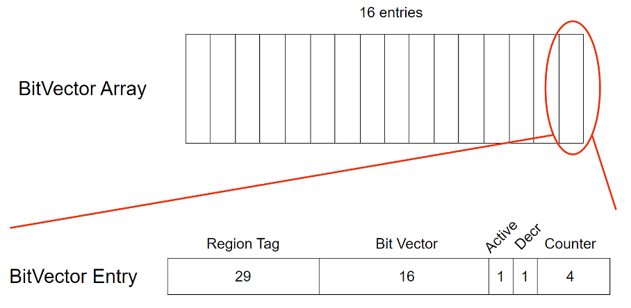
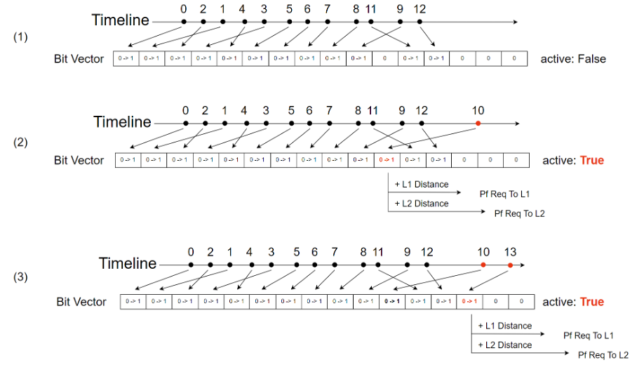
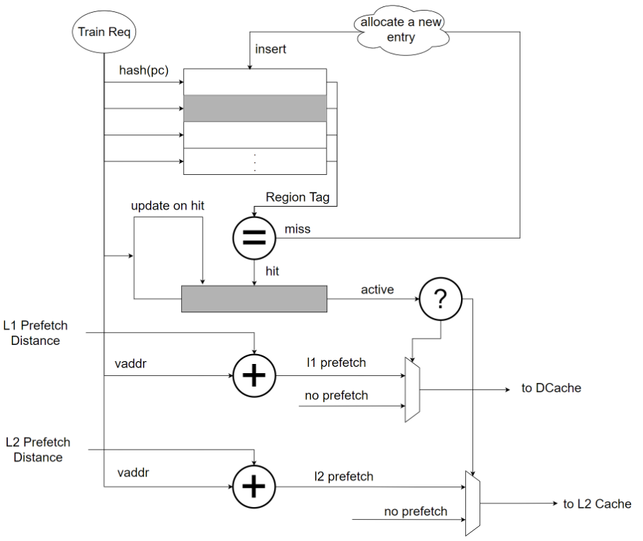
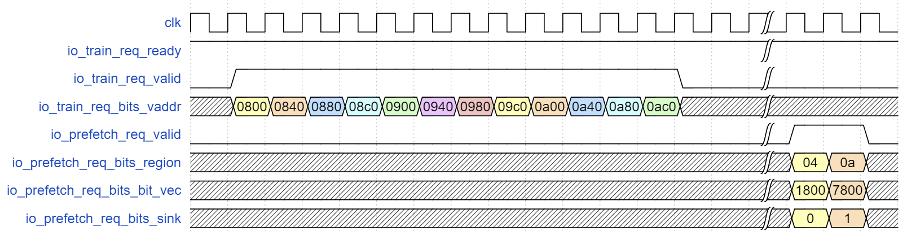

# Stream 预取器

## 功能描述

Stream 预取器主体部分，负责检测 X、X+1、X+2…的访存规律，提前发出预取请求覆盖 Stream 访存模式。

### 结构说明

Stream 预取器将虚拟内存空间均分为若干个大小为 1 KB 的 Region，类似于 SMS 预取器。

Stream 预取器中的主要存储结构为 Bit Vector Array，其中一共有 16 项 Bit Vector Entry。以 cacheline 为粒度进行训练和预取。

Bit Vector Entry 结构说明：

- Region Tag：用于标识当前 Entry 属于哪一个 Region，每一个 Region 有唯一的地址标识，具体为 Vaddr[38:10]，Array 中的不同 Entry 的 Region Tag 一定不相同。
- Bit Vector：用于标识当前 1KB 的 Region 内 16 个 Cache 块中哪些被访问过。被访问过标为 1，否则为 0。
- Active：用于标识这个 Entry 是否被激活，被激活状态下可以触发预取。两种情况下 Entry 会被标记为激活状态：
  - 这个 Region 中 16 个 Cache 块被访问的数量达到 12 个及以上
  - 这个 Region 存在相邻的 Region，且相邻的 Region 处于激活状态
- Decr：用于标识这个 Entry 是否为负向 Stream，判断方式为：Entry 被分配时如果 Array 中存在当前 Region 相邻的下一个 Region 则认为该 Entry 为负向 Stream，否则为正向 Stream。
- Counter：用于记录 Region 中被访问过的 Cache 块数量，超过 11 个之后将 Entry 设置为激活状态。

Bit Vector Entry 工作示意图如下：

时间轴上不同时间访问不同的 Cache 块，访问 Region 的第 0 个块记为 0，第 1 个块记为 1。上图（1）中一共包含 12 次访问，访问 Region 的第 0 个块时，分配一个新的 Bit Vector Entry，并将 Bit Vector 中第 0 位从 0 标记为 1，激活状态目前为 false。访问 Region 的第 2 个块时，更新这一项 Bit Vector，将第 2 位从 0 标记为 1，激活状态目前为 false。后续的 1、4、3…等访问流程类似。

上图（2）时间轴标红处表明访问到 Region 的第 10 个块，将这个 Bit Vector 的第 10 位从 0 标记为 1，此时 Bit Vector 为 1 的数量超过了阈值 12，将 Bit Vector 的激活状态设置为 True。以该 Region 的第 10 个块位置为基础，加上 L1 Distance，预取 2 个块到 Dcache，加上 L2 Distance，预取 4 个块到 L2 Cache。目前设置的 L1 Distance 为 32 个块，L2 Distance 为 128 个块。

上图（3）新到来一个对 Region 的第 13 个块的访问，处理流程与以上描述类似。如果后续的连续访问超过了这个 Region，到达下一个 Region，则会新分配一项 Bit Vector Entry，新分配的 Entry 自动变为激活状态。

Stream 预取器主要有三部分关键电路，分别阐述如下。

### 特性 1：接收训练请求

Stream 预取器的训练分为两级流水线 s0 和 s1：

S0：从训练请求中获取虚拟地址，将虚拟地址转换为 Region 地址，并生成当前 Region 相邻的前后两个 Region 地址。三个 Region 地址并行查询 BitVectorArray，比较每一个 Entry 的 Region Tag，得到三个命中向量。如果 BitVectorArray 中已经存在相同 Region 的 Entry，则为命中，否则为 miss。如果 miss 则需要申请一项新的 Entry，使用 PLRU 替换算法得到最近最不常被使用到的 Entry。

S1：根据 S0 是否命中执行不同的操作。

- 命中：计算本次训练请求位于 Region 中的哪一个 Cache Block，并将 Entry 的 Bit Vector 中该位置标为 1，表示被访问过。更新 Entry 中的 Counter，如果这个 Cache Block 是第一次被访问，将 Counter 加 1，当 Counter 达到 12 时，将 Entry 标记为激活状态。
- Miss：设置新 Entry 的信息，Region Tag 为训练请求虚拟地址所在的 Region；Bit Vector 为 One-Hot 向量，1 的位置为训练请求虚拟地址所在该 Region 的 Cache 块编号；Counter 记为 1；根据前文提到的正负向 Stream 检测方式设置 Decr；根据相邻 Region 是否处于激活状态来设置 Active。将新的 Entry 信息更新到 s0 阶段替换算法选出来的 Entry 中。

### 特性 2：发出预取请求

s2、s3、s4、s5 级流水线负责触发预取请求。

s2 阶段计算发出到 L1/L2/L3 Cache 的预取请求地址和相关的控制信息，具体为当前虚拟地址加上一个固定值 D，D 为 Distance，L1 Distance 为 32 个 Cache 块，L2 Distance 为 128 个 Cache 块，L3 Distance 为 256 个 Cache 块。从预取地址开始连续预取 N 个块，N 为 Degree，L1 Degree 为 2，L2 Degree 为 4，L3 Degree 为 8。

举例来说，如果一个 Region Entry 学习到当前地址符合 X、X+1、X+2…的规律，如果训练请求访问的地址为 Y，则将地址为 Y+32，Y+33 的预取请求发送给 Dcache，Y+128、Y+129、Y+130 和 Y+131 的预取请求发送给 L2 Cache，Y+256、Y+257、Y+258、Y+259、Y+260、Y+261、Y+262 和 Y+263 的预取请求发送给 L3 Cache。

一旦满足触发预取的要求（当前 Region 处于激活状态），s3，s4，s5 级流水线分别发出 L1/L2/L3 级的预取请求（目前不启用 L3 预取）。

### 特性 3：Stride冲突避免（kmh-v2 目前没有启用）

由于 Stream 是特殊的步长为 1 的 Stride 访问模式，在 Stream 访问模式下，Stride 预取器也可以学习到相应的访问模式，即步长为 1。但 Stride 预取器在 Stream 流下表现不佳，因为 Stride 是一个 degree-1 的预取器，在大量连续的 Stream 流访问下，覆盖率和及时性不够。因此在 Stream 预取器已经检测到 Stream 模式后，Stride 预取器可以不用发出预取请求。

Stride 预取器会在训练阶段 s0 查询 Stream 预取器，s1 阶段进行 region tag 比较，s2 阶段得到比较结果，并判断此 region 是否为处于激活状态，如果处于激活状态则不触发 Stride 预取。

## 整体框图

## 接口时序

上图从第 2 个上升沿到来连续收到 12 个训练请求，从 0x800 到 0xac0，地址依次递增 0x40（即一个 cacheline），Stream 预取器训练后学习到此地址规律满足地址依次递增的 Stream 访存模式，在收到第 12 个训练请求时 Stream 预取器被激活，向 L1 发出基地址为 0xac0 + 32 * 0x40，长度为 2 个块的预取请求，向 L2 发出基地址为 0xac0 + 128 * 0x40，长度为 4 个块的预取请求。
