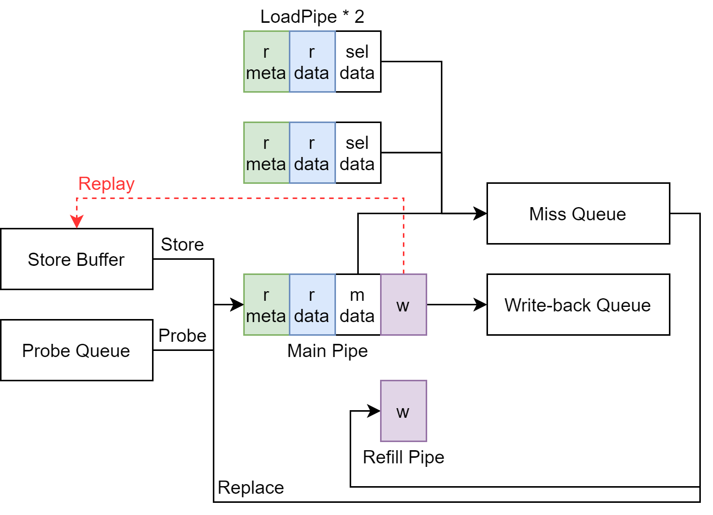

# 一级数据缓存

DCache 在南湖架构中与访存流水线紧耦合, 对外通过 TileLink 总线协议和 L2 Cache 直接交互. 南湖架构中 DCache 默认为 128KB 总容量, 8 路组相联结构, 采用伪 LRU 替换和 SECDED 校验. dcache 与 l2 cache 配合来处理 128 KB 容量带来的[缓存别名问题](../../huancun/cache_alias.md). 南湖架构的 dcache 支持自定义的 [cache 操作](./csr_cache_op.md).

DCache 内部模块包括: 

模块名称|说明
-|-
[Load PipeLine](./load_pipeline.md) (Load 流水线)|与 Load 访存流水线紧耦合, 3 拍读出数据
[Main Pipeline](./main_pipe.md) (主流水线)|负责 store, probe, replace, 原子操作的执行
[Refill Pipeline](./refill_pipe.md) (Refill 流水线)|负责将 L2 重填的数据写回 dcache
[Atomics Unit](../fu/atom.md#dcache-对原子指令的支持) (AtomicsReplayEntry)|调度原子请求
[Miss Queue](./miss_queue.md) (MSHRs, 16 项)|向 L2 请求缺失的块, 每一项通过一个状态机控制该 miss 请求在 DCache 中的流动
[Probe Queue](./probe_queue.md) (8 项)|接收 L2 Cache 的一致性请求
[Writeback Queue](./writeback_queue.md) (18 项)|负责将替换块写回 L2 Cache, 或应答 Probe 请求

[Committed Store Buffer](../lsq/committed_store_buffer.md) 在向 DCache 发送写请求的同时也会作为写请求的重发缓冲区. DCache 以及 Committed Store Buffer 的整体结构示意图如下:

## 接口

雁栖湖架构中的 DCache 对 L2 Cache 采用 TileLink 总线协议, TileLink 涉及到的一致性请求主要分为三类:

* Acquire 获取权限
* Probe 被动释放权限
* Release 主动释放权限

!!! todo
    图待更新

<!--  -->

## 请求处理流程

### Load 请求处理流程

* 经过三级流水, 命中则直接返回, 失效则进入 Miss Queue
* Miss Queue 取回回填数据并转发给 Load Queue
* 在主流水线中将回填数据写入 DCache
* 如果需要替换块, 在 Writeback Queue 中将替换块写回

### Store 请求处理流程

Store Replay Unit 接收来自 Store Buffer 的请求, 在主流水线中访问 DCache:

* 如果 DCache 命中
    * 在 Main Pipeline 中完成对 DCache 的写入
* 如果 DCache 未命中且 Miss Queue 已满(或拒绝接受请求)
    * 由 Store Buffer 在一段时间后重发此请求
* 如果 DCache 未命中且 Miss Queue 成功接受请求
    * 由 Miss Queue 继续执行后续操作
    * 在完成后通知 Store Buffer, 并通过 Refill Pipe 更新 dcache
* 如果有被替换的块, 在 Writeback Queue 中写回
    * 特别地, 被替换的块只有在替换它的块到达 DCache 之后才被 Writeback Queue 向下写.

### Atomics 请求处理流程

参见[原子指令的处理流程](../fu/atom.md).

### Refill 请求处理流程

!!! todo
    待更新

<!-- ### Replace 触发及处理流程 -->

### Probe 请求处理流程

* 接收来自 L2 Cache 的 Probe 请求
* 在主流水线中修改被 Probe 的块的权限
* 返回应答, 同时写回脏数据

## 资源争用

!!! todo
    dcache 中的组件会争用 data array, tag array, MissQueue, Writeback Queue 等资源. 这一节将描述 dcache 如何调度这些资源.