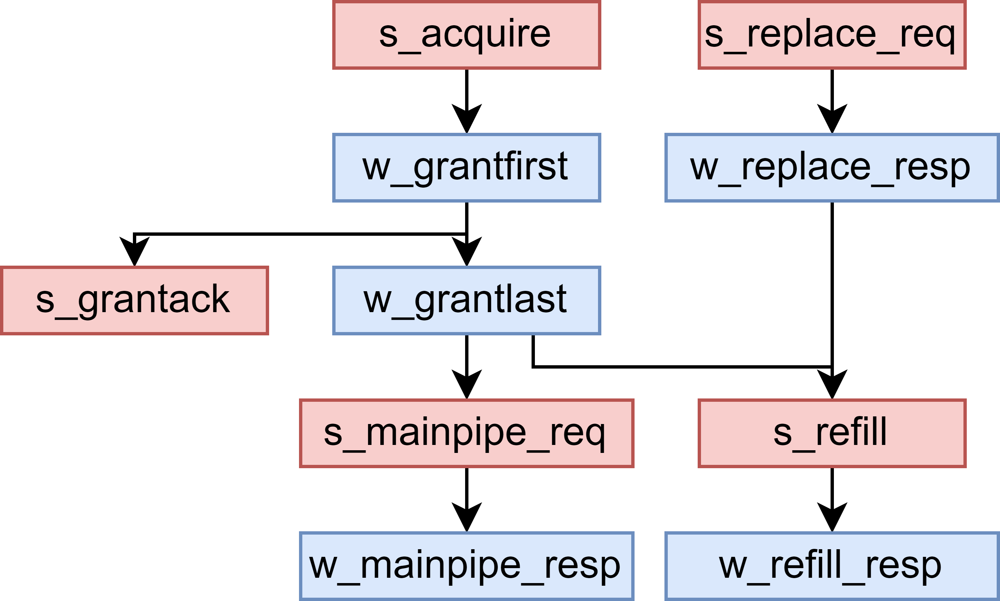

# Miss Queue

NanHu 架构中 Miss Queue 包含 16 项 Miss Entry, 每一项 Miss Entry 负责接收 miss 的 load、store 和原子请求, 从 L2 Cache 取回需要回填的数据, 并将缺失的 load 数据返回给 Load Queue.

!!! todo
    介绍一次 miss 进 missq -> refill 的流程

## Miss Queue 分配逻辑

!!! todo
    介绍 Miss Queue 的分配, 合并逻辑. 介绍 Miss Queue 拒绝接收请求的两种情况.

## Miss Queue 状态维护

Miss Entry 由一系列状态寄存器控制需要完成哪些操作, 以及这些操作之间的执行顺序. 如下图所示, `s_*` 寄存器表示需要调度的请求, `w_*` 寄存器表示要等待的应答, 这些寄存器在初始状态下被置为 `true.B`, 在为请求分配一项 Miss Entry 时, 会将相应的 `s_*` 和 `w_*` 寄存器置为 `false.B`, 前者表示某一个向外的请求还没有发出去, 后者表示要等待的某个响应还没有握手.

<!-- 

 -->

Miss Entry 中各个事件是依据一定的依赖关系先后执行的. 上图是一个 DAG 的流程图, 箭头表示前面一个状态寄存器置为 `true.B` 后才可以做下一个事件.

状态|说明
-|-
`s_acquire`|向 L2 发送 AcquireBlock / AcquirePerm, 如果 miss 的块要对整个块写覆盖就只需要 AcquirePerm
`w_grantfirst`|接收到 GrantData 的第一个 beat
`w_grantlast`|接收到 GrantData 的最后一个 beat
`s_grantack`|表示收到 L2 的数据后向 L2 返回应答, 在收到 Grant 的第一个 beat 时就可以返回 GrantAck了
`s_mainpipe_req`|将原子请求发送到 Main Pipe 回填到 DCache
`w_mainpipe_resp`|表示将原子请求发送到 Main Pipe 回填到 DCache 后, 接收到 Main Pipe 的应答
`s_replace_req`|需要做替换, load / store 请求在进入 Miss Queue 之前会根据替换算法选择好替换路, 进入 Miss Queue 后直接向 Replace Pipe 发送请求
`w_replace_resp`|完成替换
`s_refill`|load / store 请求需要发送到 Refill Pipe 进行回填
`w_refill_resp`|表示回填完成.

## Miss Queue 触发替换

!!! todo
    111

## Miss Queue Refill

参见 [Refill Pipe](./refill_pipe.md).