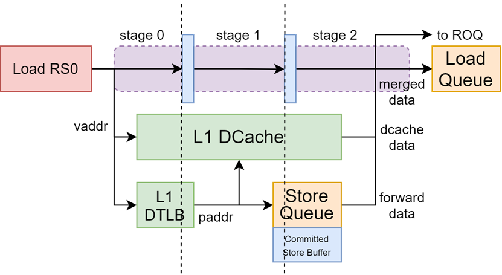

# Load Pipeline

本章介绍香山处理器南湖架构 load 流水线的设计以及 load 指令的处理流程. 香山处理器(雁栖湖架构)包含两条 load 流水线, 每条 load 流水线分成3个流水级.

<!-- !!! todo
    update graph -->
<!--    -->

## 流水线的划分

load 指令执行流水线各级划分如下:

### Stage 0

* 指令和操作数被从保留站读出
* 加法器将操作数与立即数相加, 计算虚拟地址
* 虚拟地址送入 TLB 进行 TLB 查询
* 虚拟地址送入数据缓存进行 Tag 查询

### Stage 1

* TLB 产生物理地址
* 完成快速异常检查
* 物理地址送进数据缓存进行 Data 查询
* 虚拟/物理地址送进 store queue / committed store buffer 开始进行 store 到 load 的前递操作
* 根据一级数据缓存返回的命中向量以及初步异常判断的结果, 产生提前唤醒信号送给保留站
* 如果在这一级就出现了会导致指令从保留站重发的事件, 通知保留站这条指令需要重发 (`feedbackFast`)

### Stage 2

* 完成异常检查
* 根据一级数据缓存及前递返回的结果选择数据
* 根据 load 指令的要求, 对返回的结果做裁剪操作
* 更新 load queue 中对应项的状态
* 结果 (整数) 写回到公共数据总线
* 结果 (浮点) 送到浮点模块

### Stage 3

* 根据 dcache 的反馈结果, 更新 load queue 中对应项的状态
* 根据 dcache 的反馈结果, 反馈到保留站, 通知保留站这条指令是否需要重发 (`feedbackSlow`)

!!! info
    Stage 3 负责将一些由于时序原因被延迟的 stage 2 检查结果送出.

## Load Miss

一条 miss 的 load 指令会执行以下操作来取得其所需的数据, 这一节将逐个介绍这些机制:

* 禁用当前指令的提前唤醒
* 更新 load queue 的状态
* 分配 dcache MSHR (MissQueue entry)
* 侦听 dcache refill
* 写回 miss 的 load 指令

在 load stage 1, 根据 dcache tag 比较结果, load 流水线可以得知当前指令是否 miss. 在发生 miss 时, 这条指令的提前唤醒有效位会被设置成`false`, 以**禁用当前指令的提前唤醒**.

在 load stage 2, 如果发现 miss, load 流水线不会写回结果到寄存器堆, 不占用 load 指令写回端口. 同时**更新 load queue 的状态**, 这条发生 miss 的 load 指令此后会在在 load queue 中等待 dcache refill. 与此同时, dcache 会尝试为这条 miss 的 load 指令**分配 dcache MSHR (MissQueue entry)**. 由于分配逻辑复杂, 分配的结果要在下一拍才能反馈到 load queue.

在 load stage 3, **根据 dcache MSHR 分配的结果再次更新 load queue 的状态**. 如果 dcache MSHR 分配失败, 则请求保留站重发这条指令.

若这条指令成功被分配 dcache MSHR, 后续其将在 load queue 中侦听 dcache refill 的结果. 参见 [load queue: Load Refill](../lsq/load_queue.md#load-refill).

## Replay From RS

load 流水线是**非阻塞的**, 亦即无论出现任何异常情况, 都不会影响流水线中有效指令的流动. 而在除 load miss 之外的异常情况发生导致 load 无法正常执行完时, load 流水线会利用从[保留站重发(Replay From RS)机制](../mechanism.md#Replay-From-RS)来重新执行这条指令. 下面逐个介绍会触发从保留站重发机制的事件:

### TLB miss

**TLB miss** 事件会通过使用 feedbackSlow 端口请求从保留站重发. TLB miss 的指令在重发时存在重发延迟, 在指令在保留站中等待到延迟结束后才被重发. 重发延迟的存在是因为 TLB 重填需要时间, 在 TLB 重填完成之前重发指令还会产生 TLB miss, 是没有意义的.

### Bank Conflict

**bank conflict** 事件. bank conflict 事件包括两条 load 流水线之间的 bank 冲突, 以及 load 流水线和 store 操作写 cacheline 之间的冲突(这里的 store 操作指已经提交的 store 从 committed store buffer 写入到 dcache 当中). 目前, 我们仅允许两条 load 指令在不触发 bank 冲突的情况下同时执行. 而对于 load / store 的冲突, 由于时序关系我们没有复杂的检查, 只要 load / store 操作作用在同一个 cacheline 上, 我们就认为发生了冲突. 来源于 bank conflict 的重发使用 feedbackFast 端口. 从保留站重发不设延迟, 保留站在收到 bank 冲突重发请求时可以立即重发这条指令. 

### Dcache MSHR Allocate Failure 

**dcache MSHR 分配失败**. dcache MSHR 分配失败的原因参见 [dcache/MissQueue](../dcache/miss_queue.md). dcache MSHR 分配失败导致的重发使用 feedbackSlow 端口发出重发请求. 重发无延迟, 保留站在收到 dcache MSHR 分配失败重发请求时可以立即重发这条指令. 

!!! note
    这里的设计有待优化, dcache MSHR 分配失败可能来源于几个不同的原因. 分开处理这些情况会有益于性能的提升.

### Store Data Invalid

**Store 地址就绪但数据未就绪**. 这些指令不会更新 load queue 也不会写回, 而是在 load stage 3 通过 feedbackSlow 发出重发请求, 通知保留站, 这条指令**正在等待此前的某条 store 指令的数据就绪**. 在进行 store - load 前递检查的过程中, load 所依赖的 store 的 sqIdx 会被一并查出, 并通过 feedbackSlow 端口反馈到保留站. 这样产生的重发有非固定的延迟. 保留站可以根据查出的 sqIdx 等待到对应的 store data 产生之后再重新发射这条 load 指令. 

## 异常的处理

load 流水线可以处理的异常分为两大类: 来自地址检查的异常和来自错误处理的异常. 异常使用单独的异常通路, 时序比 data 通路宽松. 地址检查结果会分级生成来优化时序表现, 参见 [MMU](../mmu/mmu.md) 部分的介绍. 

## 预取指令的处理

目前, 软件预取指令使用与 load 指令类似的处理流程, 软件预取指令会与正常的 load 指令一样进入 load 流水线, 在发现 miss 时向 dcache 的 MissQueue 发出请求, 触发对下层 cache 的访问. 特殊地, 软件预取指令执行期间会屏蔽所有例外, 且不会重发.

## Load 的提前唤醒

南湖的保留站支持提前唤醒机制来尽快调度后续的指令. 但是, 南湖架构暂时**不支持推测唤醒机制**. 被提前唤醒的指令必须要能正常地执行, 否则就需要冲刷整个流水线. 如果一条 load 指令正常执行但没有发出提前唤醒信号, 则会导致依赖这条 load 的后续指令晚一个周期才能被发射, 造成少许的性能损失.

load 流水线会在 load stage 1 向保留站给出快速唤醒信号. 由于 MemBlock 和 IntBlock 之间的线延迟, 这一信号处于关键路径上. 在提前唤醒信号的产生, load 流水线会进行指令能否正常执行的粗略判断. 一旦指令有不能正常执行的迹象, 就不进行提前唤醒.

## Forward Failure

这一小节介绍南湖架构在虚地址前递失败时的处理. 当 store queue 或者 store buffer 反馈虚地址前递失败时, load 流水线会在 stage 2 将这条指令附加上 `replayInst` (需要从取指重发) 的标签. 在这条指令到达 ROB 队尾时触发重定向. 由于虚地址前递失败是很罕见的现象, 这样的重定向不会对性能产生过大影响.

## 调试相关

load 流水线中设置了 trigger 触发机制. 出于时序考虑, 南湖架构**只支持使用地址作为触发条件**. 
