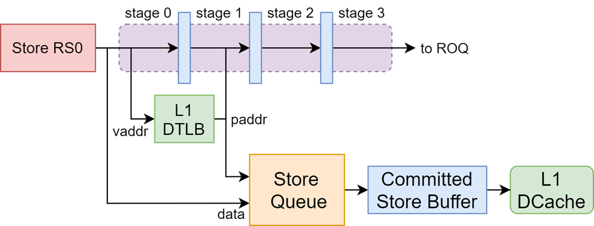

# Store Pipeline

本章介绍香山处理器(南湖架构) store addr / store data 流水线的设计以及 store 指令的处理流程.

香山处理器(南湖架构)采用了 store 地址与数据分离的执行方式. store 的地址与数据在就绪时可以分别从保留站中被发出, 进入后续的处理流程. 同一条 store 指令对应的数据/地址两个操作靠相同的 robIdx / sqIdx 联系在一起.

香山处理器(南湖架构)包含两条 store addr (sta) 流水线, 每条 store addr 流水线分成4个流水级. 前两个流水级负责将 store 的控制信息和地址传递给 store queue, 后两个流水级负责等待访存依赖检查完成. 

香山处理器(南湖架构)包含两条 store data (std) 流水线, 在保留站提供 store data 后, store data 流水线会立刻将 data 写入 store queue 的对应项中. 

  

## sta 流水线的划分

各级流水线的划分如下:

Stage 0
* 计算虚拟地址
* 虚拟地址送入 TLB

Stage 1
* TLB 产生物理地址
* 完成快速异常检查
* 开始进行访存依赖检查 
* 物理地址送入 store queue

Stage 2
* 访存依赖检查
* 完成全部异常检查和PMA查询, 根据结果更新 store queue

Stage 3
* 完成访存依赖检查 
* 通知 ROB 可以提交指令

## std 流水线的划分

Stage 0
* 保留站给出 store data
* 将 store data 写入 store queue

## Store 的执行细节

上面的文档已经完整地展示了 store 指令的一般流程. 这一部分将展开一些 store 指令执行的细节.

### TLB miss 的处理

和 load 流水线一样, store addr 流水线也可能经历 TLB miss. 针对 TLB miss, 两者的处理方式基本一致, 参见 load TLB miss 的处理 (TODO).

使用一个 rsFeedback 端口向保留站反馈 store addr 计算操作是否需要从保留站重发

### PMA和异常检查

为时序考虑, 异常/PMA/PMP检查结果在 data 更新到 store queue 一周期之后才全部完成.

> TODO: 解释 TLB-PMP/PMA 这条路径上的内容
