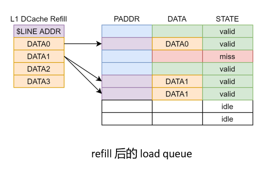
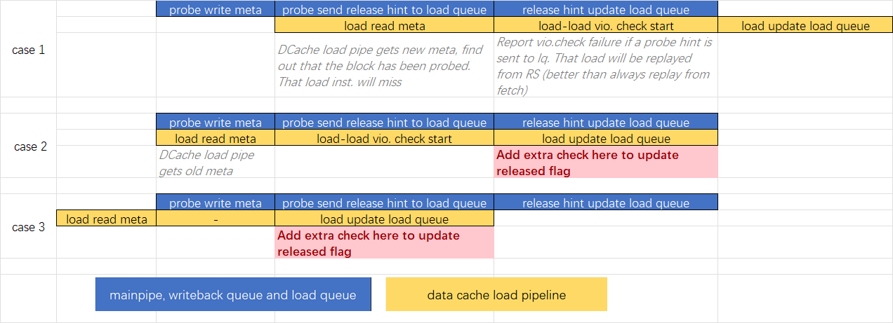

# Load Queue

本章介绍香山处理器南湖架构 load queue 的设计.

南湖架构的 load queue 是一个 80 项循环队列. 其每周期至多: 

* 从 dispatch 处接收 4 条指令
* 从 load 流水线接收 2 条指令的结果, 以更新其内部的状态
* 从 dcache 接收 miss refill 结果, 更新 load queue 中全部等待此次 refill 的指令的状态
* 写回 2 条 miss 的 load 指令. 这些指令已经取得了 refill 的数据, 会与正常的访存流水线争用两个写回端口

一级数据缓存 refill 时，会将一整个 cacheline 的所有数据反馈给 load queue, 所有在 load queue 中等待这一 cacheline 数据的指令都会得到数据.

## Load Queue 每项的内容

Load Queue 每项包含以下的信息:

* 物理地址
* 虚拟地址 (debug)
* 重填数据项
* 状态位
* trigger 使用的状态位

状态位|说明
-|-
allocated|该项已经被 dispatch 分配
datavalid|load 指令已经拿到所需的数据
writebacked|load 指令结果已经写回到寄存器堆并通知 ROB, RS
miss|load 指令未命中 dcache, 正在等待 dcache refill
pending|该 load 指令访问 mmio 地址空间, 执行被推迟. 正在等待指令成为 ROB 中最后一条指令
released|load 指令访问的 cacheline 已经被 dcache 释放 (release)
error|load 指令在执行过程中检测到错误

## Load Queue Enqueue

load 指令进入 load queue 实际分两步完成: enqPtr 的提前分配和 load queue 的实际写入. 

提前分配的原因是 dispatch 模块距离 MemBlock 太远, 将 load
queue 处产生的 `enqPtr` 送到 dispatch 做为 `lqIdx` 需要面临很长的延迟. 南湖架构在 dispatch 附近维护 enqPtr 的提前分配逻辑, 由提前分配逻辑负责提供指令的 `lqIdx`.

### enqPtr 的提前分配

!!! todo
    参见 dispatch 部分, `lqIdx` / `sqIdx` 的[提前分配](../../backend/dispatch.md). 

### Load Queue 实际写入

在 load queue 被实际写入时, load queue 本身的 `enqPtr` 会根据写入 load queue 的指令数量被更新. 出于时序考虑, load queue 只会在 load queue 中 `空项数 >= enq指令数` 的情况下接受 dispatch 分派的指令. 

## Update Load Queue

这一小节描述流水线中的 load 指令更新 load queue 这一过程. 在一条指令在 load 流水线的执行过程中, 可以在多个阶段更新 load queue 的状态.  

### Load Stage 2

在这一阶段, dcache 和前递返回结果, 并将以下内容写入到 load queue 中:

* 关键控制信号
* 物理地址
* 前递结果
* trigger 检查结果

此时会被更新的状态标志位包括: `datavalid`, `writebacked`, `miss`, `pending`, `released`

### Load Stage 3

在这一阶段, 部分上个周期来不及完成的检查返回结果, load queue 会使用这些结果来更新其状态. 例如 `dcacheRequireReplay` 事件(dcache 请求从指令从保留站中重发)一旦触发, 会将 `miss` 和 `datavalid` flag 更新为 false. 这标志着这条指令会从保留站重发, 而不是在 load queue 中等待 refill 将其唤醒. 这一操作与 load 指令流水线中 stage 3 的保留站反馈操作同步发生.

!!! info
    load 流水线中 [load miss](../fu/load_pipeline.md#load-miss) 的处理部分也涉及了 load queue 更新的相关信息

### 特例: MMIO 指令


## Load Refill

若一条 load 指令成功被分配 dcache MSHR, 后续其将在 load queue 中侦听 dcache refill 的结果. 一次 refill 会将数据传递到所有等待这一 cacheline 的 load queue 项. 这些项的数据状态被标识为有效, 随后可以被写回. 如果指令此前已经进行了 store 到 load 的前递, load queue 负责在 refill 时合并前递结果, 参见 [Store 到 Load 的前递](../mechanism.md#store-to-load-forward) 一节. 下面的示意图展示了一次 dcache refill 前后 load queue 中各项的变化. 

!!! todo
    更新图的描述

  

  

在 load queue 拿到 dcache refill 回来的数据后, 就可以开始**从 load queue 写回 miss 的 load 指令**. load queue 为这种指令的写回操作提供了两个端口. 在每个周期, load queue 会分别从奇偶两列中选出最老的已经完成了 refill 但还没写回的指令, 在下一个周期将其通过写回端口写回(出于时序考虑, 写回指令的选择和实际写回放在了前后两个周期来执行). load queue 会和 load 流水线中正常执行的 load 指令争用写回端口. 当 load 流水线中的指令试图写回时, 来自 load queue 的写回请求被阻塞.

## load 指令的完成

load 指令的完成指 load 取得结果, 写回 rob 和 rf 的操作. 写回 ROB 和 RF 的 load 的选择分奇偶两部分进行, 较老的指令优先被选择. 每周期至多选出两条指令被写回. load queue 选择写回的指令有两种: 

* 已经完成的 mmio load 指令
* 此前 miss, 现在已经从 dcache 取得 refill 回来的数据结果的 load 指令

!!! info
    正常命中 dcache 的 load 会直接从流水线写回. 参见 [load pipeline](../fu/load_pipeline.md#stage-2) 部分.

实际写回操作在写回选择的下一拍发生. load queue 会根据选择结果读出对应指令的信息, 根据指令要求完成结果裁剪, 最后争用 load 写回端口将结果写回. load 被成功写回后, `writebacked` flag 会被更新成 false.

!!! note
    注意区分 load 指令写回到 load queue 和 load 从 load queue 写回到 rob 和 rf. 两者是不同的操作.

## load 提交相关机制

rob 在指令提交后, 根据 load 指令提交的数量产生 `lcommit` 信号, 通知 load queue 这些数量的 load 指令已经成功提交.

由于 load queue 与 ROB 间隔较远. load queue 实际使用 `lcommit` 更新内部状态是在 ROB 处进行指令 commit 的两拍之后. load queue 会将已经 commit 的指令 `allocated` flag 更新为 false 以表示其完成. 同时根据提交的 load 的数量(lcommit) 更新队列尾指针 `deqPtr`.

## redirect

这一小节介绍 load queue 中与指令重定向相关的机制. 重定向到达 load queue 之后会在 2 拍内更新 load queue 的状态:

* Cycle1: 根据 robIdx 找出所有错误路径上的指令. 被刷掉的指令 allocated 被设置成 false.
* Cycle2: 根据上一拍查找的结果, 统计有多少指令需要被取消, 更新 enqPtr

在目前的设计下, 跳转指令触发重定向后, dispatch queue 中仍然可能有有效的 load 指令需要进入 load queue. 在 cycle2 进行 enqPtr 更新时, 在重定向更新 load queue 期间进入 load queue 的指令是否需要取消会被单独统计. 

<!-- TODO: Cycle2 指令 enq 的处理 -->

<!-- ### 队列指针维护 -->

## store - load 违例检查相关机制

在 store addr 操作向 store queue 中写入地址的同时 (store addr pipeline stage 1), 它也会在 load queue 中搜索物理地址相同但程序序在 store 之后的 load 指令. 如果这些 load 指令已经被执行并产生了错误的结果(即触发 store - load 违例), 则 load queue 会发出重定向请求: 处理器会从这条 load 指令开始, 从取指开始重新执行后续的指令.

对于两条 store 流水线, 每条指令要检查三个位置的 load 指令是否违例(load 流水线 stage 1 / stage 2, load queue), 共计有 6 个可能的违例会被检查出. 违例检查逻辑需要在 6 个可能的违例中选出最老的一个, 产生重定向请求传出. 为此, 对于每条 store 指令, 它的 store - load 违例检查被划分到三个周期执行, 每个周期执行的操作如下:

* Cycle 0: store addr 更新 store queue
    * store 流水线将物理地址送入 load queue, 根据地址匹配生成匹配向量
    * 根据 store 指令附带的 lqIdx 计算检查范围
    * 检查 load 流水线 stage 1 / stage 2 中的指令是否用到这条 store 的结果 
* Cycle 1: 重定向生成
    * 完成 load queue 中的违例检查
    * 如果此前 load 流水线 stage 1 / stage 2 中的指令发生了违例, 选出其中最老的一个
* Cycle 2: 重定向生成
    * 从所有的违例中选出最老的一个
    * 生成重定向请求传出

```
 stage 0:        lq l1 l2     l1 l2 lq
                 |  |  |      |  |  |  (paddr match)
 stage 1:        lq l1 l2     l1 l2 lq
                 |  |  |      |  |  |
                 |  |------------|  |
                 |        |         |
 stage 2:        lq      l1l2       lq
                 |        |         |
                 --------------------
                          |
                      rollback req
```

**违例恢复.** 如果检查出存在违例, 且触发违例的指令尚未被其他来源的重定向请求取消, 则发出重定向请求, 并更新访存违例预测器. st-ld 违例发出的重定向请求**与分支预测错误的重定向请求处理方式相似**, 不需要等待指令到达 ROB 队尾才向前端发出重定向请求.

## load - load 违例检查相关机制

当 load 到达 load 流水线 stage 1 时, 会在 load queue 中查询 load queue 中具有相同物理地址的 load 指令. 如果后续的 load 指令返回了结果且已经被 release, 则重新执行后续的 load 指令, 以确保访问相同地址的 load 之间的顺序. 为了实现上述的检查, load queue 包含以下机制:

* 在 dcache release 一个 cacheline 时, 更新 load queue 中对应项的 `released` flag, 标记这条 load 指令所在的 cacheline 已经被释放.
* load 在执行时在 load queue 中检查之后的 load
* 如果发现之后的 load 拿到了更老的结果 (即已经被 release), 从这条 load 开始重新执行

<!-- ### release 更新 load queue 中的对应项 -->

dcache 会向 load queue 发送 release 信号来标识 dcache 已经失去了对某一 cacheline 的读权限. dcache release 信号产生标志着 dcache 会将这一拍之后对相同 cacheline 的 load 全部标记为 miss, 直到 dcache 重新获得这一行的权限为止. dcache release 信号会在 dcache mainpipe 更新 dcache 内 cacheline 的状态位的同时产生. 参见 [dcache mainpipe](../dcache/main_pipe.md) 部分. 

为时序考虑, dcache release 信号传递到 load queue 的过程加了拍, load queue 中 `released` flag 的更新实际在 dcache 写 meta 更新 cacheline 权限的两拍之后. dcache 和 huancun (l2 cache) 的设计保证了在 dcache release 信号产生后(意味着 dcache 放弃对一个 cacheline 的读权限)的至少 3 个周期之内, dcache 不会重新获得对对应行的读权限. 在此基础上, load - load 违例检查发生的时机有以下几种情况:



dcache release 信号在更新 load queue 中 `released` 状态位时, 会与正常 load 流水线中的 load-load 违例检查争用 load paddr cam 端口. release 信号更新 load queue 有更高的优先级. 如果争用不到资源, 流水线中的 load 指令将立刻被从保留站重发.

<!-- Future Work: 目前所有的 release 操作都会产生 dcache release 信号. 这里可以进行细化, TtoB 不需要产生 dcache release 信号 -->

**违例恢复.** 触发 load-load 违例的 load 指令会被标记为需要从取指重新执行. 重定向请求会在这些指令到达 ROB 队尾时发出.

## MMIO (uncached 访存)

在地址检查阶段发生 exception 的 mmio 指令会在 Load Stage 2 立即将异常信息写回到 ROB 并更新 load queue. 这样的 mmio 指令不会进行 uncached 访存操作.

不带 exception 的 mmio 指令会在 Load Stage 2 更新 load queue, 将 load queue 中的这条指令标记为等待执行的 mmio 指令. 但其不会将 ROB 中的指令标识为已写回的状态. 当这条指令到达 ROB 的队尾后, ROB 会通知 load queue, 由 load queue 向下发出 uncached 访存请求. uncached 访存请求由一个状态机维护. 在 uncached 访存完成之后, mmio load 如同 miss 的 load 一样, 将数据从 load queue 写回.
