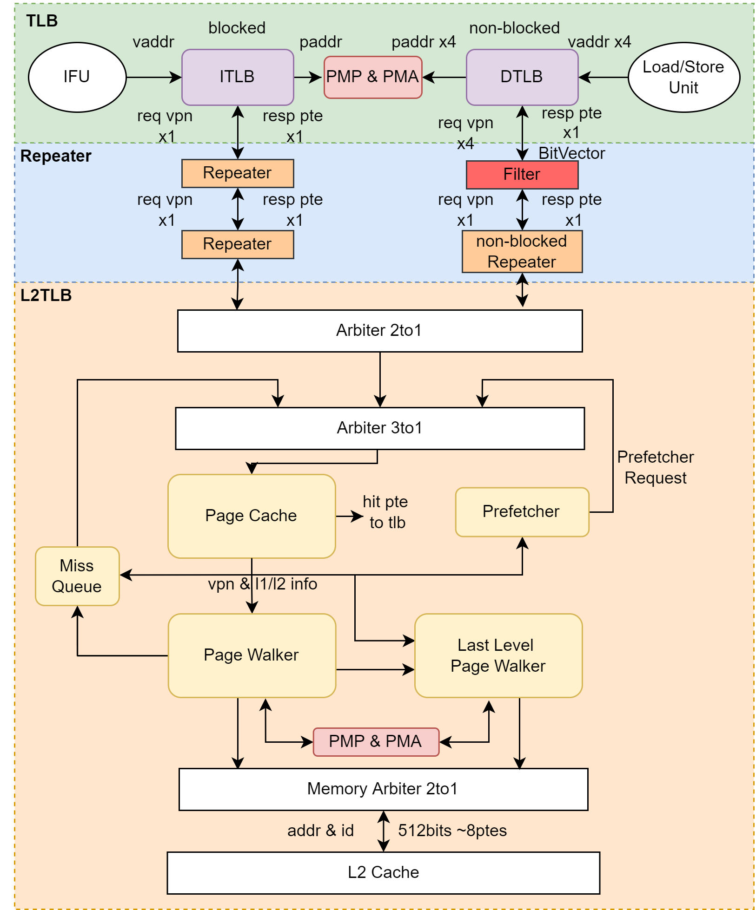

# MMU

这一节介绍香山的 MMU（Memory Management Unit），包含 TLB， L2TLB，Repeater，PMP 和 PMA 等。

为了实现进程隔离，每个进程都会有自己的地址空间，使用的地址都是虚拟地址。MMU 也就是 Memory Management Unit，在处理器中主要负责将虚拟地址翻译成物理地址，然后用这个物理地址去访存。同时也会进行权限检查，比如是否可写，可执行。

香山处理器支持 Sv39 分页机制，主要特点是虚拟地址长度为39位，低12比特是页内偏移，中间的 27 比特分为三段，也就是三层页表，这意味着遍历页表三次内存访问，因此需要对页表做缓存。

香山的 MMU 主要分为三部分，和流水线紧耦合的分别位于前端和后端的 ITLB 和 DTLB，需要考虑流水线的需求，考虑时序问题，比如拆成两拍等操作。当 ITLB 和 DTLB 如果 miss，会发送请求 L2 TLB，当 L2 TLB 也 miss，就会使用 Hardware Page Table Walker 去访问内存中的页表内容。L2 TLB 主要考虑是如何提高并行度和过滤重复的请求。Repeater 是一级 TLB 到 L2 TLB 的请求缓冲。PMP 和 PMA 需要对所有的物理地址访问进行权限检查。

## TLB

香山的 TLB 可以对组织结构进行配置，包括相联模式、项数及替换策略等。默认配置为 ITLB 32 项普通页和 4 项大页（superpage），全相联，伪 LRU 替换；DTLB 为 128 项普通页直接相连，8 项全相联负责所有大小的页，伪 LRU 替换策略。DTLB 的直接相联项是全相联项的 victim cache。如右图所示，查询 TLB 时，部分内容负责权限检查，部分内容负责地址翻译。

DTLB 为非阻塞式设计，如果 miss，需要由外部（Load/Store Unit）重发请求。ITLB 在 TLB 的基础上包了一层，实现了简单的阻塞式设计。
每一条访存流水线都拥有独立的 DTLB，但 Load TLB 和 Store TLB 的内容分别是相同的。通过统一“替换算法”和回填信息维持多个TLB保持相同的内容：

## L2TLB

L2 TLB 是更大的页表缓存，由 ITLB 和 DTLB 共享。具体结构如右图所示，L2 TLB 分为 Page Cache，Pake Walker，Miss Queue 和 Prefetch 四部分。

一级 TLB 的请求会首先发送给 Page Cache，如果 hit，则会返回给一级 TLB。如果 miss，且 Page Walker 空闲，则进入 Page Walker，否则进入 Miss Queue。
同时为了加快页表访问，Page Cache 将三级页表都做了缓存。Page Cache 支持 ecc 校验，如果 ecc 校验出错，则刷新此项，并重新进行 Page Walk。

Page Walker 接收 Page Cache 的请求，进行 Page Walk。Page Walker 只访问前两级页表，即 1GB 和 2MB，不访问 4KB 页表。对 4KB 页表的访问由 Miss Queue 承担。Page Walker 如果访问到叶子节点，即大页或空页，则返回给一级 TLB，否则送往 Miss Queue。Page Walker 同时只能处理一个请求。

Miss QUeue 接收来自 Page Cache 和 Page Walker 的请求，承担两项任务：miss 请求的缓冲，等到重新访问 Page Cache，以及访问最后一级页表。Page Walker 可以同时处理 N 个请求，N 为 Miss Queue 的项数。因为对页表的访问集中于最后一级页表，因此 L2 TLB 主要通过 Miss Queue 提高访存并行度，但限制 Page Walker 的访存能力，避免重复访存的发生。

Page Cache 的结果引发预取请求的产生，预取请求的处理请求与普通一级 TLB 请求相似，不同点在于：预取请求不会返回给一级 TLB；预取请求进入 Miss Queue 时，如果前两级页表 miss，会被直接丢弃，防止占用过多 Page Cache 和 Page Walker 的资源。目前采用 NextLine 预取算法。

## Repeater

TLB 和 L2 TLB 因为有比较长的物理距离，就会导致比较长的线延迟，因此就需要在中间加拍，称为Repeater。
Filter 在 Repeater 的基础上进行强化，接受 DTLB 的请求，发送给 L2 TLB。Filter 负责过滤掉重复的请求，避免一级 TLB 中出现重复项。Filter 的项数一定程度上决定了 L2 TLB 的并行度。

## PMP 与 PMA

香山实现了 PMP（Physical Memory Protection），具体实现上分为四部分：CSR Unit，ITLB，DTLB，L2TLB。在 CSR Unit 中，负责读写。在 ITLB，DTLB 和 L2 TLB 中，负责写以及地址检查的功能。在 DTLB 中，因为时序因素，分为动态检查和静态检查两部分。回填 DTLB 时，进行 PMP 检查，将结果存到 DTLB 中，PMP 的结果随 TLB 检查一并查询，此为静态检查。TLB 翻译后得到物理地址，再进行 PMP 检查，此为动态检查。为了实现静态检查，将 PMP 粒度提升至 4KB。

PMA 为自定义实现，采用类 PMP 的方式，利用 PMP Configure 寄存器的保留位实现 Cachable 和 Atmoic 的检查。PMA 与 PMP 并行查询。除此之外，额外提供 Memory Mapped 形式的 PMA，供 DMA 等外设使用。