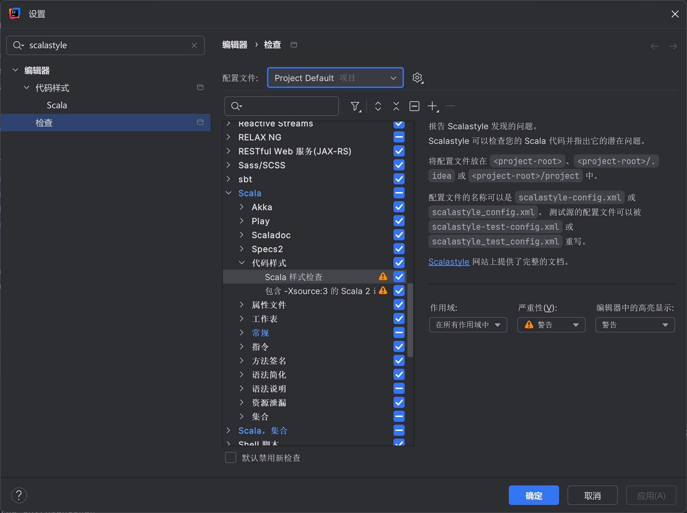

# 香山 Style Guide

香山 style guide 旨在为香山代码编写提供明确且详细的规范。目前，这些规范已经在前端部分实施，一个例子是[对 ICache 的重构](https://github.com/OpenXiangShan/XiangShan/pull/4461)。在昆明湖 V3 的开发中，前端所有新增代码都将遵循这一规范，并根据规范逐步重构现有代码

## Scalafmt

目前前端已经启用了 Scalafmt，这是一个代码格式化工具，配置文件为.scalafmt.conf，自动处理了包括代码缩进、对齐、折行等基础问题。对于代码格式化的检查已经加入了 CI 当中，如果未正确格式化代码会导致 CI 报错

在提交前，可以使用`make check-format`检查代码是否符合规范，使用`make reformat`自动进行格式化

VS Code 和 IDEA 都支持在保存时自动格式化，不需要再手动检查与格式化。另外，也可以在 git 中增加 pre-commit hook：

```bash
#!/bin/bash

make check-format 2>/dev/null | grep -v '^file excluded'
if [ ${PIPESTATUS[0]} -ne 0 ]; then
    echo "Format checking failed, refusing to commit"
    echo "hint: Run 'make reformat' will resolve this issue"
    exit 1
fi
```

将以上文件放在 git hooks 文件夹内，命名为 pre-commit，赋予可执行权限：

+ XiangShan 环境：.../XiangShan/.git/hooks
+ xs-env 环境：.../xs-env/.git/modules/XiangShan/hooks

如果在提交时格式检查失败，会提交失败：

```plain
$ git commit
mill xiangshan.checkFormat
[4] ../xs-env/XiangShan/src/main/scala/xiangshan/frontend/Frontend.scala
Format checking failed, refusing to commit
hint: Run 'make reformat' will resolve this issue
```

此外，有一点需要额外注意。现在，Scalafmt 启用了对类型注解的额外对齐，这会导致在某些情况下对齐出错。这些错误主要集中在函数定义中，例如：

```scala
def +(offset:  UInt):       PrunedAddr = PrunedAddrInit(toUInt + offset)
def +(that:    PrunedAddr): PrunedAddr = PrunedAddrInit(toUInt + that.toUInt)
def -(that:    PrunedAddr): PrunedAddr = PrunedAddrInit(toUInt - that.toUInt)
def >>(offset: Int):        UInt       = (toUInt >> offset).asUInt
```

解决这一问题的方法是在函数间添加空行：

```scala
def +(offset: UInt): PrunedAddr = PrunedAddrInit(toUInt + offset)

def +(that: PrunedAddr): PrunedAddr = PrunedAddrInit(toUInt + that.toUInt)

def -(that: PrunedAddr): PrunedAddr = PrunedAddrInit(toUInt - that.toUInt)

def >>(offset: Int): UInt = (toUInt >> offset).asUInt
```

实际上，在函数间确实也应当存在空行

## Scalastyle

另一个用于格式化的工具是 Scalastyle，配置文件位于 scalastyle-config.xml，其可以对 scalafmt 进行补充，例如文件头检查和变量命名检查等，但不具备自动修复机制。

IDEA 支持 Scalastyle 检查，并将存在问题的地方标记警告：编辑器-检查-scala-代码样式-scala 样式检查



暂时不清楚 vscode 有没有插件可以做到这一点，可以考虑使用命令行手动进行检查，参考[官方文档](https://www.scalastyle.org/command-line.html)

Scalastyle 配置检查内容基本与本文推荐的规范相同：

1. 文件头检查：文件头必须是至少一个 Copyright+一行空行+Mulan License 的格式，例如：

    ```scala
    // Copyright (c) 2025 someone
    // Copyright (c) 2018-2025 someone else
    //
    // XiangShan is licensed under Mulan PSL v2
    ...
    ```

    不合法的格式请参考[此评论](https://github.com/OpenXiangShan/XiangShan/pull/4329#issuecomment-2696328600)
2. 命名检查：见[本文“命名规范”一节](#命名规范)
    1. `class`大驼峰
    2. `object`大驼峰
    3. `trait`暂不支持检查，请手动大驼峰
    4. `val`大驼峰或小驼峰，取决于用其定义变量还是常量，请手动检查
    5. `def`大驼峰或小驼峰，取决于用其定义方法还是常量，请手动检查
3. import 检查：
    1. 禁止 block import，即`import package.{abc, def}`，此问题 scalafmt 也可以检查并可以自动修复（展开）
    2. 禁止 wildcard import，即`import package._`，`chisel3._`和`chisel3.util._`除外，此问题无法自动修复
4. 类型标注：所有 public 成员必须有类型标注
5. 文件大小（可读性）检查：
    1. 单文件 800 行以内
    2. 单行 120 字符以内，此问题 scalafmt 也可以检查并可以自动修复
    3. 单`class`30 方法以内
    4. 单方法 50 行以内

## 强制规范

### 命名规范

这部分规范主要包含变量和文件命名，这些规范应当在任何时候都被遵守

总体来说，香山采用驼峰命名法：

```scala
UpperCamelCase
lowerCamelCase
```

对于缩写，应当将其视为一个单词，例如：

```scala
ifuWbPtr
Ftq1rSramEntry、
ICache
```

而不是：

```scala
IFUWBPtr
Ftq_1R_SRAMEntry
icache
```

如果缩写只缩写了一个单词，那么这一单词和之后的单词首字母都应当大写。例如，应当使用`ICache`而非`Icache`

#### 类和特征

类和特征应当采用大驼峰命名

#### 单例对象

单例对象应当和类一样采用大驼峰命名

#### 方法

方法名应当使用小驼峰命名

#### 常量、值和变量

常量应当使用大驼峰，值和变量应当使用小驼峰。在任何时候都应当尽量避免下划线的出现

流水线信号命名是唯一的特例，保留`sx_lowerCamelCase`里的下划线有利于看波形时进行筛选

尽管将每个流水级的信号进行打包，也可以使生成的 verilog 达成相同的效果，但这样做会造成一些迷惑行为：

```scala
class S1 extends Bundle {
  val someSignal: UInt = UInt()
}
private val s1 = Wire(new S1)
s1.someSignal := RegEnable(s0.someSignal, s0_fire) // verilog: s1_someSignal
// 这个写法的RegEnable是一个匿名寄存器
private val s1_someSignal = RegEnable(s0_someSignal, s0_fire)
// 这个写法的Reg被绑定到了s1_someSignal这个名字上

// 这产生了如下的行为不一致：
when (cond) {
  s1.someSignal := otherValue
  // 等价于 s1.someSignal := Mux(cond, otherValue, RegEnable(s0.someSignal, s0_fire))
  s1_someSignal := otherValue
  // 等价于 s1_someSignal := RegEnable(Mux(cond, otherValue, s0_someSignal), s0_fire || cond)
}
```

两害相权取其轻，我们允许流水线信号采用`sx_lowerCamelCase`这样的命名

### private 和类型标注

为了让 IDEA 开心，所有变量都应是 private 或具有类型标注。理论上，模块内部连线都应该是`private val`，只有`io`和少量特例是 public 且具有类型标注的。

```scala
class SomeModule extends Module {
  private class SomeModuleIO extends Bundle {
    val somePort: UInt = UInt(width.W)
  }

  val io: SomeModuleIO = new SomeModuleIO

  private val someWire = Wire(UInt(width.W))
}
```

对于模块自身使用的一些方法，也可以定义成 private 的，而对于多个模块（比如整个 Frontend，例如`isRVC`）共享的方法，应考虑包装到`trait`中，由需要的模块继承，其可以定义成 public 并具有类型标注。

```scala
trait HasPreDecodeHelper {
  def isRvc(inst: UInt): Bool = inst(1, 0) =/= 3.U
}

class SomeModule extends Module with HasPreDecodeHelper {
  private def somePrivateMethod = ...
}
```

### 常量和 NamedUInt

`package utils`提供了`NamedUInt`，其提供`width`和`apply`两个方法便于使用

多数常量可以定义成继承自`NamedUInt`的单例对象方法，例如：

```scala
object ExceptionType extends NamedUInt(2) {
  def none: UInt = 0.U(width.W)
  def pf: ...
}

class SomeBundle extends Bundle {
  val exception: UInt = ExceptionType()
  // ExceptionType.apply() 等价于 UInt(ExceptionType.width.W)
}
```

### 文件

理想情况下，文件名应当与该文件所包含的唯一类同名。例如，`Ftq.scala`中仅包含一个名为`Ftq`的类。此外，类和其伴生对象、密封类和其子类应当放在同一文件中，这已经由 scala 编译器所要求

然而，考虑到硬件设计的特殊性，这一规范存在下述例外：

1. 将多个相关的 IO 放在同一个文件中是十分符合直觉的
2. 将 LazyModule 和它的 LazyModuleImp 放在同一个文件中是十分符合直觉的

更明确的文件结构与命名有助于代码的理解与维护，这一规范带来的收益要远大于文件数量增加的负面影响

### 包和目录结构

包应当遵循 JAVA 的命名规范：

```scala
// wrong!
package coolness

// right! puts only coolness._ in scope
package com.novell.coolness

// right! puts both novell._ and coolness._ in scope
package com.novell
package coolness

// right, for package object com.novell.coolness
package com.novell
/**
 * Provides classes related to coolness
 */
package object coolness {
}
```

不过对于香山的情况而言，应当不会用到上述比较复杂的用法，只需要在每个文件顶部（紧跟 license 后）声明本文件的 scope 即可：

```scala
/* license here */
package xiangshan.frontend.somemodule

class SomeModule {
  /* logic here */
}
```

package 应当全小写

对于大部分单例模块而言，目录结构、包结构和硬件结构三者应当统一。理想情况下，应当按硬件上的主要模块（Ftq、Bpu、Ifu、ICache）拆分目录和包，次要模块归属于主要模块。

例如：

+ 主要模块 Ifu 应当在`src/scala/xiangshan/frontend/Ifu/Ifu.scala`中，属于`package xiangshan.frontend.ifu`
+ 次要模块 PreDecode 在硬件结构上是 Ifu 的子模块（`new PreDecode`出现在`class Ifu`中），则其应当在`src/scala/xiangshan/frontend/Ifu/PreDecode.scala`中，同样属于`package xiangshan.frontend.ifu`

对于非单例的模块（例如`SRAMTemplate`、`FIFO`），如果是较泛用的，应考虑提交到 Utility 仓库，属于`package utility`

考虑 diplomacy 框架中需要使用 LazyModule 机制，为了代码编写方便可能存在一些特例。例如`InstrUncache`模块在硬件结构上理应是`Ifu`的子模块，但为了方便将其实例化在`class Frontend`中，这种情况仍应当将其放在`src/scala/xiangshan/frontend/Ifu/InstrUncache.scala`中，属于`package xiangshan.frontend.ifu`。

## 推荐规范

这部分规范大多数来自 Scala Style Guide 和香山的开发实践。这些规范应当尽量被遵守，然而考虑到硬件设计的特殊性，可能并非所有情况都适用这些规范

### import

除了`chisel3._`和`chisel3.util._`以外，应尽可能避免使用`import xxx._`。

应尽可能避免同级 package 间相互 import，如下，遇到这种情况也许需要考虑将`SomeObject`放在公共的父 package（如`package xiangshan.frontend`）中是否更加合理。

```scala
package xiangshan.frontend.icache
import xiangshan.frontend.ifu.SomeObject
```

import 应按 scalastyle 排序，应避免单行内多个 import（即合并相同前缀），scalafmt 可以自动修改。

```scala
// before
import xiangshan.frontend.ExceptionType
import utility._
import xiangshan.backend.fu.{PMPReqBundle, PMPRespBundle}

// after
import utility._
import xiangshan.backend.fu.PMPReqBundle
import xiangshan.backend.fu.PMPRespBundle
import xiangshan.frontend.ExceptionType
```

### 类长度

在软件工程中，一般会对类的长度、包含的方法数量有明确限制。激进一些的限制可能会要求类中的方法数量不超过 15 个，如果超出限制，就需要拆分成多个子类。此外，JAVA 虚拟机对类的长度上限存在限制，过长会导致编译失败，目前前端有几个类已经接近此限制

短类可以有效明确代码结构和功能，降低代码阅读难度。即使硬件设计有特殊性，也应当尽量缩短类的长度

## 参考

[Scala Style Guide](https://docs.scala-lang.org/style/)

[Style Guide | Chisel](https://www.chisel-lang.org/docs/developers/style)
