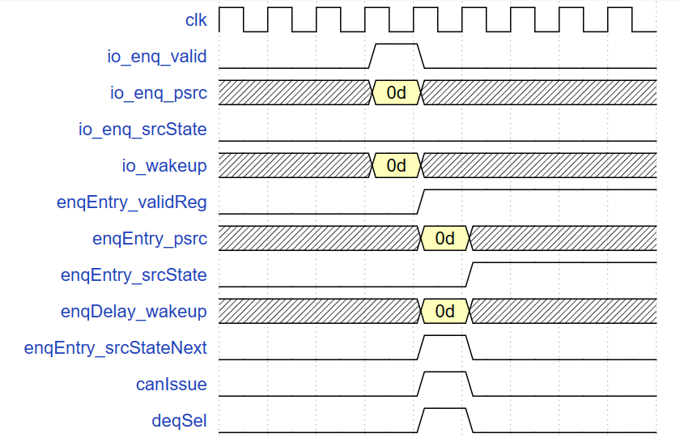

# IssueQueueEntries

- 版本：V2R2
- 状态：OK
- 日期：2025/01/20
- commit：[xxx](https://github.com/OpenXiangShan/XiangShan/tree/xxx)

## 术语说明

Table: 术语说明

| 缩写 | 全称 | 描述 |
| --- | --- | --- |
| IQ | IssueQueue | 发射队列 |

## 设计规格

- 支持三类发射队列项：EnqEntry、SimpleEntry和ComplexEntry
- 支持双端口读写
- 支持写回唤醒和推测唤醒
- 支持EnqEntry直接出队
- 支持Entry间指令转移
- 支持唤醒取消反馈

## 功能

### 总体功能

Entries 是发射队列中存放 uop 的模块，它内部有多个 entry 模块，每个 entry 可以存放一条 uop。这些 entry 可以分为两大类：与发射队列入队端口对应的 EnqEntry，以及数量较多的 OthersEntry。
Entries 整合所有 entry 的发射和状态信息，传给发射队列控制逻辑；接收控制逻辑的选择结果，输出要发射 uop 的全部信息。
Entries 接受来自 IQ（自身 IQ 或其它 IQ 的快速唤醒）和 WriteBack（写回唤醒）的唤醒信号、来自 datapath 等的取消信号（og0Cancel、og1Cancel 等），接受并整合发射后的反馈信号，送给每个 entry。
Entries 还负责 entry 之间的转移逻辑。EnqEntry 接收 IQ 入口的 uop，如果 OthersEntry 就绪，它会以一定规则转移到 OthersEntry 中，EnqEntry 支持当拍同时转移出上一个 uop 并入队下一个 uop，实现无缝衔接。
在高级的发射队列配置中，OthersEntry 又分为两类：SimpleEntry 与 ComplexEntry。Entries 也负责控制从 SimpleEntry 到 ComplexEntry 的转移策略。

### 转移策略
ComplexEntry 是最终的项，不可转移；SimpleEntry 可向 ComplexEntry 转移；EnqEntry 可向 ComplexEntry 也可向 SimpleEntry 转移。
只有没有被发射过的项才可被转移，如果发射过的项反馈发射失败了，会清掉发射过的标记，就变成可被转移的项；如果发射过的项反馈发射成功了，该项会变成无效项，不需要再转移了。
EnqEntry 到 OthersEntry 的转移逻辑。EnqEntry 优先转移到 ComplexEntry，其次转移到 SimpleEntry。转移只能是全或者零，要么全部转移到 ComplexEntry，要么全部转移到 SimpleEntry，要么就不转移。EnqEntry 转移到ComplexEntry 的条件是，ComplexEntry 里有足够的空闲项，同时 SimpleEntry 全空；否则只能向 SimpleEntry 转移。
SimpleEntry 到 ComplexEntry 的转移逻辑。每个周期，SimpleEntry 可至多转移 num_enq（相当于EnqEntry数量）项到 ComplexEntry，只要 ComplexEntry 每有一个空位，就可以转移过去一条。SimpleEntry 转移的优先级比 EnqEntry 更高。SimpleEntry 转移次序有强要求，更老的项更优先转移。各项年龄次序通过查询 IQ 中的年龄矩阵得到。

### 发射与出队
Entries 收集各个 entry 的 valid 与 canIssue 信号，传递给 IQ，IQ 返回各个出队口选择出要出队的 entry 位置 deqSelOH，以及各个出口能否接受的 deqReady 信号，现在 deqReady 是常数值，一直拉高。两者同时有效时，认为该 entry 将出队，把 deqSel 信号传给该 entry。
收到 deqSel 后 entry 还不能清空，只是标记为已发射状态，记录发射的端口和发射后经过的周期，之后还要看发射后后续返回的 resp 信号，只有收到发射成功的 resp 后才能清空。
Entries 负责汇总各个 resp，将对应的 resp 传给 entry。非访存 IQ 的 entry 的 resp 只有 og0resp 和 og1resp，根据各 entry 的出队端口和发射后经过的周期来选择 resp。Entry 和 robIdx 和 resp 的 robIdx 一致时，选择对应的 resp 传给 entry。
访存 IQ 的 resp 较多，不同访存 IQ 的 resp 也有所区别，需要比对 lqidx 和 sqidx 来选择 resp。
发射时还要将选中 entry 的 uop 信息传给 IQ，因为时序原因不直接使用 deqSelOH 来选择。deqSelOH 的各bit形成时间差别较大，为了能减少延迟，IQ 会传进各阶段选择结果，包括 enqEntryOldest、simpEntryOldest、compEntryOldest 的结果。用三组信号分别选出对应的出队 uop，再按 comp、simp、enq 的优先级选出最终出队 uop。

### 唤醒与取消
Entries 不处理唤醒逻辑，只将唤醒和取消信号传入所有 entry。由于时序原因，Entries 也负责处理当拍的取消逻辑。取消的来源延迟较长，如果正常经过唤醒、取消，再给 IQ 进行出队选择，时序就太差了。因此我们将只经过当拍唤醒的结果给 IQ 进行出队选择，然后由 Entries 单独计算当拍取消，最后再对各个出口选出要出队的 uop 进行取消判断。

## 整体框图

## 接口时序

io_* 信号组为 IQ 入队指令，每拍至多两条，同时伴随着可能的唤醒信号。
基于时序考虑，对入队指令被同时唤醒这种情况的处理，选择将 wakeup 打一拍，见图中 enqDelay_wakeup，为了对上拍，这部分唤醒会类似推测唤醒的 bypass 时序，影响 srcStateNext，即影响 canIssueBypass，类似 ComplexEntry 的当拍唤醒当拍发射。

## 二级模块 EnqEntry & OthersEntry

### 功能

EnqEntry 和 OthersEntry 功能基本一致，EnqEntry 因为直接对接入队端口，会多一层入队唤醒的处理，其余功能一致，因此放到一起描述。
Entry 有这几个最重要功能：valid、canIssue、issued、status。
Valid 表示 entry 是否有效，有 uop 进入 entry 时，将 enq 中的 uop 信息写入寄存器，将 valid 置为有效。
当 flush、tranSel 有效或者 issueResp 表示发射成功这三个条件之一成立时，entry 清空，valid 置无效。
Issued 记录 uop 是否发射，当 deqSel 有效时记为已发射；收到 issueResp 失败或者有操作数被 cancel 而不再就绪时，记为未发射。
当所有源操作数就绪，且是未发射状态，将 canIssue 输出为有效。
Status 是描述源操作数状态的一系列信息，包括操作数类型 srcType、状态 srcState、数据来源 dataSources、唤醒该操作数的 load 信息 srcLoadDependency、唤醒该操作数的 exu 信息 srcWakeUpL1ExuOH、唤醒后周期计数器 srcTimer。
wakeUpFromWB 和 wakeUpFromIQ 传递要唤醒的 pdest 和寄存器类型 xp、fp、vp，如果 pdest 号与 entry 操作数的寄存器号一致，寄存器类型也一致，该操作数被唤醒，记为就绪状态。
og0Cancel、og1Cancel 传递要取消的 exu 号。对于 og*Cancel 如果要取消的 exu 与唤醒该操作数的 exu 一致，且 srcTimer 对应发出的流水级延迟，则取消该操作数。对于 ldCancel，如果要取消的 ld 流水级与 srcLoadDependency 一致，取消该操作数。
当同一操作数唤醒和取消同时达到时，取消的优先级更高。
Entry 向外输出的源操作数状态信息有立刻和延迟两种，对应快速和慢速唤醒。立刻指源操作数状态信息从寄存器获取后，经过上述唤醒与取消更新状态之后当拍立刻输出；延迟指源操作数状态信息经过上述唤醒与取消更新状态之后，写回寄存器，下一拍才能从寄存器输出。
WB 唤醒总是慢速的，而 IQ 唤醒可配置快速和慢速。配置为快速的称为 ComplexEntry，配置为慢速的称为 SimpleEntry。EnqEntry 理论上也可配置，但实际中总是快速的。
EnqEntry 区别于 OthersEntry 的地方在于要多一次入队唤醒。入队时的唤醒与取消因为时序原因不好在写入 EnqEntry 前做，因此延迟到写入 EnqEntry 下拍开头，先使用延迟的唤醒与取消信号（enqDelay*）更新寄存器直出的状态，再进行正常的唤醒与取消。注意入队唤醒只在 uop 进入 EnqEntry 的第一拍进行，此后都是直接使用寄存器直出的状态。

总结：
1. Entry 是 IssueQueue 内部存储 uop 关键信息的结构，可类比 RS。
2. 昆明湖的整数 IssueQueue 标准设计规格下有24项Entry。
3. Entry 按照行为逻辑分为三类：EnqEntry，SimpleEntry 和 ComplexEntry。
4. 2 个 EnqEntry，作为入队端口，每周期进入 IQ 的两条指令只能存入这里。
5. 6 个 SimpleEntry + 16 个 ComplexEntry。

### 整体框图

imm存放立即数，payload存放指令原始信息，entry不对其进行处理。

srcStatus 指示各项 uop 各源操作数的状态。
issued 指示 uop 的发射状态，因为发射可能成功可能失败，发射直到成功才能修改 validReg，所以使用 issued 来标记在不在发射途中。

issueTimer 和 deqPortIdx 的存在是为了适配 entry 转移机制，指令发射出去后，要经过 OG0 和 OG1 两级，只有通过 OG1 进入 EXU 的 uop 才算发射成功，中途如果失败了就需要告知 IQ 重发，无转移机制的情况下，uop 可以通过 entryIdx 进行定位；有了转移机制后，uop 发射出去后，可能下一拍就转移至其他位置，这样 OG0/1 的 resp 信号就难以定位，所以增加 issueTimer 和 deqPortIdx 信号，一旦 uop 发射出去，就修改 issueTimer 并每拍自增，deqPortIdx 记录其从哪个出队端口发出，根据上图的时序关系，OG0 和 OG1 的 resp 只需要识别各 Entry 内部的这两个信号值，即可定位 uop。

唤醒 --> 修改srcState
srcWakeupL1ExuOH --> 标记推测唤醒信号来自哪个 exu

写回唤醒在 uop 执行的最后一拍发出，被写回唤醒的项不支持当拍唤醒当拍发射。

dataSource 用于推测唤醒场景
写回唤醒直接置为 reg
推测唤醒当拍 --> forward
每多停留一拍修改一次，最后维持 reg
forward --> bypass --> reg --> reg

srcLoadDependency 3 bit，用于记录各 uop 的 Load 依赖关系。
ldCancel 产生时，刷掉唤醒链上的全部 uop。

