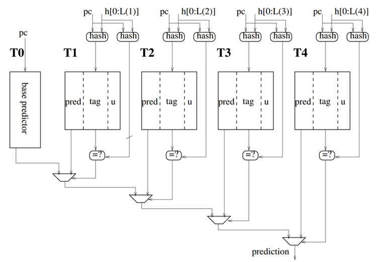
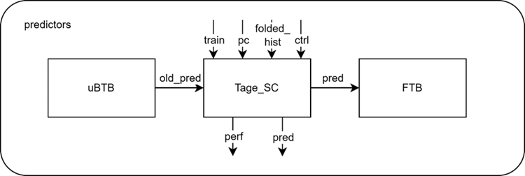

# BPU 子模块 TAGE-SC

## 功能

TAGE-SC 是南湖架构条件分支的主预测器，属于精确预测器（Accurate Predictor，简称 APD）。其中 TAGE 利用历史长度不同的多个预测表，可以挖掘极长的分支历史信息；SC 是统计校正器。

TAGE 由一个基预测表和多个历史表组成，基预测表用 PC 索引，而历史表用 PC 和一定长度的分支历史折叠后的结果异或索引，不同历 史表使用的分支历史长度不同。在预测时，还会用 PC 和每个历史表对应的分支历史的另一种折叠结果异或计算 tag，与表中读出的 tag 进行匹配，如果匹配成功则该表命中。最终的结果取决于命中的历史长度最长的预测表的结果。

当 SC 认为 TAGE 有较大的概率误预测时，它会反转最终的预测结果。

在南湖架构中，每次预测最多同时预测 2 条条件分支指令。在访问 TAGE 的各个历史表时，用预测块的起始地址作为 PC，同时取出两个预测结果，它们所用的分支历史也是相同的。

### TAGE：设计思路

TAGE 作为一种混合式预测器，其优势在于可以同时根据不同长度的分支历史序列，对某一个分支指令分别进行分支预测，并且对在该分支指令在各个历史序列下的准确率进行评估，并且选择历史准确率最高者作为最终分支预测的判断标准。

相较于传统的混合式预测器，TAGE 兼具下两个新的设计特性，使得其预测准确率得到可观的提升：

- 对于每个预测表中的表项添加了 tag 数据。在传统的优先分支预测器中，往往仅采用分支历史以及当前分支指令的 PC 值作为依据来对预 测表进行取指。这种情况会导致多条不同的分支指令指向同一个预测表表项的情况(aliasing)产生，而这种情况对混合式预测器中采取的分支历史长度较短的部分预测表所给出的分支预测准确率影响尤为显著。因此，在 TAGE 的设计中，通过 partial tagging 的方法，可以更 好地将当前指令与预测表中的表项进行实际的匹配，从而较大程度地避免上述情况的产生。
- 采用几何级数变化的分支历史长度来索引不同的预测表，从而使得在分支预测过程中对各个预测表中的表项选择过程的粒度得到了很大的提升。除此之外，在每个表项中还添加了一个 usefulness 计数器，用于记录该表项对于分支预测的有用程度。通过这种设计，各类分支指令都有更高的几率藉由预测准确率最高的分支历史长度进行索引来做出最终的分支预测。

以上两个设计特性使得 TAGE 预测器既不会因为所选取的历史分支长度过短而使得某个预测表中的表项同时映射到多条不同的指令从而降低表项的信息有效程度，也不会因为选取的历史长度分支过大而使得整个 TAGE 需要经过很长时间的更新之后才能够发挥有效的预测功能。因此，TAGE 所可采用的分支历史长度范围非常大，可以用于判断各种代码语境下的分支指令。

### TAGE：硬件实现

TAGE 是高精度条件分支方向预测器。使用不同长度的分支历史和当前 PC 值寻址多个 SRAM 表，当在多个表中出现命中时，优先选择最 命中的历史长度最长的对应表项的预测结果作为最终结果。

TAGE 的结构原理图如上图所示，提供了一个基准预测器 T0 和四个带 tag 的预测表 T1-T4，基准预测器和带 tag 的预测表的基本信息见下表。

| **预测器**    | **是否带 tag** | **作用**                                               | **表项构成**                                                                                    | **项数**         |
| ------------- | -------------- | ------------------------------------------------------ | ----------------------------------------------------------------------------------------------- | ---------------- |
| 基准预测器 T0 | 否             | 用于在四个局部 tag 预测表的 tag 均不匹配时提供预测结果 | ctr 2bits（最高位给出预测结果，1 跳转，0 不跳转）                                               | set 2048way 2    |
| 预测表 T1-T4  | 是             | 存在 tag 匹配时，选历史长度最长者提供预测结果          | valid 1bittag 8bitsctr 3bits（最高位给出预测结果，1 跳转，0 不跳）us: 1bit（usefulness 计数器） | T1-T4 各 4096 项 |

注：上表中的 way 是 chisel 里 SRAMTemplate 类的参数名字，这个参数的值表达在 SRAM 里面存储几份同样类型的数据，不一定代表通常意义 上的需要 tag 匹配的 way。T0 有两个 way 是因为预测块内最多两条分支指令，不同的 way 是为了分别对预测块内两条不同的分支指令进行预测。

每个预测块的两条跳转指令的预测内容是分开存储、分开 update 的。带 tag 的预测表 T1-T4 的 4096 项要平均分成两个 bank 分给预测块内最多两条分支，每个 bank 有 2048 项，所以预测表 T1-T4 的 index 只有 11bit，是 log2（预测表的项数/2）。同一个预测块中的两条分支指令的 index 是相同的，但是索引的是两个不同的 bank，一次读出来的来自两个 bank 代表两条预测信息的结果可能会出现一个是 hit，一个没有 hit。

TAGE 类预测器的每一个预测表都有特定的历史长度。为了让原本很长的全局分支历史表能够与 PC 异或后进行预测表的索引或 tag 匹配，原 本很长的分支历史序列需要被分成很多段，然后全部异或起来。每一段的长度一般等于历史表深度的对数。由于异或的次数一般较多，为了避免预测路径上多级异或的时延，我们会直接存储折叠后的历史。

每个预测表对应的折叠分支历史都有三份，一份用于索引预测表，两份用于 tag 匹配。在 BPU 模块中维护了一个 256 比特的全局分支历史 ghv，并为 TAGE 的 4 个带 tag 的预测表分别维护了各自的折叠分支历史。具体配置见下表（见 TageTableInfos），其中 ghv 是一个循环队列，"低"n 位指的是从 ptr 指示的位置算起的低位：

| **历史**            | **index 折叠分支历史长度** | **tag 折叠分支历史 1 长度** | **tag 折叠分支历史 2 长度** | **设计原理**                     |
| ------------------- | -------------------------- | --------------------------- | --------------------------- | -------------------------------- |
| 全局分支历史 ghv    | 256 比特（非折叠）         | 无                          | 无                          | 每比特代表对应分支跳转与否       |
| T1 对应折叠分支历史 | 8 比特                     | 8 比特                      | 7 比特                      | ghv 取 ptr 起低 8 比特折叠异或   |
| T2 对应折叠分支历史 | 11 比特                    | 8 比特                      | 7 比特                      | ghv 取 ptr 起低 13 比特折叠异或  |
| T3 对应折叠分支历史 | 11 比特                    | 8 比特                      | 7 比特                      | ghv 取 ptr 起低 32 比特折叠异或  |
| T4 对应折叠分支历史 | 11 比特                    | 8 比特                      | 7 比特                      | ghv 取 ptr 起低 119 比特折叠异或 |

如上图所示，出于时序考虑，折叠分支历史的具体实现方式并不是设计原理中的折叠，而是把折叠前的分支历史最老的那一位（图中对应 h[12]）和最新的一位（图中对应 h[0]）异或到相应的位置（图中对应 c[1]和 c[4]），再做一个移位操作（图中对应变为 c[0]和 c[2]）即 可，伪代码如下所示：

c[0] \<= c[4] ^ h[0];

c[1] \<= c[0];

c[2] \<= c[1] ^ h[12];

c[3] \<= c[2];

c[4] \<= c[3];

分支历史表不只会在后端提交之后更新，s1~s3 中间每一级都有可能更新，更新时更新的是 pointer 和值。如果在 s1~s3 产生了新的结果就 会恢复 pointer，更新新的值.但是如果预测没有错误就不会修改（因为之前已经更新过了）。

注：由 TAGE 的折叠分支历史具体配置表可见，tag 折叠分支历史有 2 个。二者都是使用相同的折叠算法，区别只是在于折叠长度不同，T1-T4 的 tag 折叠分支历史 1 都为 8 比特，而 tag 折叠分支历史 2 都为 7 比特。

### TAGE：预测时序

在每次进行预测时，首先在每个带 tag 的预测表中使用 pc 值以及各自的分支历史进行两种不同的哈希函数计算（见下表），计算结果分别 用于计算该运算的最终 tag 以及对预测表的索引。

|       | 计算方式                                                             |
| ----- | -------------------------------------------------------------------- |
| Index | （index 折叠分支历史）^（（pc>>1）的低位）                           |
| Tag   | （tag 折叠分支历史 1）^（tag 折叠分支历史 2<<1）^（（pc>>1）的低位） |

若 T1-T4 中索引所得到的 valid 为 1，且 tag 与计算 tag 哈希函数得到的结果匹配，则该预测表中给出的 pred 最高位被加入最终的分支预判序 列。最终，通过多级 MUX，可以从所有 tag 匹配的分支预判中选择历史长度最长者作为最终预测结果。

若 T1-T4 无匹配，则采用 T0 为最终的预测结果。T0 的索引方式为直接用 pc 的低 11 位进行索引。

TAGE 需要 2 拍延迟：

- 0 拍生成 SRAM 寻址用 index。index 的生成过程就是把折叠历史和 pc 异或，折叠历史的管理不在 ITTAGE 和 TAGE 内部，而在 BPU 里
- 1 拍读出结果
- 2 拍输出预测结果

  ### TAGE：预测器训练

首先，定义所有产生 tag 匹配的预测表中所需历史长度最长者为 provider，而其余产生 tag 匹配的预测表（若存在的话）被称为 altpred。

TAGE 表项中包含一个 usefulness 域，当 provider 预测正确而 altpred 预测错误时 provider 的 usefulness 置 1，表示该项是一个有用的项，便不会被训练时的分配算法当作空项分配出去。当 provider 产生的预测被证实为一个正确的预测，且此时的 provider 与 altpred 的预测结果 不同，则 provider 的 usefulness 域被置
若分支指令实际是跳转，则将对应 provider 表项的 ctr 计数器自增 1；若分支指令实际是不跳转，则将对应 provider 表项的 ctr 计数器自减
若由于误预测导致 TAGE 表项需要更新，且误预测不是由使用 altpred 而抛弃了正确的 provider 导致的，则说明需要增添表项。但此时并不 一定真的能够增添表项。还需要满足 provider 所源自的预测表并非所需历史长度最长的预测表，则此时执行表项增添操作。

这里从逻辑上举一个判断是否满足 provider 所源自的预测表并非所需历史长度最长的预测表的例子：

s1_providers(i)表示预测块中第 i 条分支的 provider 对应的预测表序号，假设 provider 在预测表 T2 中，则 LowerMask(UIntToOH(s1_providers(i)), TageNTables)为 0b0011。 s1_provideds(i)表示预测块中第 i 条分支的 provider 是否在 T1~T4，根据刚刚的假设，Fill(TageNTables, s1_provideds(i).asUInt)为 0b1111，二者相与，得到结果为 0b0011，再取反得到 0b1100，于是可以看出 T3、T4 都是比 provider 历史长度更长的预测表。

再举一个例子。在最开始，预测表都是空的，不存在 provider，此时对应的 s1_providers(i)为 0， s1_provideds(i)为 false，则此时 Fill(TageNTables, s1_provideds(i).asUInt)为 0b0000，二者相与取反一定得到 0b1111，说明 T1~T4 都属于所谓的比 provider 历史长度 更长的预测表。

具体的表项增添操作如下：

表项增添操作会首先读取所有历史长度长于 provider 的预测表的 usefulness。若此时有某表的 usefulness 域值为 0，则在该表中分配一对 应的表项；若没有找到满足 usefulness 域值为 0 的表，则分配失败。当有多个预测表（如 Tj,Tk 两项）的 usefulness 域均为 0 时，表项的分配概率是随机的，分配的时候随机把某些 table 给 mask 掉，让它不会每次都分配同一个。这个 mask 的具体实现是：待选的历史表中（长度 大于 provider 且 u 为 0 的所有历史表），使用产生的随机数随机将一些表屏蔽掉，如果 maskedEntry 的第一个不可用，那么选没 mask 的第一个。这里的表项分配的随机性是通过 chisel 的 util 包里的 64 位线性反馈移位寄存器原语 LFSR64 生成伪随机数来实现的，在 verilog 代码中 对应 allocLFSR_lfsr 寄存器。在训练时，用 7bit 饱和计数器 bankTickCtrs 统计分配失败次数-成功次数，当分配失败的次数足够多，bankTickCtrs 计数器计数到满达到饱和时，触发全局 useful bit reset，把所有的 usefulness 域清零。

最后，在初始化时/TAGE 表分配新项时，所有的表项中的 ctr 计数器均被设置为 0，所有的 usefulness 域均被设置为 0。

注：同一个预测块中的两条分支指令对应的 usefulness 不一定是相等的，如果 altpred 的第一条分支预测跳转，第二条分支预测不跳转，provider 的都预测跳转，就只有第一个 u 要置一。

注：meta 是预测器预测的时候的数据，update 的时候拿回来更新用。都叫 meta 是因为 composer 将所有预测器整合起来，用共同的接口 meta 和外界交互。TAGE 的 meta 具体构成见下图：

### TAGE：备选预测逻辑（USE ALT ON NA）

当 tag 匹配的项的置信度计数器 ctr 为 0 时，altpred 有时比正常预测更准确。因此在实现中使用一个 4-bit 计数器 useAltCtr，动态决定是否在最长历史匹配结果信心不足时使用备选预测。在实现中处于时序考虑，始终用基预测表的结果作为备选预测，这带来的准确率损失很小。

备选预测逻辑的具体实现如下：

ProviderUnconf 表示最长历史匹配结果的信心不足。当 provider 对应的 ctr 值为 0b100、0b011 时，说明最长历史匹配结果的信心很足，此 时 providerUnconf 为 false；当 provider 对应的 ctr 值为 0b01、0b10 时，说明最长历史匹配结果的信心不足，此时 providerUnconf 为 true。

useAltOnNaCtrs 是 128 个 4-bit 饱和计数器构成的计数器组，每个计数器都被初始化为 0b1000。在 TAGE 收到训练更新请求时，如果拿来训练的预测中，发现 provider 的预测结果与 altpred 不同，且 provider 的预测结果信心不足，则讨论备选预测结果是否正确。如果备选预测结 果正确而 provider 错误，则对应 useAltOnNaCtrs 计数器的值+1；若备选预测结果错误而 provider 正确，则对应 useAltOnNaCtrs 计数器的值-1。因为 useAltOnNaCtrs 是饱和计数器，所以当 useAltOnNaCtrs 值已经为 0b1111 且正确或已经为 0b0000 且错误时，useAltOnNaCtrs 的值不变。

useAltOnNa 是利用 pc(7, 1)，即 pc 的对应低位索引 useAltOnNaCtrs 计数器组后得到的计数结果的最高位。

当 providerUnconf && useAltOnNa 为真时，使用备选预测结果（即基预测表的结果）为 TAGE 最终的预测结果，而不是 provider 的预测结果。

### TAGE：wrbypass

Wrbypass 里面有 Mem，也有 Cam，用于给更新做定序，每次 TAGE 更新时都会写进这个 wrbypass，同时写进对应预测表的 sram。每次更新的时候会查这个 wrbypass，如果 hit 了，那就把读出的 TAGE 的 ctr 值作为旧值，之前随 branch 指令带到后端再送回前端的 ctr 旧值就不要了。这 样如果一个分支重复更新，那 wrbypass 可以保证某一次更新一定能拿到相邻的上一次更新的最终值。

T0 有一个对应的 wrbypass，T1~T4 各有 16 个。每个预测表对应的 wrbypass 中，Mem 都有 8 个 entry，T0 每个 entry 存储 2 个（对应两个 bank）预测表的表项，T1~T4 每个 entry 存储 1 个（因为 2 个 bank 存在不同的 wrbypass 里）预测表的表项 ；Cam 有 8 个 entry，输入更新的 idx 和 tag（T0 没有 tag）就可以读到对应数据在 Cam 中的位置。Cam 和 Mem 是同时写的，所以数据在 Cam 中的位置就是在 Mem 中的位置。于是利用这个 Cam， 我们就可以在更新的时候查看对应 idx 的数据是否在 wrbypass 中。

### 存储结构

- 4 张历史表，每张表根据 pc 低位分了共 8 个 bank，每个 bank 有 256 个 set，每个 set 对应一个 FTB 项的最多 2 条分支。每个 bank 共 512 项，每张表共 4096 项，所有表共 16K 项
- 每个表项含有 1bit valid，8bit tag，3bit ctr，1bit useful；其中 useful bit 独立存储
- base table 有 2048 set，每 set 两条分支各一个 2bit 饱和计数器，共记录 4K 条分支
- 历史表每个 bank 有 8 项的写缓存 wrbypass，base table 共有 8 项的 wrbypass
- use_alt_on_na 预测共 128 个 4 bit 饱和计数器

### 索引方式

- index = pc[11:1] ^ folded_hist(11bit)
- tag = pc[11:1] ^ folded_hist(8bit) ^ (folded_hist(7bit) << 1)
- 历史采取基本的分段异或折叠
- 每项两条分支和 FTB 两个 slot 之间的两种对应关系，用 pc[1]选取，由于 FTB 项的建立机制，第一个 slot 的使用率会大于第二个，此举可以缓解这种分布不均的情况
- base table 和 use_alt_on_na 都直接使用 pc 低位索引

### 预测流程

- s0 进行索引计算，地址送入 SRAM，仅有对应的 bank 被使能
- s1 进行 tag 匹配和 bank 数据选取，以及两个 slot 间的重排序，得到每张历史表的总结果，传到顶层进行最长历史选取，结合 use_alt_on_na 机制，在最长历史匹配和 base table 之间进行选取（将原算法简化为始终用 base table 作为备选预测），得到每条分支的预测结果后暂存至 s2
- s2 使用预测结果，在 BPU 内和 s1 结果进行比对，判断是否需要冲刷流水线

### 训练流程

收到来自 FTQ 的训练请求后，根据预测时记录的信息进行更新，更新流程分为两个流水级，其中第一个流水级在历史表外部判断一些更新条件，细节如下：

- provider 更新：预测时命中的最长历史表会进行更新
  - 当备选预测和它不同时，按 provider 是否正确，决定新的 useful bit
  - 根据实际方向决定 ctr 的加减
- alloc：当误预测，且排除以下情况（provider 正确，但预测时选择了错误的备选预测结果）时进行分配
  - 分配时根据预测时记录的所有历史表的 useful bit 信息生成 mask，用随机数 LFSR 随机 mask 掉一些 bit，判断是否仍有比 provider 更长的历史表空余项？
    - 如有，使用其中最短历史的项
    - 如无，用 LFSR mask 前，历史长于 provider 的最短历史的可分配项
- useful reset 计数器：根据分配成功/失败的净次数增减一个 8bit 饱和计数器，如失败次数过多以至饱和，清除所有的 useful bit
  - 记比 provider 长的历史表个数为 n，其中 useful bit 为 0 的视为分配成功，反之视为失败，两者次数之差作为此次增减的绝对值
- use_alt_on_na 训练：当 provider 的 ctr 为两个最弱的值，且备选预测和 provider 方向不同时，根据备选预测的正确与否，增减 pc 低
位索引的的 use_alt_on_na 饱和计数器

第二个流水级将更新请求发入各个预测表内部，尝试写入 SRAM

- 其中 ctr 的旧值可能来自很久以前的预测内容，也许和现在表内 ctr 的情况已经大相径庭，为解决此问题，引入 wrbypass 机制：
  - wrbypass 是 TAGE table 的全相联写缓存，每当尝试写入时，首先根据历史表的索引查询此全相联表，若命中，将对应的内容当作旧 ctr，根据对应的跳转方向更新后，同时写入 SRAM 和 wrbypass，如果不命中，根据替换算法选取一项替换
  - 每个 bank 有一个对应的 8 项全相联 wrbypass，每个 table 共 64 项
- 由于使用了单口 SRAM，不能同时处理读写请求，故为了避免读写冲突：
  - 使用分 bank 的做法
  - 当饱和且新值等于旧值时，不写入
- 当仍然发生了读写冲突时，处理写请求，但不阻塞读请求，使用读结果时默认当作 not hit，此举可能降低准确率

### SC：设计思路

一些应用上，一些分支行为与分支历史或路径相关性较弱，表现出一个统计上的预测偏向性。对于这些分支，相比 TAGE，使用计数器捕捉统计偏向的方法更为有效。TAGE 在预测非常相关的分支时非常有效，TAGE 未能预测有统计偏向的分支，例如只对一个方向有小偏差，但 与历史路径没有强相关性的分支。

SC 统计校正的目的是检测不太可靠的预测并将其恢复。SC 负责预测具有统计偏向的条件分支指令并在该情形下反转 TAGE 预测器的结果。

### SC：硬件实现

SC 共维护了 4 个预测表，预测表的具体参数见下表。

| 序号 | 项数 | ctr 长度 | 折叠后历史长度 | 设计原理                        |
| ---- | ---- | -------- | -------------- | ------------------------------- |
| T1   | 512  | 6        | 0              | ghv 取 ptr 起低 0 比特折叠异或  |
| T2   | 512  | 6        | 4              | ghv 取 ptr 起低 4 比特折叠异或  |
| T3   | 512  | 6        | 8              | ghv 取 ptr 起低 10 比特折叠异或 |
| T4   | 512  | 6        | 8              | ghv 取 ptr 起低 16 比特折叠异或 |

### SC：预测时序

SC 收到来自 TAGE 的预测结果 pred 和 ctr、来自 BPU 的折叠分支历史信息和 pc，根据（（index 折叠分支历史）^（（pc>>1）的低位））索 引 SC 预测表，根据 SC 预测表的结果 ctr 和 TAGE 的预测结果 pred 和 ctr 动态判定（见 HasSC）是否反转 TAGE 的预测。

SC 的动态判定具体逻辑如下：

SC 中实现了 2 个 bank 的 scThresholds 寄存器组，2 个 bank 是为了和 TAGE 的 2 个 bank 对应，都是因为一个预测块内最多会有两条分支指令。SC 中动态判定的寄存器组一共就是这两个。每个 bank 的 scThresholds 中有一个 5 比特的饱和计数器 ctr（初始值为 0b10000）和一个 8 比特的 thres（初始值为 6）。为了以示区别，我们后面用 tage_ctr、sc_ctr、thres_ctr 来分别表示 TAGE 传给 SC 的 ctr、SC 自己的 ctr、scThresholds 中的 ctr。

scThresholds 的更新：当 SC 收到训练数据时，如果当时 SC 翻转了 TAGE 的预测结果，且(sc_ctr_0*2+1)+(sc_ctr_1*2+1)+(sc_ctr_2*2+1)+(sc_ctr_3*2+1)+(2*(tage_ctr-4)+1)*8（有符号进位加）后取绝对值后在[thres-4, thres-2]的范围内，则 scThresholds 会被更新。

- scThresholds 中 ctr 的更新：若预测正确，则 thres_ctr+1；若预测错误，则 thres_ctr-1；若 thres_ctr 已为 0b11111 且预测正确，或 thres_ctr 已为 0b00000 且预测错误，则 thres_ctr 保持不变。
- ScThresholds 中 thres 的更新：若 thres_ctr 更新后的值已达 0b11111 且 thres<= 31，则 thres+2；若 thres_ctr 更新后的值为 0 且 thres>=6，则 thres-2。其余情况 thres 不变。
- Thres 更新判断结束后，会对 thres_ctr 再做一次判断，若更新后的 thres_ctr 若为 0b11111 或 0，则 thres_ctr 会被置回初始值 0b10000。

设定 scTableSums 为 (sc_ctr_0*2+1)+(sc_ctr_1*2+1)+(sc_ctr_2*2+1)+(sc_ctr_3*2+1) （有符号进位加），tagePrvdCtrCentered 为 (2*(tage_ctr-4)+1)*8（有符号进位加），totalSum 为 scSum+tagePvdr（有符号进位加）。若 scTableSums>(有符号的 thres - tagePrvdCtrCentered)并且 totalSum 为正，或者 scTableSums<(-有符号的 thres - tagePrvdCtrCentered)并且 totalSum 为负，都 说明已经超过了阈值，翻转 TAGE 的预测结果，否则仍使用 TAGE 的预测结果不变。

SC 的预测算法依赖 TAGE 里面的是否有历史表 hit 的信号 provided，以及 provider 的预测结果 taken，从而来决定 SC 自己的预测。provided 是使用 SC 预测的必要条件之一，provider 的 taken 作为 choose bit，选出 SC 最终的预测，这是因为 SC 在 TAGE 预测结果不同的场景下可能有不同的预测。

sc 反转 TAGE 的预测结果会造成 TAGE 表增添新项。

SC 需要 3 拍延迟：

- 0 拍生成寻址 index 得到索引 s0_idx
- 1 拍读出 SCTable 对应 s0_idx 的计数器数据 s1_scResps
- 2 拍根据 s1_scResps 选择是否需要反转预测结果
- 3 拍输出完整的预测结果

### SC：Wrbypass

Wrbypass 里面有 Mem，也有 Cam，用于给更新做定序，每次 SC 更新时都会写进这个 wrbypass，同时写进对应预测表的 sram。每次更新的时候会查这个 wrbypass，如果 hit 了，那就把读出的 SC 的 ctr 值作为旧值，之前随 branch 指令带到后端再送回前端的 ctr 旧值就不要了。这样如 果一个分支重复更新，那 wrbypass 可以保证某一次更新一定能拿到相邻的上一次更新的最终值。

SC 的 T1~T4 各有 2 个 wrbypass，每个预测表的 wrbypass 中，Mem 都有 16 个 entry，每个 entry 存储 2 个预测表的表项；Cam 有 16 个 entry，输入更新的 idx 就可以读到对应数据在 Cam 中的位置。Cam 和 Mem 是同时写的，所以数据在 Cam 中的位置就是在 Mem 中的位置。于是利用这个 Cam，我 们就可以在更新的时候查看对应 idx 的数据是否在 wrbypass 中。

### SC：预测器训练

sc_ctr（见 signedSatUpdate）是一个 6 比特的有符号饱和计数器，在指令实际 taken 后+1，nottaken-1，计数范围是[-32，31]。

注：meta 是预测器预测的时候的数据，update 的时候拿回来更新用。都叫 meta 是因为 composer 将所有预测器整合起来，用共同的接口 meta 和外界交互。SC 的 meta 具体构成见下图：

## 整体框图

## 接口时序

s0 输入 pc 和折叠历史时序示例

上图示意了 s0 输入 pc 和折叠历史时序的示例，当 io_s0_fire 为高时，输入的 io_in_bits 数据有效。

### 存储结构

- 4 张表，历史长度分别为 0、4、10、16，每张表有 256 项，每项中是 4 个 6 bit 宽的饱和计数器，其中 4 个饱和计数器分别对应 2 条分支*TAGE 的 2 种预测结果（T/NT）。每张表共 1024 个计数器，存储开销 3KB
- 每张表有 16 项的写缓存 wrbypass
- 2 个 threshold 寄存器，分别对应一个 slot 的分支。每个 threshold 有 8bit 宽的阈值饱和计数器，以及 5bit 的增减缓冲饱和计数器

### 索引方式

- index = pc[8:1] ^ folded_hist(8bit)
- 历史采取基本的分段异或折叠
- 每项两条分支和 FTB 两个 slot 之间的两种对应关系，用 pc[1]选取，由于 FTB 项的建立机制，第一个 slot 的使用率会大于第二个，此举可以缓解这种分布不均的情况

### 预测流程

- s0 进行索引计算，地址送入 SRAM
- s1 读出饱和计数器，进行 slot 间的重排序，对应 TAGE 两种预测结果的 SC ctr 传到顶层分别做加法，结果寄存到 s2
- s2 将 SC 的 ctr 和与 TAGE 的 provider ctr 做加法，得到最终结果，取绝对值，若大于阈值，且 TAGE 也有 hit，用加法结果的符号作为最终预测的方向，寄存到 s3
- s3 使用方向结果，在 BPU 内和 s2 结果进行比对，判断是否需要冲刷流水线

### 训练流程

收到来自 FTQ 的训练请求后，根据预测时记录的信息进行更新，更新流程分为两个流水级，其中第一个流水级在历史表外部判断一些
更新条件，细节如下：

- 若预测时 TAGE 命中，根据预测时存下的旧 SC ctr 与旧 TAGE ctr 再次做加法，和更新所用的阈值（预测阈值*8+21）比对，若小于阈值，或者此时预测结果和执行方向不符，则根据 perceptron 训练规则训练每个计数器，请求寄存到下一拍发送给每张表

第二个流水级将更新请求发入各个预测表内部，尝试写入 SRAM，仍然尝试查询写缓存 wrbypass 获取最新计数器值（应该可以在上一
个流水级先查询，而不是直接使用旧 ctr）

