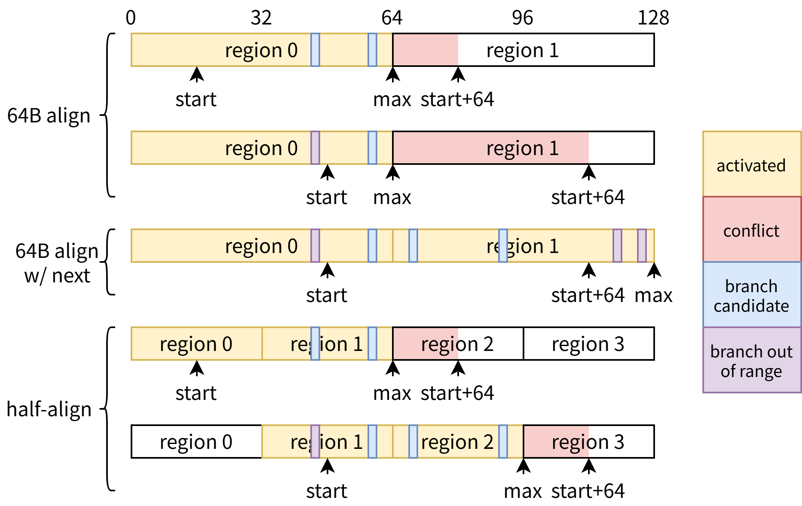
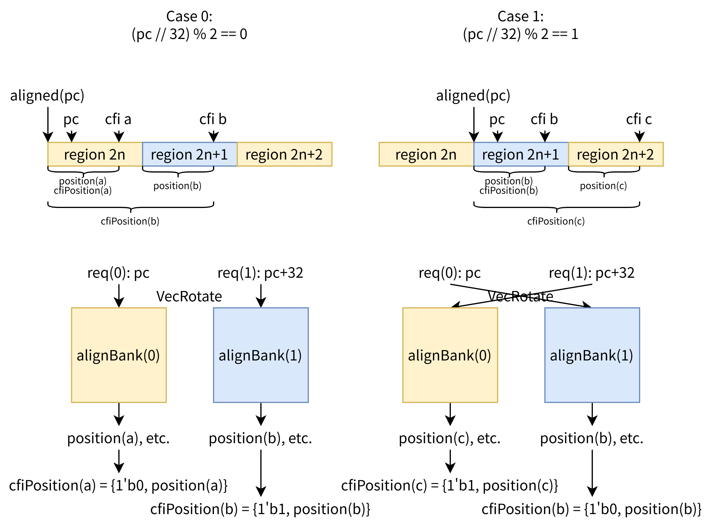
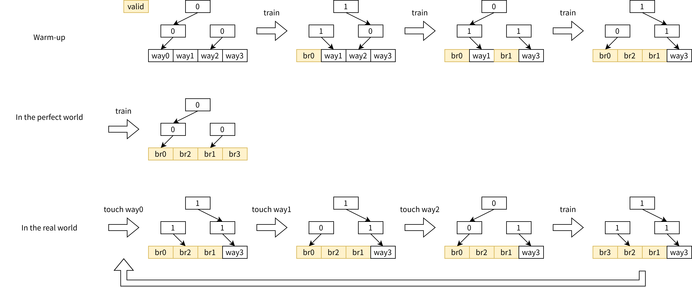

# Main Btb (mbtb) {#sec:bpu-mbtb}

mbtb 属于 S3 精确预测器组，其负责记录分支指令的位置、目标地址、分支类型等元数据，并使用饱和计数器提供一个基础方向预测（承担 tage baseTable 的功能）。

为了方便描述，我们下面假设使用默认参数，即取指块大小为 64B，每个 64B 内至多包含 8 条分支。

另外，定义对齐函数如下伪代码，默认为 half-align，即对齐到 32B：

```plaintext
define aligned(addr, alignSize=32):
    return addr & ~(alignSize - 1)
```

## 参数列表 {#sec:bpu-mbtb-params}

| 参数 | 默认值 | 描述 | 要求 |
| ------ | --- | --------- | ------ |
| `NumEntries` | 8192 | 表项总数 | 2 的幂次 |
| `NumWay` | 4 | 组相联度 | 2 的幂次 |
| `NumInternalBank` | 4 | 内部 bank 数 | 2 的幂次 |
| `TagWidth` | 16 | tag 位宽 | |
| `TargetWidth` | 20 | 跳转目标地址地位位宽 | |
| `WriteBufferSize` | 4 | 写缓冲大小 | 大于等于 `NumWay` |
| `Replacer` | "Lru" | 替换器 | "Lru" 或 "Plru" |
| `TakenCntWidth` | 2 | 饱和计数器位宽 | |

## 表索引 {#sec:bpu-mbtb-index}

与参数有关，下面为默认参数下的示意，请以编译期输出为准。

```plaintext
MainBtb:
  Size(set, way, align, internal): 256 * 4 * 2 * 4 = 8192
  Address fields:
    50| 49..32 | 31..16 | 15...8 | 7.............6 | ...........5 | 4.........0 |
      | unused |    tag | setIdx | internalBankIdx | alignBankIdx | alignOffset |
                          | 13...................6 |
                          |         replacerSetIdx |
                    | 20....................................................1 |
                    |                                             targetLower |
                                                                  | 4.......1 |
                                                                  |  position |
                                                               | 5..........1 |
                                                               |  cfiPosition |
```

其中：

- `setIdx`：set 索引
- `internalBankIdx`：物理上拆分到多个 bank 中存储，减少访问冲突，逻辑上是 set 索引的一部分，物理上是 bank 索引
- `alignBankIdx`：half-align bank 索引
- `tag`：tag
- `replacerSetIdx`：替换器索引，和 setIdx 一样长，但最低位与 internalBankIdx 对齐，达成面积开销与替换准确度的权衡
- `targetLower`：跳转目标地址的低位
 - `position`：cfi 指令在当前 region 中的位置，另请参考 [@sec:bpu-mbtb-half-align] [Half-align](#sec:bpu-mbtb-half-align) 小节
 - `cfiPosition`：cfi 指令在整个取指块中的位置，另请参考 [@sec:bpu-mbtb-half-align] [Half-align](#sec:bpu-mbtb-half-align) 小节

## 表项结构 {#sec:bpu-mbtb-entry}

- `valid`：表项是否有效
- `tag`：tag
- `attribute`：分支属性，见 [@sec:bpu-constants-branchattribute] [BranchAttribute](index.md#sec:bpu-constants-branchattribute) 小节
- `position`：cfi 指令在当前 region 中的位置，另请参考 [@sec:bpu-mbtb-half-align] [Half-align](#sec:bpu-mbtb-half-align) 小节
- `targetCarry`：跳转目标低位进位/借位标记，见 [@sec:bpu-constants-targetcarry] [TargetCarry](index.md#sec:bpu-constants-targetcarry) 小节
- `targetLowerBits`：跳转目标低位
- `takenCnt`：饱和计数器[^takenCnt]

[^takenCnt]: 在逻辑上是 mbtb 表项的一部分，但在物理上单独存储，因为表项的其余属性通常在分配后不会被更新，而饱和计数器会被频繁更新，这样设计可以减少访问冲突和功耗。

## 层级结构 {#sec:bpu-mbtb-hierarchy}

为了解耦功能、简化每个模块的实现，将 mbtb 划分成多个层级。

### 顶层 {#sec:bpu-mbtb-hierarchy-top}

- 处理如 [@sec:bpu-mbtb-half-align] [Half-align](#sec:bpu-mbtb-half-align) 中描述的 VecRotate 相关逻辑
- 生成提供给每个 AlignBank 的预测/训练请求
- 提供对齐的接口与 Bpu 交互
- 统计性能事件

在预测流水级上：

- s0：接收 Bpu 顶层的预测请求，生成两个预测请求（当前 region，即 `start`；和下一个 region，即 `start+32`）并送入两个 AlignBank
- s1：空流水，与 AlignBank 对齐用
- s2：接收来自 AlignBank 的预测结果，进行合并，并送回 Bpu 顶层
- s3：向 AlignBank 发送 replacer 更新数据，见 [@sec:bpu-mbtb-replacer] [replacer](#sec:bpu-mbtb-replacer) 小节

在训练流水级上：

- t0：接收 Bpu 顶层的训练请求
- t1：生成所需的训练请求送入对应 AlignBank

顶层内实例化 `NumAlignBank = FetchBlockSize / FetchBlockAlignSize`（默认为 2）个 AlignBank。

### 中层 AlignBank {#sec:bpu-mbtb-hierarchy-alignbank}

- 处理每个 half-align 的 bank 内的事务
- 过滤训练请求
- 选择需要预测/训练的 InternalBank
- 与 replacer 交互

在预测流水级上：

- s0：接收来自顶层的预测请求，选择需要预测的 InternalBank 并送入 InternalBank
- s1：接受来自 InternalBank 的预测结果
- s2：判断预测是否命中，过滤超范围的结果，见 [@sec:bpu-mbtb-range-check] [范围检查](#sec:bpu-mbtb-range-check) 小节，送回顶层
- s3：更新 replacer，见 [@sec:bpu-mbtb-replacer] [replacer](#sec:bpu-mbtb-replacer) 小节

在训练流水级上：

- t1：接收来自顶层的训练请求，过滤掉不需要训练的情况（命中且元数据无误则不需要更新 entry；命中且不是条件分支则不需要更新 counter），选择需要训练的 InternalBank 并送入 InternalBank

AlignBank 内实例化 `NumInternalBank`（默认为 4）个 InternalBank；以及一个 replacer。

### 底层 InternalBank {#sec:bpu-mbtb-hierarchy-internalbank}

- 处理实际与各个物理 SRAM（entrySram，counterSram）和写缓冲交互的事务。

对读请求：

- 第 0 周期：接收来自 AlignBank 的读请求，发出 SRAM 读请求
- 第 1 周期：接收 SRAM 读响应，送回 AlignBank

对写请求：

- 第 0 周期：接收来自 AlignBank 的写请求，送入写缓冲
- 第 x 周期：当 SRAM 可写（即当前没有读请求访问 SRAM）时，写缓冲回写到 SRAM。

## Half-align {#sec:bpu-mbtb-half-align}

mbtb 采用 Region-BTB 格式，即将整个地址空间划分成多个 region，预测时用当前 `pc`（或称为取指块的起始地址 `start`）所在的 region index 作为索引查表并作出预测。

一种最简单的设计是让 region 的大小和取指块的最大大小相等，但这样会带来一个问题：当起始地址落在 region 内靠后的部分时，可提供预测的范围就会很小。如 [@fig:mbtb-half-align] 上半部分所示，mbtb 只能预测当前 region 范围内的分支，有效的预测范围是 `start` 到 `max=aligned(start+64, 64)` 之间。

我们也许可以通过 interleave 的方式在不引入 SRAM 读口的情况下同时查询相邻的两个 region 来扩大预测范围。但这又会带来备选分支数量过多，时序收敛困难等问题。如 [@fig:mbtb-half-align] 中间部分所示，尽管将 `max` 扩大到了 `aligned(start+128, 64)`，但这意味着我们需要处理（e.g. 范围检查、访问 tage 等预测器做预测）的备选分支数也从 8 翻倍到了 16；而大于 `start+64` 的分支超出了 ICache/Ifu 的处理能力，预测出来也无意义。

适当减小 region 的大小是一个比较好的折中方案，XiangShan 采用的 half-align 就是将 region 的大小设置为取指块大小的一半（即默认参数下 32B），这样 `max` 就是 `aligned(start+64)`，其与 `start+64` 之间的差值不会超过 32，尽可能扩大预测范围的同时又不会引入额外的备选分支（我们改为限制每个 32B 范围内至多包含 4 条分支，故需要处理的备选分支数量仍为 8）。如 [@fig:mbtb-half-align] 下半部分所示。

当然，我们也可以把 region 切得更细，例如 16B（quarter-align?），但首先这会带来更高的实现复杂度。更糟的是，“每 $64$B 内至多 $8$ 条分支”和“每 $\frac{64}{x}$B 内至多 $\frac{8}{x}$ 条分支”实际上不等价：前者可以容许分支集中在特定位置附近，而后者要求分支尽可能均匀分布，否则利用率会下降、冲突引起的替换会增加。综合考虑，half-align 是一个比较好的折中选择。

{#fig:mbtb-half-align}

在实现上，mbtb 顶层将地址空间划分成两个 alignBank，分别存储 region idx 为奇数和偶数（i.e. `address` 整除 32 为奇数或偶数）的表项。

预测和训练时，根据 `start` 的 `alignBankIdx` 对请求做 rotate（i.e. `start` 的 `alignBankIdx` 为 0，则 `req(0)` 进入 `alignBank(1)`，`req(1)` 进入 `alignBank(1)`；`alignBankIdx` 为 1 则交换），并在每个 alignBank 内使用 `start` 的 internalBankIdx 进行索引。

> 代码中 `VecRotate` 类的设计主要是为了参数化的考虑，假如有 4 个 alignBank，那么当 `alignBankIdx` 为 0 时，进入 4 个 alignBank 的 req 下标分别是 0、1、2、3；当 `alignBankIdx` 为 1 时，进入 4 个 alignBank 的 req 下标分别是 3、0、1、2；以此类推。另参考 [@sec:utils-vecrotate] [utils/VecRotate.md](../../utils/VecRotate.md)。

在这种设计下，存入每个 alignBank 的 cfi 指令的 pc 的 `alignBankIdx` 位都是定值，故不需要存储，换句话说就是 `cfiPosition` 的最高位不需要存储。有：`cfiPosition = Cat(reqIdx, position)`。

{#fig:mbtb-half-align-rotate}

我们不关心 mbtb 输出的分支顺序，因此没有必要做反向 rotate。

## 范围检查 {#sec:bpu-mbtb-range-check}

由于 Region-BTB 的结构特性，mbtb 并不满足“当前 pc 索引出的所有分支一定都在曾经某个 fallThrough 的块中”这一特性，其索引出的分支可能来自另一条训练路径，只是恰好落在同一个 region 内，这些分支可能不在有效的预测范围内。因此 mbtb 需要对输出的命中结果进行过滤，具体来说：

1. 丢弃在当前预测块起始地址之前的分支，即 `cfiPc < startPc` 的分支
2. 当跨页时，丢弃来自请求的第二个 alignBank 的分支，即 `cfiPc >= aligned(start+64)` 的分支 [^drop-cross-alignbank]

[^drop-cross-alignbank]: 由于页大小 4KB，region 大小 32B，因此页边界一定也是 region 边界，所以当取指块跨页时，需要查询的两个 region 一定分别属于两个页，因此来自第二个 alignBank 的分支一定是超范围的。此处的“第二个”不是指物理下标，而是指 rotate 后的第二个请求进入的 alignBank。

## Replacer {#sec:bpu-mbtb-replacer}

由于不同 alignBank 在地址空间上是互斥的，因此可以每个 alignBank 内独立维护一个 replacer。

replacer 采用可配置的 Plru / Lru 替换算法，前者存储开销更小（每个状态 `NumWays - 1` bit），但无法处理下面描述的一些特殊情况；后者替换准确度更高，但面积是平方级的（每个状态 `NumWays * (NumWays - 1) / 2` bit）。

在早期设计中，replacer 默认采用 Plru 替换策略，且其更新逻辑是比较简单的：

- 预测时：若发现命中，则更新该表项为最近使用
- 训练时：若命中，则更新该表项为最新使用；否则更新 replacer 选择的 victim（即最久未使用的表项）为最新使用

但对于 mbtb 的应用场景来说，这样的简单设计无法处理分支密集（相联度压力大）的情况，考虑如下 gcc 的反汇编代码：

```asm
cbfc2: 212bebb3 sh3add s7, s7, s2
cbfc6: 00093783 ld     a5, 0(s2)
cbfca: 854a     mv     a0, s2
cbfcc: 85a2     mv     a1, s0
cbfce: 0921     addi   s2, s2, 8
cbfd0: 00f4f563 bgeu   s1, a5, cbfda <cselib_invalidate_rtx.lto_priv.0+0xc8>
cbfd4: e8dff0ef jal    ra, cbe60 <cselib_invalidate_mem_1>
cbfd8: d559     beqz   a0, cbf66 <cselib_invalidate_rtx.lto_priv.0+0x54>
cbfda: ff7966e3 bltu   s2, s7, cbfc6 <cselib_invalidate_rtx.lto_priv.0+0xb4>
cbfde: b761     j      cbf66 <cselib_invalidate_rtx.lto_priv.0+0x54>
```

在这个 32B 的 region 内集中了 5 条 cfi 指令，其中位于 `cbfd8` 的 `beqz` 是几乎从来不跳转的分支，因此对于默认参数下的 4-way 相联来说，应该勉强是够用的（只需要保存其余 4 条经常跳转的分支就可以在绝大多数情况命中）。

但我们考虑 Plru 的实际工作状态：如 [@fig:mbtb-plru-conflict] 所示。

1. 依次训练 3 条分支进入 mbtb。
2. 在理想情况下，Plru 会指向最后一个空闲项供第 4 条分支进入。
3. 但这里的代码是一个小循环（`cbfda` 是一条跳转到 `cbfc6` 的分支，是循环尾），这意味着在训练对 replacer 进行更新的间隔中会穿插着大量预测对 replacer 的更新。
    - 注意到 br0、1、2 都在当前 region 内，预测时它们都会命中
    - replacer 在这种情况下的行为是在一周期内依次更新 way0、1、2
    - 这会使 Plru 错误的认为 way0 是最久未被使用的项，而不是 way3
    - 最终导致 br3 在训练时错误地替换了 br0，以此往复，br0 和 br3 两个热点分支抢占 way0，而 way3 长久处于空闲状态，等效相联度下降到 3，无法满足需求，造成性能大幅倒退

{#fig:mbtb-plru-conflict}

> 以防读者对 Plru 不熟悉，此处做简单说明：Plru 通过一个二叉树结构来近似 Lru，当结点为 0 时表示左子树相比右子树更久未被使用，为 1 反之。每次 touch 时将对应路径上的结点更新为指向另一个子树的值，选择 victim 只需从根结点开始按值走向叶子结点即可。

因此，mbtb 的 replacer 采用了两个技巧来缓解相联度的压力：

1. 默认使用 Lru 替换策略，避免 Plru 本身的限制。
2. 在预测时，不再 touch 所有的命中项，而是 touch 最终预测[^mbtb-touch-final]为跳转[^mbtb-touch-taken]的项。这样可以将经常不跳转（如上例中的 `cbfd8`）的项尽快踢出 mbtb，从而腾出空间给其他热点分支 [^mbtb-touch-fall]。

[^mbtb-touch-final]: Bpu 顶层综合 mbtb、tage 等预测器给出的预测

[^mbtb-touch-taken]: 包括无条件跳转或者预测为跳转的分支

[^mbtb-touch-fall]: fallThrough 可以为不跳转的分支提供预测，因此将它们存在 mbtb 中价值不大
