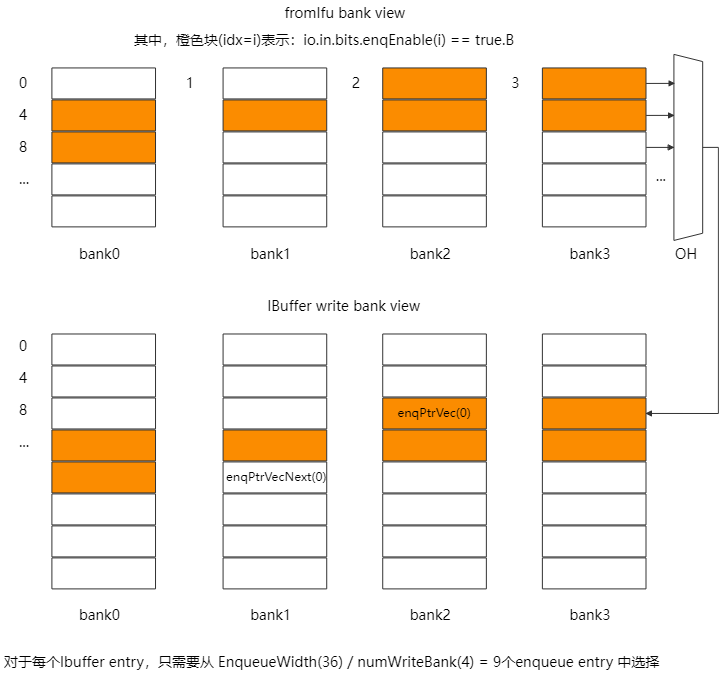
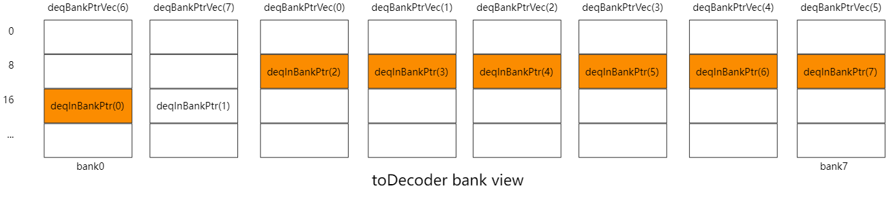
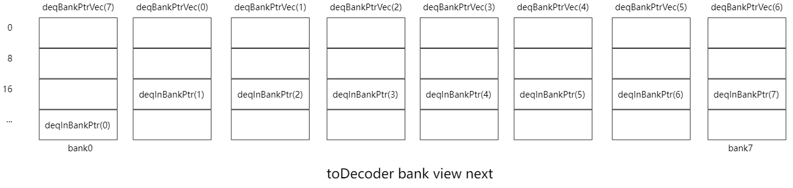
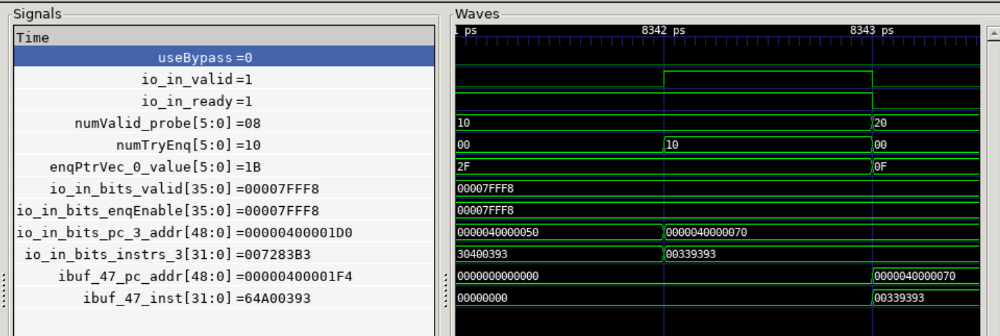
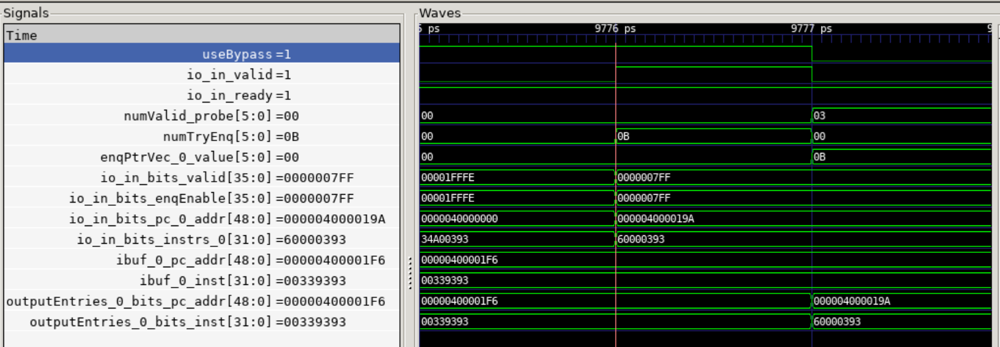
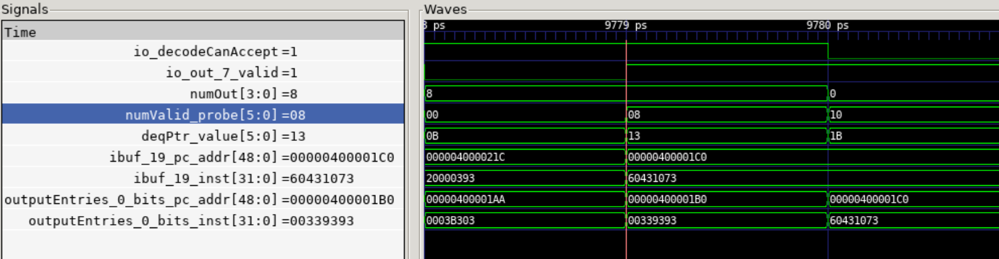

# 昆明湖 IBuffer 模块文档

## 术语说明

| **缩写**    | **全称**                 | **描述**       |
| ----------- | ------------------------ | -------------- |
| IFU         | Instruction Fetch Unit   | 取指令单元     |
| PredChecker | Predicted Branch Checker | 分支预测检查器 |
| IBuffer     | Instruction Buffer       | 指令缓冲       |
| IBufEntry   | Instruction Buffer Entry | 指令缓冲表项   |

##  参数列表

| **参数**                            | **默认值** | **描述**                                             | **要求**                         |
| ----------------------------------- | ---------- | ---------------------------------------------------- | -------------------------------- |
| Size                                | 48         | IBuffer 总项数                                       |                                  |
| NumWriteBank                        | 4          | 写端 Bank 划分个数                                   | 整除 Size                        |
| NumReadBank                         | 8          | 读端 Bank 划分个数                                   | 整除 Size，大于等于 DecodeWidth  |
| WriteBankSize                       | 12         | 写端 Bank 项数                                       | Size / NumWriteBank              |
| ReadBankSize                        | 6          | 读端 Bank 项数                                       | Size / NumReadBank               |
| DecodeWidth                         | 8          | 译码宽度，即发送给后端的 IBufEntry 个数              |                                  |
| MaxBypassNum                        | 12         | Bank 对齐后，旁路需要从写端读取的最大 IBufEntry 个数 | DecodeWidth + NumWriteBank       |
| IBufferEnqueueWidth or EnqueueWidth | 36         | Bank 对齐后，IFU 传来的 IBufEntry 个数               | FetchBlockInstNum + NumWriteBank |

## 功能描述

### 功能概述

IBuffer 是前端取指单元（IFU）和后端之间的缓存队列，它的主要职能是暂存 IFU 取得的指令、元数据以及异常信息等（以上信息统称为 IBufEntry），根据指令到来的顺序发送给后端译码。

### 存储结构

IBuffer 需要支持最多 36 Entry 的写入和最多 8 Entry 的读出，若使用 SRAM 则需要分 Bank，读写冲突的仲裁逻辑也相对复杂，同时面积和功耗剧增，难以布线。因此，IBuffer 采用寄存器堆实现。

IFU 的取指结果被存入寄存器堆 ibuf 中，其表项结构 IBufEntry 如下表。

| inst | pc   | foldpc | pd   | predTaken | identifiedCfi | ftqPtr | instrEndOffset | exceptionType | backendException | triggered | isLastInFtqEntry | debug_seqNum |
| ---- | ---- | ------ | ---- | --------- | ------------- | ------ | -------------- | ------------- | ---------------- | --------- | ---------------- | ------------ |
|      |      |        |      |           |               |        |                |               |                  |           |                  |              |

### 控制逻辑 {#sec:logic_ctrl}

IBuffer 的两个循环指针分别是 enqPtr 和 deqPtr。enqPtr 代表入队指针，deqPtr 代表出队指针。enqPtr 按照实际入队的指令数量进行增加，deqPtr 按照实际出队的指令数量进行增加。即使是 bypass，也按照进行过入队计算。

对于出队（Dequeue），有：

- 当后端允许接收指令： deqPtr :=[^assign] deqPtr + numDeq（即将出队的指令个数，见[出队](#sec:dequeue)）；
- 如果不满足前面一种情况： deqPtr := deqPtr；

对于入队（Enqueue），有：

- 当 IBuffer 与 IFU 握手时： enqPtr := enqPtr + numFromFetch（IBuffer 接收的指令个数）；
- 如果不满足前面一种情况： enqPtr := enqPtr。

因为循环指针模块重写了加减运算符，因此计算 numValid（IBuffer 有效指令数）可以直接使用减号计算，即 numValid = enqPtr - deqPtr。

下面将详细说明入队和出队的具体情况。

[^assign]: 本文档使用 “:=” 表示寄存器赋值，用 “=” 表示组合逻辑赋值。

### 入队 {#sec:enqueue}

IFU 向 IBuffer 入队指令时，最多同时写入 EnqueueWidth = 36 项 IBufEntry。为降低寄存器堆中的每个 IBufEntry 的写入 MUX 复杂度，我们将 IBuffer 的写入端口组织为多个 Write Bank。具体而言：

- IBuffer 总大小为 Size = 48 项；
- 被划分为 numWriteBanks = 4 个写入 Bank；
- 每个 Bank 的大小为 WriteBankSize = Size / numWriteBanks = 12 项。

IFU 在 s2 阶段从 ICache 获取一个 Fetch Block（64 Bytes）及其元数据，并整理为最多 32 项有效的 IBuffer Entry 候选。在 s3 阶段，这些 32 项会根据推测的入队指针 s3_prevIBufEnqPtr 的低 log2Ceil(numWriteBanks) 位进行偏移，使得：

- 第 0 项对齐到目标 Bank 的起始位置；
- 后续项依次填充；
- 每个 Write Bank 内部的写入项连续对齐。

最终得到 32 + numWriteBanks = 36 项，如下图所示。

偏移后，每个 IBuffer Entry 的写入源只需从最多 9 项中选择，而非原始的 32 项，降低了延迟。

Q1：为何要按照 s3_prevIBufEnqPtr 进行偏移？

A1：目的是提前一拍对齐写入数据到目标 Write Bank。在 predChecker 没有检出预测错误的情况下：

- s3_prevIBufEnqPtr 在 s3 阶段等于 s4 阶段 IBuffer 实际使用的 enqPtr。
- 这是因为：
	- 在 s3_fire 时：s3_prevIBufEnqPtr := s3_prevIBufEnqPtr + s3_instrCount；
	- 在 s4_fire（即 io.toIBuffer.fire）时：enqPtr := enqPtr + numTryEnq，其中 numTryEnq == numFromFetch == s3_instrCount。

因此，在 s3 阶段即可提前一拍获知 s4 阶段的 enqPtr 值。即使在 s3 阶段预译码检查（如 predChecker）发现错误：

- 当前周期的 enqPtr 仍保持正确（因错误尚未冲刷）；
- 下一周期将由 IFU 的写回（WB）阶段执行冲刷，并重置指针；
- 因此，偏移逻辑在错误路径下依然安全。

### 旁路 {#sec:bypass}

当队列空时，若有入队请求，且 decodeCanAccept（后端空闲），且 numValid > DecodeWidth，则可以把 DecodeWidth 个IBufEntry 旁路给 outputEntries（输出寄存器，见[出队](#sec:dequeue)），其余的 Entry 保存在 IBuffer；若 numValid <= DecodeWidth，则全部旁路给 outputEntries。为了方便维护，旁路产生的入队出队也参与指针计算。

Bypass 逻辑主要在 bypassEntries 的选择和 numBypass计算。

- bypassEntries选择：
	- 对于 bypassEntries(idx)，需要找到某个入队端口 i，使得 idx == enqOffset(i)（即在端口 i 之前的有效端口数量）；此时端口 i 即为数据来源。具体地：
	  - 对于 bypassEntries(idx)，遍历 (i <- 0 until MaxBypassNum)，
	
	  	匹配 valid(i) && enqEnable(i) && enqOffset(i) === idx.asUInt，
	  	
	  	得到独热码 validOH；
	
	  - bypassEntries(idx).valid = validOH.reduce(\_ \|\| \_) && io.in.fire && !io.flush；
	  - bypassEntries(idx) = Mux1H(validOH, enqData)；
	
- numBypass计算：
	- useBypass条件：队列空且后端空闲 （enqPtr === deqPtr && decodeCanAccept）；
	- 若 useBypass
		- numFromFetch：入队指令个数；
		- 若 numFromFetch >= DecodeWidth，则 numBypass = DecodeWidth；
		- 否则 numBypass = numFromFetch；
	- 否则 numBypass = 0.U。

### 出队 {#sec:dequeue}

在解码阶段（Decode Stage），最多有 DecodeWidth = 8 条指令需要从 IBuffer 中并行读取。为支持并行读取并减少面积，我们将 IBuffer 视为由多个 Read Bank 构成，具体如下：

- IBuffer 总大小为 Size = 48 项；
- 被划分为 numReadBanks = 8 个读出 Bank；
- 每个 Bank 的大小为 ReadBankSize = Size / numReadBanks = 6 项。

满足：numReadBanks ≥ DecodeWidth，使得每个读口都至少有一个bank可以选择。

首先，我们记需要从寄存器堆出队的所有项为 deqEntries，共 DecodeWidth = 8 项。出队逻辑用到的指针如下表。

| 名称          | 描述                                               | 属性                                                |
| ------------- | -------------------------------------------------- | --------------------------------------------------- |
| deqPtr        | 出队指针，用于配合 enqPtr 计算队列 valid 个数      | 循环指针，循环范围为Size                            |
| deqBankPtr    | 出队通道指针，即 deqBankPtrVec(0)                  | 循环指针，循环范围为 numReadBanks                   |
| deqBankPtrVec | 出队通道指针向量，表示出队通道对应的 Bank 号       | 共 DecodeWidth 个循环指针，循环范围为 numReadBanks  |
| deqInBankPtr  | 出队 Bank 内指针，表示每个 Bank 内待出队数据的偏移 | 共 numReadBanks 个循环指针，循环范围为 ReadBankSize |

如图下所示，对于每个 deqEntries(i) ，先选择 deqBankPtrVec(i) 位置的 bank(j)；再从 bank(j) 中选择 deqInBankPtr(j) 位置的 IBufEntry。图中需要出队的 IBufEntry 个数为 7，deqEntries(0) 选择 bank(2) 中的第 2 个数据，deqEntries(6) 选择 bank(0) 中的第 3 个数据，其余同理。

现在我们得到了来自寄存器堆的出队结果 deqEntries 和旁路结果 bypassEntries，需要判断将哪个结果送入 outputEntries 寄存。

具体选择逻辑如下：

- 若 decodeCanAccept，本周期的结果输出给 DecodeUnit，需要选择下周期的数据：

	- 若 useBypass，则outputEntries := bypassEntries；
	- 否则 outputEntries := deqEntries；

- 再若 outputEntriesIsNotFull，即后端未准备好且输出寄存器未满，则填充输出寄存器：

	- outputEntriesValidNum 表示 outputEntries 有效个数；

	- 当 i < outputEntriesValidNum，outputEntries 保持不变；

	- 当 i >= outputEntriesValidNum，outputEntries(i) := deqEntries(i - outputEntriesValidNum)；
	> 这里做了优化：先从 deqEntries 选出前i+1项，即 deqEntries.take(i+1)，再从这 i+1 项中用 (i - outputEntriesValidNum) 索引，减少了索引的级数。

- 否则，outputEntries 保持不变。

在选择输出数据后，指针更新结果如下图。

- numDeq（numOut），表示即将出队的指令数：

    - 若 decodeCanAccept：
        - 若 useBypass，则 numOut = numBypass；
        - 否则：
            - 若 numValid >= DecodeWidth，则 numOut = DecodeWidth；
            - 否则 numOut = numValid；
    - outputEntriesIsNotFull = !outputEntries(DecodeWidth - 1).valid；
    - 再若 outputEntriesIsNotFull，即后端未准备好且输出寄存器未满，则填充输出寄存器：
        - 若 numValid >= DecodeWidth - outputEntriesValidNum，

            则 numOut = DecodeWidth.U - outputEntriesValidNum；

        - 否则 numOut = numValid；

    - 否则 numOut = 0.U；

- deqBankPtrVec，表示出队通道指针向量：

    - 初始化为 tabulate(DecodeWidth)(_.U)，即出队通道 i 对应 i 号 bank；
    - 每周期更新：deqBankPtrVec(i) := deqBankPtrVec(i) + numDeq；

- deqInBankPtr，表示出队 Bank 内指针：

    - 初始化为0；
    - 每周期更新：
        - 对于 bank(i)，首先通过 deqBankPtrVec(0) 计算出对应 deqEntries 的偏移；如上图，deqInBankPtr(2) 对应的偏移为 0，deqInBankPtr(0) 对应的偏移为 6；
        - 若对应的偏移小于 numDeq，则该 bank 有某个 IBufEntry 出队，deqInBankPtr(i) := deqInBankPtr(i) + 1.U；
        - 若对应的偏移大于等于 numDeq，则该 bank 没有 IBufEntry 出队，指针不变。

### 判满

IBuffer 模块的 ready 信号会级联到 IFU 模块的 ready，路径较长，因此不能在入队时当周期判断 (numValid + numFromFetch - numDeq) < Size，需要寄存一拍，在 IFU.s3 阶段完成计算。

虽然 IFU.s3 无法得知最新的 dequeue 信息，但可以得到部分的 enqueue 信息：numFromFetch 来自s3_instrValid，而s3_instrValid = UIntToMask(s3_instrCount)。在不考虑出队和 predChecker 的情况下，我们可以使用 s3_instrCount 当作推测的 numFromFetch，完成入队条件判断。特别地，当 s3_firstIsMmio 为真，可以认为只有一条指令发送给 IBuffer。除此之外，还需要考虑 pipeline stall，具体如下：

在 FetchToIBuffer（Bundle） 中，定义 prevInstrCount = UInt(log2Ceil(IBufferEnqueueWidth).W)，表示在没有 predChecker 的情况下 IFU.s3 阶段给出的推测 numFromFetch。我们考虑 prevInstrCount 的数据来源：

- 当 s3_fire 时，下周期 s4_valid 一定有效，IBuffer 当周期需要 prevInstrCount，因此有 prevInstrCount = Mux(s3_firstIsMmio, 1.U, s3_instrCount)；

- 当 !s3_fire 且 s4_stall （即 s4_vaild && !s4_ready），下周期 s4_valid 一定有效，IBuffer 当周期需要 prevInstrCount，此时 s3_instrCount 无法作为数据源，解决方案是添加一个 s4_instrCount。s4_instrCount 由 s3_instrCount 寄存一拍得到；由于 s4_stall，下一周期的 enqueue 信息等于当周期的 enqueue 信息，因此有 prevInstrCount := Mux(s4_firstIsMmio, 1.U, s4_instrCount)

  > TODO：此处的s4_instrCount可以优化为PopCount(toIBuffer.enqEnable)

- 当以上条件均不符合时，可以不考虑 prevInstrCount 的来源。因为下一周期 s4_valid 一定无效。

对于 IBuffer，我们需要计算出下一周期队列的余量（nextNumInvalid），将其和 prevInstrCount 比较，即可得到下一周期的 allowEnq。具体地，

- nextNumValid = numValid + numFromFetch - numDeq
- nextNumInvalid = Size - nextNumValid
- allowEnq := prevInstrCount < nextNumInvalid

### 冲刷

冲刷时，需要将状态和指针复位，包括

- allowEnq := true.B
- enqPtrVec := indices.map(_.U)
- deqBankPtrVec := indices.map(_.U)
- deqInBankPtr := 0.U
- deqPtr := 0.U
- outputEntries.foreach(_.valid := false.B)

## 整体框图

## 接口时序

### 入队

如图，在 8342 ps，IFU 与 IBuffer 握手。当前队列有效指令数为 16；尝试入队 16 条指令；enqPtr 指向 ibuf(47)；观察 valid 和 enqEnable，第一条有效指令位于入队端口 3；以入队的第一项为例，我们观察入队端口 3 和 ibuf(47) 的数据，可以发现 useBypass 为 false，数据正确存入 ibuf(47)。

### 旁路

如图，在 9776 ps，IFU 与 IBuffer 握手。当前队列有效指令数为 0；尝试入队 11 条指令；enqPtr指向 ibuf(0)；观察 valid 和 enqEnable，第一条有效指令位于入队端口 0；以入队的第一项为例，我们观察入队端口 0、ibuf(0) 和outputEntries(0)，可以发现 useBypass 为 true，数据没有存入 ibuf(0)，而是旁路到了 outputEntries(0)。

### 出队

如图，在 9779ps，后端空闲，ibuf 中有 8 个有效项，需要出队。deqPtr 指向 ibuf(19)。以出队的第一项为例，我们观察 ibuf(19)，outputEntries(0)，可以发现 ibuf(19) 数据正确存入 outputEntries(0)。
