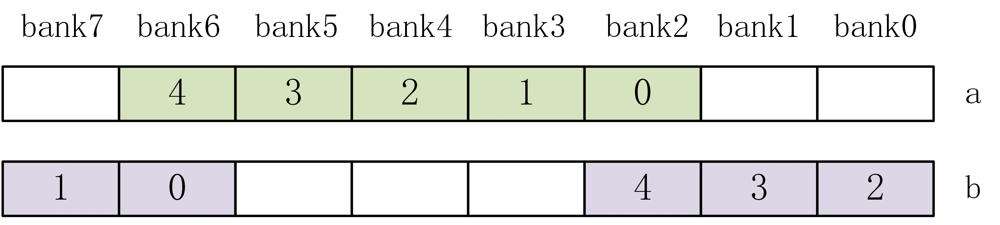
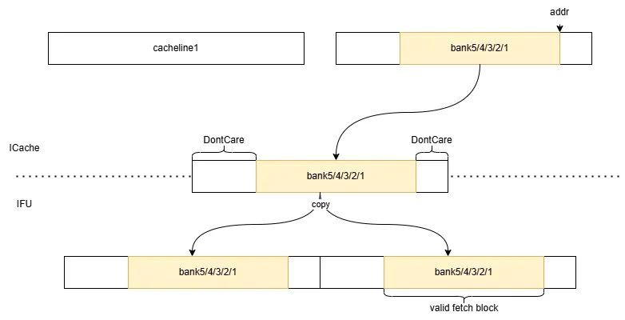
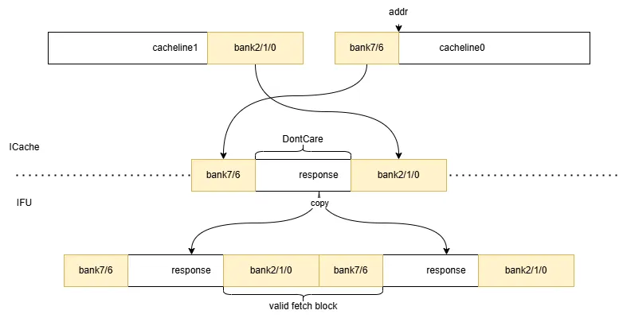

# MetaArray 及 DataArray 子模块文档

### DataArray 分 bank 的低功耗设计 {#sec:icache-dataarray-per-bank-lowpower}

目前，ICache 中每个 cacheline 分为 8 个 bank，bank0-7。一个取指块需要 34B 指令数据，故一次访问连续的 5 个 bank。存在两种情况：

1. 这 5 个 bank 位于单个 cacheline 中（起始地址位于 bank0-3）。假设起始地址位于 bank2，则所需数据位于 bank2-6。如下图 a。
2. 跨 cacheline（起始地址位于 bank4-7）。假设起始地址位于 bank6，则数据位于 cacheline0 的 bank6-7、cacheline1 的 bank0-2。有些类似于环形缓冲区。如下图 b。

当从 SRAM 或 MSHR 中获取 cacheline 时，根据地址将数据放入对应的 bank。

由于每次访问只需要 5 个 bank 的数据，因此 ICache 到 IFU 的端口实际上只需要一个 64B 的端口，将两个 cacheline 各自的 bank 选择出来并拼接在一起返回给 IFU（在 DataArray 模块内完成）；IFU 将这一个 64B 的数据复制一份拼接在一起，即可直接根据取指块起始地址选择出取指块的数据。不跨行/跨行两种情况的示意图如下：

亦可参考 [IFU.scala 中的注释](https://github.com/OpenXiangShan/XiangShan/blob/fad7803d97ed4a987a743036cec42d1c07b48e2e/src/main/scala/xiangshan/frontend/IFU.scala#L474-L502)。

