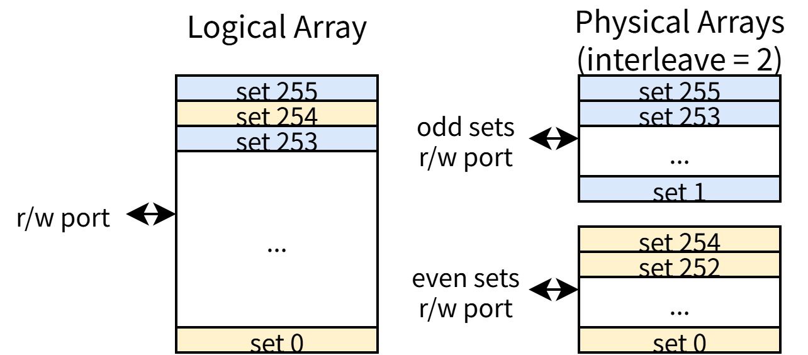
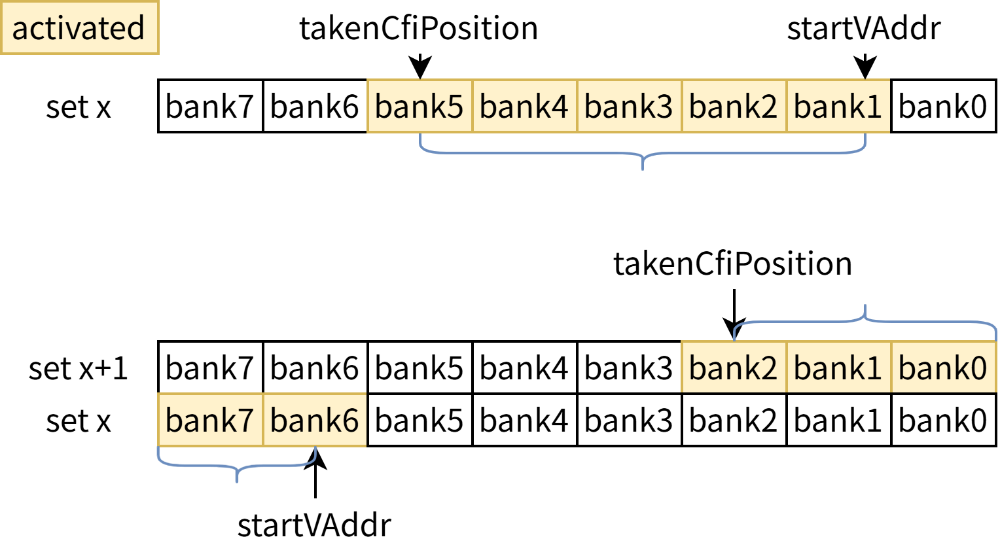
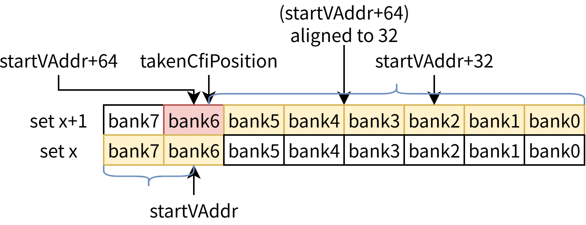

# MetaArray 及 DataArray

## MetaArray 分 interleave {#sec:icache-metaarray-interleave}

metaArray 按 setIdx 做了 interleave，即将 `setIdx % NumInterleaveBanks` 不同的 set 存储到不同的物理 SRAM 中，从而减少访问冲突。我们要求 `NumInterleaveBanks` 至少是 2，这样可以保证单个取指块一定可以在单周期内处理（如果未跨行，则访问一个 setIdx；如果跨行，需要访问 `setIdx` 和 `setIdx + 1`，正好落在两个不同的物理 SRAM 中）。

`NumInterleaveBanks` = 2 的情况如 [@fig:icache-metaarray-interleave] 所示：

{#fig:icache-metaarray-interleave}

## DataArray 分 bank

dataArray 则将单个缓存行拆分成多个 bank 存储，每个 bank 存储一个 cacheline 的一部分，每次访问只激活需要的 bank，从而降低功耗。下面以默认参数下将 64B 的缓存行拆分成 8 个 8B 存储为例进行说明。

在 V2R2，单个取指块的大小固定是 34B，因此每次需要固定激活 5 个 bank。而在 V3 中，单个取指块的大小由 BPU 提供的 `takenCfiPosition` 决定（即，取指块的范围为起始地址到 BPU 预测的第一条跳转的分支指令对应的地址），BPU 对该值会保证 ICache 一定没有访问冲突。因此，ICache 不需要对 `takenCfiPosition` 进行检查，直接根据它激活对应的 bank 即可。

[@fig:icache-dataarray-bank] 展示了 dataArray 分 bank 的设计。

{#fig:icache-dataarray-bank}

在 [@fig:icache-dataarray-large-fb] 中，取指块的大小小于 64B，看起来是一个合法的取指块，其起始位置在 bank 内存在一定偏移，因此取指块头尾落在了不同 set 的同一个 bank 中，似乎存在 SRAM 冲突。

但 BPU 的设计保证了这种情况不会发生：简单来说，BPU 可以预测的 `takenCfiPosition` 必须落在 `startVAddr + 64B 对齐到 32B 的位置` 之前，对于例图来讲，它至多落在 `set x+1` 的 `bank3` 末尾，不可能落到 `bank4` 及以后的 bank 中。更具体的解释请参考 BPU 设计文档。

{#fig:icache-dataarray-large-fb}
