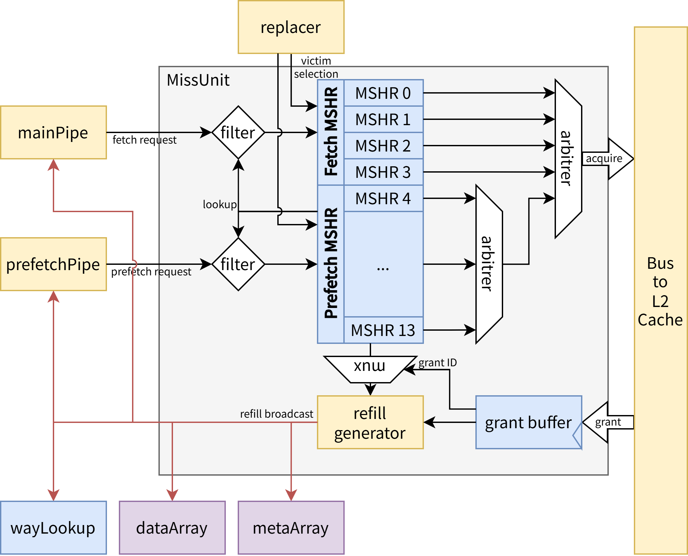

# MissUnit {#sec:icache-missunit}

MissUnit 负责处理 ICache 的缺失请求，通过 MSHR 进行管理所有正在处理的请求，通过总线与 L2 Cache 进行交互。收到总线响应后负责向各 SRAM、Queue、Pipeline 广播重填信息。

{#fig:icache-missunit-structure}

## MSHR 的管理 {#sec:icache-missunit-mshr}

missUnit 通过 MSHR 分别管理取指请求和预取请求，为了防止冲刷时取指 MSHR 不能完全释放，默认设置取指 MSHR 的数量为 4、预取 MSHR 的数量为 10。采用数据和地址分离的设计方法，所有的 MSHR 公用一组回填数据寄存器（grant buffer），在 MSHR 只存储请求的地址信息及状态信息。

## 请求写入 {#sec:icache-missunit-enqueue}

missUnit 接收来自 mainPipe 的取指请求和来自 prefetchPipe 的预取请求，取指请求只能被分配到 fetchMSHR，预取请求只能分配到 prefetchMSHR，写入时选择下标最小的一个空闲 MSHR。

### 过滤重复请求 {#sec:icache-missunit-filter-duplicate}

MSHR 向 missUnit 顶层暴露 lookup 接口，供 missUnit 检查新请求是否已在某个 MSHR 中存在。若已存在，则该直接对齐这一新请求，对 mainPipe、prefetchPipe 的接口上仍表现为 fire，只是不做实际写入操作。

### victim 选择 {#sec:icache-missunit-victim}

在 MSHR 向总线发起 acquire 请求时从 replacer 选择一个 victim（即，要被重填覆盖的 way），并将 victim 信息写入 MSHR。重填时直接使用 MSHR 中记录的 victim 信息，无需再次访问 replacer。

## acquire {#sec:icache-missunit-acquire}

当到 L2 的总线空闲时，选择 MSHR 表现进行处理，整体 fetchMSHR 的优先级高于 prefetchMSHR，只有没有需要处理的 fetchMSHR，才会处理 prefetchMSHR。

对于 fetchMSHR，采用低 index 优先的优先级策略，因为同时最多只有两个请求需要处理，并且只有当两个请求都处理完成时才能向下走，所有 fetchMSHR 之间的优先级并不重要。

对于 prefetchMSHR，考虑到预取请求之间具有时间顺序，采用先到先得的优先级策略，在入队时通过一个 FIFO 记录入队顺序，处理时按照入队顺序进行处理。

## grant {#sec:icache-missunit-grant}

通过状态机接收总线响应，目前 L1 Cache 到 L2 的总线带宽为 32B，故一个 64B 缓存行需要分 2 拍传输。总线 burst 机制保证不同的请求不会发生交织，所以只需要一组 grant buffer 来存储数据。当一次传输完成时，根据传输的 id 选出对应的 MSHR，从 MSHR 中读取地址、victim 等信息，将数据广播到各 SRAM、Queue、Pipeline，并重置 MSHR 状态。

### 异常处理 {#sec:icache-missunit-exception}

目前使用的 TileLink 总线可能会出现 corrupt 和 denied 两种异常，前者用来表示 L2 Cache（或更下级存储结构）出现数据损坏（如 ECC 校验出错），后者用来表示请求被拒绝（如权限不足）。根据 TileLink 手册，当拉高 denied 的同时一定会拉高 corrupt。因此我们需要将 `corrupt & !denied` 作为实际的 corrupt 信号返回给 mainPipe。mainPipe 会向 BEU 报告错误并引起相关异常。
