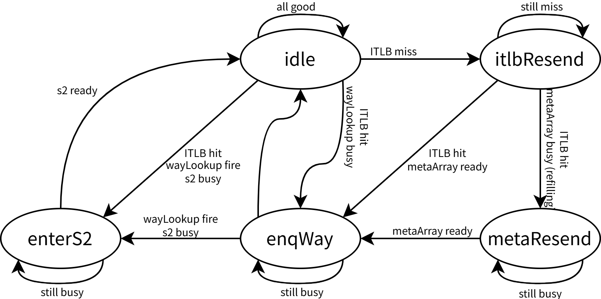

# PrefetchPipe 子模块文档

prefetchPipe 为预取的流水线，为两级流水设计，负责预取请求的过滤。

## S0 流水级

1. 接收来自 FTQ / MemBlock 的硬/软件预取请求
2. 向 metaArray 和 ITLB 发送读请求
3. 接收 BPU s3 override 引起的冲刷请求，若 ftqIdx 与当前流水级匹配且不是软件预取，则进行冲刷

## S1 流水级

1. 接收 metaArray / ITLB 的响应
2. 若 ITLB miss，重发请求直到 hit
3. 将元数据入队 wayLookup
4. 监听 missUnit 重填广播，更新命中信息
5. 接收 BPU s3 override 引起的冲刷请求，若 ftqIdx 与当前流水级匹配且不是软件预取，则进行冲刷

### 状态机

本级的行为由一个状态机进行控制：

- 初始状态为 `idle`，当 S1 流水级进入新的请求时，首先判断 ITLB 是否缺失，如果缺失，就进入 `itlbResend`；如果 ITLB 命中但命中信息未入队 wayLookup，就进入 `enqWay`；如果 ITLB 命中且 wayLookup 入队但 S2 请求未处理完，就进入 `enterS2`
- 在 `itlbResend` 状态，重新向 ITLB 发送读请求，此时占用 ITLB 端口（即新的进入 S0 流水级的预取请求被阻塞），直至请求回填完成，在回填完成的当拍向 metaArray 再次发送读请求，回填期间可能发生新的写入，如果 metaArray 繁忙（正在被 missUnit 写入），就进入 `metaResend`，否则进入 `enqWay`
- 在 `metaResend` 状态，重新向 metaArray 发送读请求，发送成功后进入 `enqWay`
- 在 `enqWay` 状态，尝试将元数据入队 wayLookup，如果 wayLookup 队列已满，就阻塞至 wayLookup 入队成功，另外在 missUnit 正在执行重填时禁止入队，主要是为了防止写入的信息与命中信息所冲突，需要对命中信息进行更新。当成功入队 wayLookup 时，如果 S2 空闲，就直接回到 `idle`，否则进入 `enterS2`
  - 若当前请求是软件预取，不会尝试入队 wayLookup，因为该请求不需要进入 mainPipe，不需要被执行
- 在 `enterS2` 状态，尝试将请求流入下一流水级，流入后回到 `idle`

### 命中信息的更新 {#sec:icache-hit-update}

在 S1 流水级中得到命中信息后，距离命中信息真正在 mainPipe 中被使用还要经过一些流水级和队列，期间可能会发生 missUnit 对 meta/dataArray 的重填，因此需要对重填广播进行监听，分为两种情况：

1. 请求原来在 metaArray 中未命中，监听到 missUnit 将该请求对应的 cacheline 重填了 SRAM，需要更新为命中状态。
2. 请求原来在 metaArray 中已经命中，监听到同样的位置（同 set，同 way）发生了其它 cacheline（不同 tag）的写入，原有数据被覆盖，需要更新为缺失状态。

为了防止更新逻辑的时序路径（set、way、tag 的比较和状态更新）串联到正常流水路径上，当 missUnit 正在执行重填时（无论是否相关），都禁止元数据进入下一阶段：

- 对 prefetchPipe s1 来说，即禁止入队 wayLookup；
- 对 wayLookup 来说，即禁止出队到 mainPipe。

## S2 流水级

1. 根据命中结果、异常信息判断是否需要预取
2. 若需要预取，通过 Arbiter 将依次将至多两个 cacheline 的缺失请求发送至 missUnit
