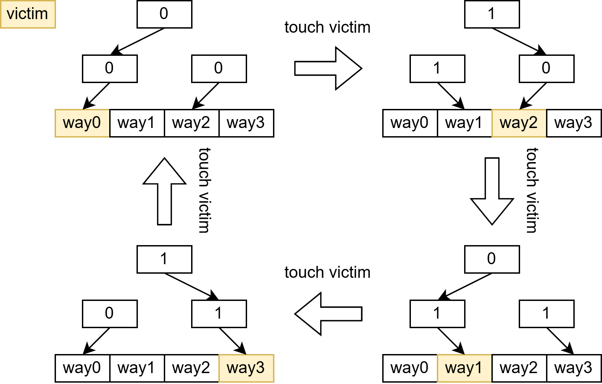

# Replacer

ICache 的 replacer 采用 PLRU 更新算法。

与 [@sec:icache-metaarray-interleave] [metaArray interleave](Array.md#metaarray-分-interleave-secicache-metaarray-interleave) 类似地，考虑到每次取指可能访问连续的两个 cacheline，对于奇地址和偶地址各自使用一个 replacer，在进行 touch 和选择 victim 时根据地址的奇偶分别更新。

## PLRU 算法

PLRU 使用一个树形结构来尽最大努力记录最久未被使用的行。以 ICache 默认参数的 4 路为例，PLRU 需要 3 位来记录 4 行的使用情况，如 [@fig:icache-plru] 所示。当对应状态 bit 为 0 时，表示左子树的行更久未被使用；当为 1 时，表示右子树的行更久未被使用。每次访问时，根据访问的行在树上的位置更新状态 bit，例如访问了 `way0`，则更新 `state[0]=1`（表示 `way0` 和 `way1` 中 `way1` 更久未被使用）和 `state[1]=1`（表示 `way0/1` 和 `way2/3` 中 `way2/3` 更久未被使用）。每次需要选择 victim 时，根据状态 bit 从根节点开始向下遍历，直到叶子节点，即可得到 victim 的 way。

{#fig:icache-plru}

另请参考 rocket-chip 的实现。

## touch

replacer 具有两个 touch 端口，对应一个取指请求的两个缓存行，根据 touch 的地址奇偶选择到对应的 replacer 进行更新。

## victim

replacer 只有一个 victim 端口，因为同时只有一个 MSHR 的请求被发送到总线上，同样根据地址的奇偶从对应的 replacer 获取 victim waymask。并且在下一拍再进行内部 touch 操作更新该 replacer。
