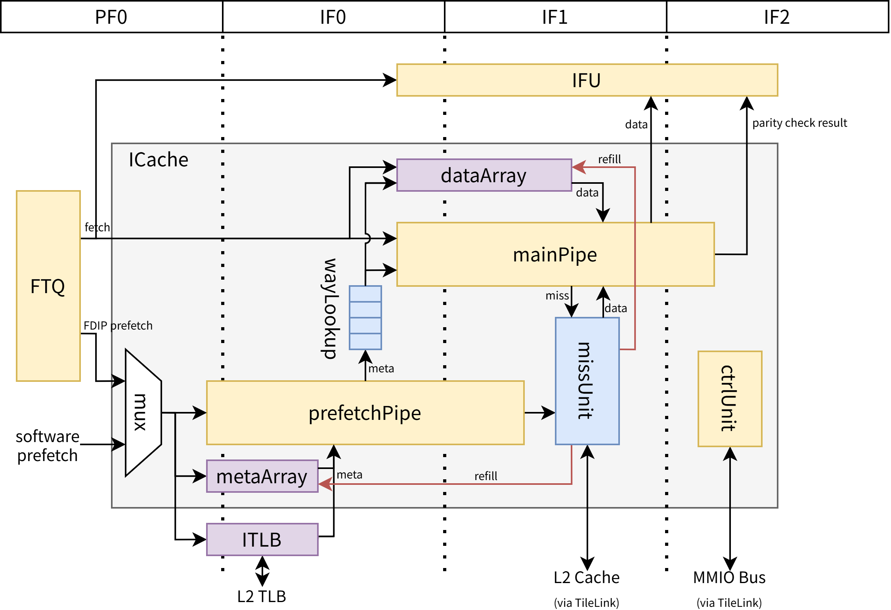
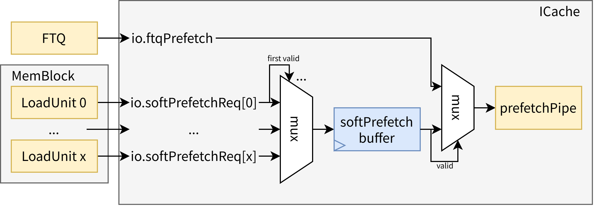
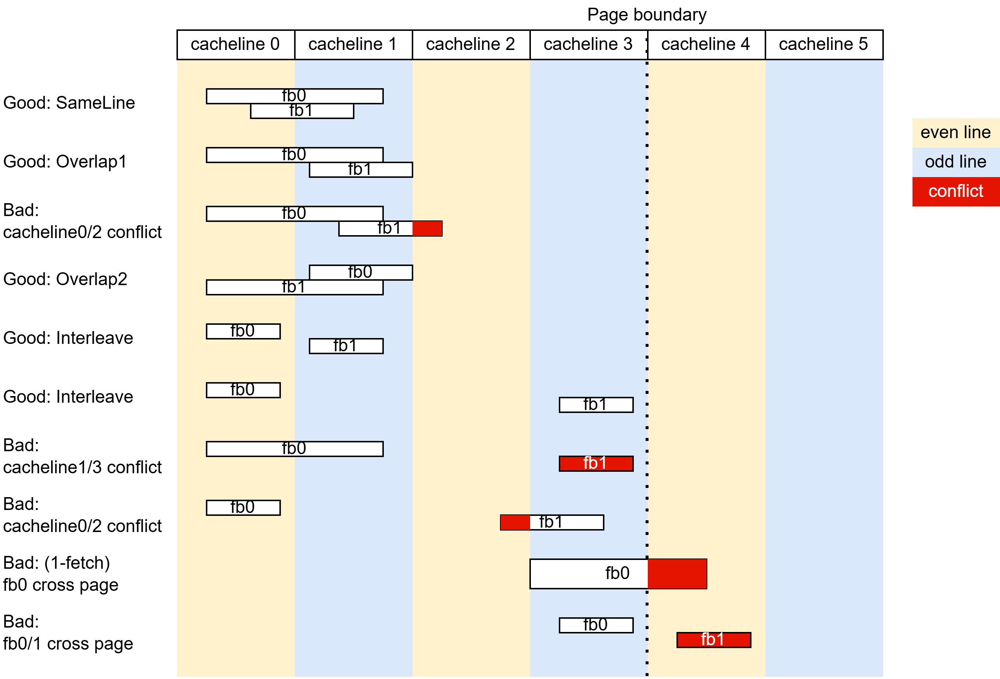

# XiangShan ICache 设计文档

- 版本：V3
- 状态：draft
- 日期：2026/04/22
- commit：TODO

## 术语说明

| 缩写 | 全称 | 描述 |
| --- | --- | --- |
| ICache/I$ | Instruction Cache | L1 指令缓存 |
| L2 Cache/L2$ | Level Two Cache | L2 缓存 |
| FTQ | Fetch Target Queue | 取指目标队列，见 [FTQ 设计文档](../FTQ/index.md) |
| IFU | Instruction Fetch Unit | 取指单元，见 [IFU 设计文档](../IFU/index.md) |
| ITLB | Instruction Translation Lookaside Buffer | 地址翻译缓冲 |
| PMP | Physical Memory Protection | 物理内存保护模块 |
| PMA | Physical Memory Attribute | 物理内存属性模块（是 PMP 的一部分） |
| BEU | Bus Error Unit | 总线错误单元 |
| FDIP | Fetch-directed Instruction Prefetch | 取指导向指令预取 |
| MSHR | Miss Status Holding Register | 缺失状态保持寄存器 |
| af | Instruction Access Fault | 访问错误，RISC-V 手册规定的 1 号异常 |
| (g)pf | Instruction (Guest) Page Fault | 指令（客户机）物理页错误，RISC-V 手册规定的 12 (20) 号异常 |
| hwe | Hardware Error | 硬件错误，RISC-V 手册规定的 19 号异常 |
| vaddr | Virtual Address | 虚拟地址 |
| (g)paddr | (Guest) Physical Address | （客户机）物理地址 |
| PBMT | Page-Based Memory Types | 基于页的内存类型，见特权手册 Svpbmt 扩展 |
| fb | Fetch Block | 取指块 |

## 子模块列表

| 子模块 | 描述 |
| --- | --- |
| [PrefetchPipe](PrefetchPipe.md) | 预取流水线 |
| [MainPipe](MainPipe.md) | 主流水线 |
| [WayLookup](WayLookup.md) | 元数据缓冲队列 |
| [MetaArray](Array.md) | 元数据阵列 |
| [DataArray](Array.md) | 数据阵列 |
| [MissUnit](MissUnit.md) | 缺失处理单元 |
| [Replacer](Replacer.md) | 替换策略单元 |
| [CtrlUnit](CtrlUnit.md) | 控制单元，目前仅用于控制错误校验/错误注入功能 |

## 设计规格

- 缓存指令数据
- 缺失时通过 tilelink 总线向 L2 请求数据
- 软件维护 L1 I/D Cache 一致性（`fence.i`）
- 支持跨 cacheline （预）取指请求
- 支持冲刷（bpu redirect、backend redirect、`fence.i`）
- 支持预取指请求
  - 硬件预取为 FDIP 预取算法
  - 软件预取为 Zicbop 扩展 `prefetch.i` 指令
- 支持可配置的替换算法
- 支持可配置的缺失状态寄存器数量
- 支持检查地址翻译错误、物理内存保护错误
- 支持错误检查 & 错误注入[^ecc]
  - 默认采用 parity code
  - 软件可通过 MMIO 空间访问的错误注入控制寄存器
- DataArray 支持分 bank 存储，细存储粒度实现低功耗
- 支持在 SRAM 不冲突的情况下单周期提供两个取指块，见 [@sec:icache-2fetch] [2-fetch](#2-fetch-secicache-2fetch) 一节的说明。

[^ecc]: 本文档也将错误检查 & 错误注入相关功能称为 ECC，见 [@sec:icache-ecc] [ECC](#ecc-secicache-ecc) 一节的说明。

## 参数列表

见 `Parameters.scala` 中 `case class ICacheParams` 的定义，部分参数的描述如下表所示：

| 参数 | 默认值 | 描述 | 要求 |
| --- | --- | --- | --- |
| nSets | 256 | SRAM set 数量 | 2 的幂次 |
| nWays | 4 | SRAM way 数量 | |
| rowBits | 64 | 每个 bank 的 data 位宽 | (blockBytes * 8) 的因子 |
| blockBytes | 64 | 每个缓存行的字节数 | RVA23 profile 要求固定 64B |
| Replacer | "setplru" | 替换算法 | rocket-chip 的 ReplacementPolicy 支持的算法，目前包括 "random", "setlru", "setplru" |
| NumFetchMshr | 4 | 取指 MSHR 的数量 | |
| NumPrefetchMshr | 10 | 预取 MSHR 的数量 | |
| WayLookupSize | 32 | WayLookup 深度，同时可以反压限制预取最大距离 | |
| MetaEcc | "parity" | MetaArray 的 ECC 类型 | "parity" 或 "secded" |
| DataEcc | "parity" | DataArray 的 ECC 类型 | "parity" 或 "secded" |
| DataEccUnit | 64 | 校验单元大小，单位为 bit，每多少 bit 的数据使用 1bit 的校验位保护 | rowBits 的因子 |
| NumInterleavedBank | 2 | MetaArray 中 interleave 的数量 | 2 的幂次且 >= 2 |
| MetaWaySplit | 2 | MetaArray 中物理 SRAM 按 way 拆分的数量，用于 SRAM 选型优化 PPA | nWays 的因子 |
| MetaDataSplit | 1 | MetaArray 中物理 SRAM 按数据拆分的数量，用于 SRAM 选型优化 PPA | |
| DataPaddingBits | 1 | DataArray 中每项额外的 padding 位数，用于 SRAM 选型优化 PPA | |
| EnableCtrlUnit | true | 是否实例化 CtrlUnit，如果为 false，则 ECC 相关功能无法被软件控制 | |
| ctrlUnitParameters | - | CtrlUnit 的参数 | 见 [CtrlUnit 文档](./CtrlUnit.md) |

## 功能概述

> 阅读本文档前建议先行阅读参考文献中 FDIP、Decoupled Frontend 相关论文，以便了解相关前置知识。

> 本文档及相关代码正在施工中，文档中部分描述可能是目前的设计预期，暂未完全实现，仅供参考！

ICache 结构如图 [@fig:icache-structure] 所示。

{#fig:icache-structure}

从结构上看，ICache 主要由以下功能单元组成：

- prefetchPipe：预取流水线，负责与 metaArray、ITLB 交互获取元数据，并处理预取请求
- mainPipe：主流水线，负责读取 dataArray，处理取指请求，完成 ECC 校验，并向 IFU 发送结果
- wayLookup：作为 prefetchPipe 和 mainPipe 之间的缓冲，缓存元数据查询结果
- metaArray：保存 cacheline 的元数据（tag、valid、maybeRvc 等）及其校验码
- dataArray：保存 cacheline 的数据及其校验码
- missUnit：负责 MSHR 状态维护，接收缺失请求，向 L2 Cache 发起请求，并在收到响应后重填 SRAM
- ctrlUnit：控制单元，使软件可通过 mmio-mapped CSR 控制 ICache 行为，目前仅可控制 ECC 校验相关功能

从流水上看，为了节省各存储结构的读端口和功耗，ICache 采用 metaArray 和 dataArray 串行读取、预取和取指紧耦合的设计，这意味着所有取指块都必须发送到 prefetchPipe，再以相同的顺序发送到 mainPipe，FTQ 的设计会保证这一点。

在处理器上电或发生重定向后，第一个取指请求会被同时发送到 mainPipe 和 prefetchPipe，由于 wayLookup 空，mainPipe 会阻塞一拍，等待 prefetchPipe 将元数据查询结果写入 wayLookup，可以认为 prefetchPipe s0 流水级为预取和取指流水共用，prefetchPipe s1 和 mainPipe s0 位于相同逻辑流水级。随着处理器的运行，由于 ICache miss、IBuffer 满等原因，mainPipe 会出现阻塞，而 prefetchPipe 可以持续运行，因此 wayLookup 会逐渐被填充，此后 mainPipe 和 prefetchPipe 的工作将是并行的，prefetchPipe s0 和 mainPipe s0 位于相同逻辑流水级，直到下一次重定向。

prefetchPipe 和 mainPipe 都会根据 metaArray 和 ITLB 提供的元数据进行缺失和异常判断，当没有异常且缺失时会通过 missUnit 向 L2 Cache 发起请求。prefetchPipe 发起预取请求后可以直接结束当前取指块的处理，而 mainPipe 发起取指请求后需要等待重填、将数据发送到 IFU 后才能完成。

## 功能详述

### 预取请求

ICache 可能接受两个来源的预取请求：

1. 来自 FTQ 的硬件预取请求，基于 FDIP 算法。
2. 来自 Memblock 中 LoadUint 的软件预取请求，其本质是 Zicbop 扩展中的 `prefetch.i` 指令，请参考 RISC-V CMO 手册。

然而，prefetchPipe 每周期仅可以处理一个预取请求，故需要进行仲裁。ICache 顶层负责缓存软件预取请求，并与来自 FTQ 的硬件预取请求二选一送往 prefetchPipe，软件预取请求的优先级高于硬件预取请求。

逻辑上来说，每个 LoadUnit 都有可能发出软件预取请求，因此每周期至多会有 LoadUnit 数量（目前默认参数为`LduCnt=3`）个软件预取请求。但出于实现成本和性能收益考量，ICache 每周期至多仅接收并处理一个，多余的会被丢弃，端口下标最小的优先。此外，若 PrefetchPipe 阻塞，而 ICache 内已经缓存了一个软件预取请求，那么原先的软件预取请求将被覆盖。



对硬件预取请求的处理流程如下：

1. 查询 metaArray、ITLB，得到 wayMask（是否命中某一路的 bitmask）、物理地址、异常信息等元数据
2. 将元数据写入 wayLookup 供 mainPipe 使用
3. 根据 wayMask 和异常信息判断是否需要发起预取请求
   1. 若需要发起预取请求，发送到 missUnit 进行缺失处理

对软件预取请求的处理和硬件预取请求几乎是一致的，但软件预取请求不会影响控制流，故其元数据不会发送到 wayLookup（进而不会发送到 mainPipe 和后续环节）

关于 prefetchPipe 流水级的细节见 [PrefetchPipe 子模块文档](PrefetchPipe.md)。

### 取指请求

对取指请求的处理流程如下：

1. 读取 wayLookup 获取元数据
2. 根据 wayMask 读取 dataArray 获取指令数据（若命中）
3. 根据 wayMask 和异常信息判断是否需要发起取指请求
   1. 若需要发起取指请求，发送到 missUnit 进行缺失处理
4. 将指令数据和元数据发送到 IFU
5. 对指令数据和元数据进行 ECC 校验，将结果发送到 IFU（若使能）

关于 mainPipe 流水级的细节见 [MainPipe 子模块文档](MainPipe.md)。

### 取指请求跨页 {#sec:icache-cross-page}

在 V3 的设计中，为了节省 ITLB 端口，ICache 不允许取指请求跨页，即一个取指请求内的至多两个取指块、两个 cacheline 必须位于同一个页内（`vaddr[49:12]`相同），但 ICache 本身的硬件不对此进行检查，由 BPU 和 FTQ 保障这一点，具体来说，前者在生成取指块时，如果发现取指块起始地址 `startVAddr` + 64 位于下一个页（即 `startVAddr[49:12]` 与 `(startVAddr + 64)[49:12]` 不同），就将取指块截断到页边界的位置（即将 `takenCfiPosition` 标记在本页的最后一个指令处）；后者在尝试发送 2-(pre)fetch 请求时会检查两个取指块是否在同一页，如果不在同一页，就不会发送 2-(pre)fetch 请求。

### 2-(pre)fetch {#sec:icache-2fetch}

为了提高分支密集场景的取指带宽，V3 的 ICache 支持接收 2-(pre)fetch 请求，即每个周期可以接收包含至多两个取指块的（预）取指请求。2-prefetch 和 2-fetch 通过 wayLookup 进行解耦（即，可以将 fb0 和 fb1 作为一个 2-prefetch 请求送入 prefetchPipe，prefetchPipe 会将它们在一拍内入队 wayLookup，而 mainPipe 可以先用一拍处理 fb0，再用一拍处理包含 fb1 和 fb2 的 2-fetch 请求）。出于硬件复杂度和性能收益权衡考虑，无论是 2-prefetch 还是 2-fetch 都存在一些限制，具体来说：

2-prefetch 请求的限制：

1. 软件预取请求不支持 2-prefetch，仅 FTQ 发送的硬件预取请求支持 2-prefetch
2. 如前 [@sec:icache-cross-page] [一节](#取指请求跨页-secicache-cross-page)所述，2-prefetch 请求内的两个取指块必须在同一页内
3. FTQ 内 `bpuPtr - pfPtr` 必须大于等于 4，即 BPU s3 override 第二个取指块的冲刷必须在 FTQ 内完成，一旦将 2-prefetch 请求发送到 prefetchPipe，不允许 BPU 对其进行冲刷（后端重定向造成的冲刷正常进行）
4. 两个取指块不能产生 metaArray 的读端口冲突，即满足下面条件之一：
   1. 位于同一个 cacheline 内
   2. 位于相邻的 cacheline 内，且靠后（setIdx 更大）的取指块不能跨行
   3. 位于 interleave 的 cacheline 内，且两个取指块都不能跨行

一些冲突示例如图 [@fig:icache-2prefetch-conflict] 所示：

{#fig:icache-2prefetch-conflict}

2-fetch 请求的限制：

1. TODO

### 异常传递/特殊情况处理

ICache 负责对取指请求的地址进行权限检查（通过 ITLB 和 PMP），接收 L2 的响应，过程中可能出现的异常如 [@tab:icache-exception] 所示。

Table: ICache 异常列表 {#tab:icache-exception}

| 来源 | 异常 | 描述 | 处理 |
| --- | --- | --- | --- |
| ITLB | af | 虚拟地址翻译过程出现访问错误 | 禁止取指，标记取指块为 af，经 IFU 发送到后端处理 |
| ITLB | gpf | 客户机页错误 | 禁止取指，标记取指块为 gpf，经 IFU 发送到后端处理，将有效的 `gpaddr` 和 `isForNonLeafPTE` 发送到后端的 GPAMem 以备使用 |
| ITLB | pf | 页错误 | 禁止取指，标记取指块为 pf，经 IFU 发送到后端处理 |
| backend | af/pf/gpf | 同 ITLB af/gpf/pf | 同 ITLB af/gpf/pf |
| PMP/PMA | af | 物理地址无权限访问 | 标记取指块为 af，经 IFU 发送到后端处理 |
| L2 | corrupt | L2 cache 响应 corrupt | 标记取指块为 hwe，经 IFU 发送到后端处理 |
| L2 | denied | L2 cache 响应 denied | 标记取指块为 af，经 IFU 发送到后端处理 |
| ECC | corrupt | ECC 校验错误 | 标记取指块为 hwe，经 IFU 发送到后端处理 |

需要指出：

1. 对于一般的取指流程来说，并不存在 backend 异常这一项。但 XiangShan 出于节省硬件资源的考虑，在前端传递的 pc 只有 41 / 50 bit（Sv39\*4 / Sv48\*4），而对于 `jr`、`jalr` 等指令，跳转目标来源于 64 bit 寄存器。根据 RISC-V 规范，高位非全0或全1时的地址不合法，需要引发异常，这一检查只能由后端完成，并随同后端重定向信号一起发送到 FTQ，进而随同取指请求一起发送到 ICache。其本质是一种 ITLB 异常，因此解释描述和处理方式与 ITLB 相同。
2. 在 V2R2 的设计中，PMP/PMA 作为一个单独的模块存在，而 V3 出于时序考虑，PMP/PMA 检查提前到在 ITLB 重填时进行，从 ICache 的接口上看，其结果是随同 ITLB 的检查结果一起发送回 ICache 的。但由于其含义不同，因此上表中仍单独列出。
3. 在 V2R2 的设计中，不支持 hwe 异常（RISC-V 特权手册 v1.13 新增定义），故 V2R2 在上述 hwe 场景都作为 af 处理，不区分 L2 的 corrupt（如 L2 ECC 校验出错）和 denied（如总线无权限）。V3 支持了 hwe。
4. 在 V2R2 的设计中，实现了 ECC 出错时自动重取的功能，故 ECC 错误不引发异常（除非重取时 L2 异常）。V3 出于设计简化和时序考虑去除了这个功能，改为引发 hwe 交由软件处理。

这些异常间存在优先级：backend > ITLB > PMP > L2 = ECC。这是自然的：

1. 当出现 backend 异常时，发送到前端的 vaddr 不完整且不合法，故 ITLB 地址翻译过程无意义，检查出的异常无效；
2. 当出现 ITLB 异常时，翻译得到的 paddr 无效，故 PMP 检查过程无意义，检查出的异常无效；
3. 当出现 PMP 异常时，paddr 无权限访问，取指请求无效，也不会向 L2 发送请求，故 L2/ECC 检查无效。
4. L2 和 ECC 检查天然互斥：前者在 miss 路径上，后者在 hit 路径上，不关心相对优先级。

而对于 backend 的三种异常、ITLB 的三种异常，由 backend 和 ITLB 内部进行有优先级的选择，保证同时至多只有一种拉高。

此外，一些机制还会引发一些特殊情况，在旧版文档/代码中也称为异常，但其实际上并不引发 RISC-V 手册定义的 `exception`，为了避免混淆，此后将称为特殊情况：

| 来源 | 特殊情况 | 描述 | 处理 |
| --- | --- | --- | --- |
| PMP | mmio | 物理地址为 mmio 空间 | 禁止取指，标记取指块为 mmio，由 IFU 进行**非推测性**取指 |
| ITLB | pbmt.NC | 页属性为不可缓存、幂等 | 禁止取指，由 IFU 进行**推测性**取指 |
| ITLB | pbmt.IO | 页属性为不可缓存、非幂等 | 同 pmp mmio |

### 冲刷

在后端/IFU 重定向、BPU 重定向、`fence.i` 指令执行时，需要视情况对 ICache 内的存储结构和流水级进行冲刷。可能的冲刷目标/动作有：

1. MainPipe、PrefetchPipe 所有流水级
    - 冲刷时直接将 `s0/1/2_valid` 置为 `false.B` 即可
2. MetaArray 中的 valid
    - 冲刷时直接将 `valid` 置为 `false.B` 即可
    - `tag`、`code`不需要冲刷，因为它们的有效性由 `valid` 控制
    - DataArray 中的数据不需要冲刷，因为它们的有效性由 MetaArray 中的 `valid` 控制
3. WayLookup
    - 读写指针复位
    - `gpf_entry.valid` 置为 `false.B`
4. MissUnit 中所有 MSHR
    - 若 MSHR 尚未向总线发出请求，直接置无效（`valid === false.B`）
    - 若 MSHR 已经向总线发出请求，记录待冲刷（`flush === true.B` 或 `fencei === true.B`），等到 d 通道收到 grant 响应时再置无效，同时不把 grant 的数据回复给 MainPipe/PrefetchPipe，也不写入 SRAM
    - 需要留意，当 d 通道收到 grant 响应的同时收到冲刷（`io.flush === true.B` 或 `io.fencei === true.B`）时，MissUnit 同样不写入 SRAM，但**会**将数据回复给 MainPipe/PrefetchPipe，避免将端口的延时引入响应逻辑中，此时 MainPipe/PrefetchPipe 也同步收到了冲刷请求，因此会将数据丢弃

每种冲刷原因需要执行的冲刷目标：

| 冲刷原因 | 1 | 2 | 3 | 4 |
| --- | --- | --- | --- | --- |
| 后端/IFU 重定向 | Y | | Y | Y |
| BPU 重定向 | Y[^redirect_tab_bpu] | Y[^redirect_tab_bpu] | | |
| `fence.i` | Y[^redirect_tab_fencei] | Y | Y[^redirect_tab_fencei] | Y |

[^redirect_tab_bpu]: BPU 精确预测器（BPU s3 给出结果）可能覆盖简单预测器（BPU s0 给出结果）的预测，显然其重定向请求最晚在预取请求的 2 拍之后就到达 ICache，因此仅需要冲刷 prefetchPipe s0/1、wayLookup 队尾项，见两个子模块文档。

[^redirect_tab_fencei]: `fence.i` 在逻辑上需要冲刷 MainPipe 和 PrefetchPipe（因为此时流水级中的数据可能无效），但实际上`io.fencei`拉高必然伴随一个后端重定向，因此目前的实现中没有冲刷 MainPipe 和 PrefetchPipe 的必要。

ICache 进行冲刷时不接收取指/预取请求（`io.req.ready === false.B`）

#### 对 ITLB 的冲刷

ITLB 的冲刷比较特殊，其缓存的页表项仅需要在执行 `sfence.vma` 指令时冲刷，而这条冲刷通路由后端负责，因此前端/ICache 一般不需要管理 ITLB 的冲刷。只有一个特例：目前 ITLB 为了节省资源，不会存储 `gpaddr`，而是在 `gpf` 发生时去 L2TLB 重取，重取状态由一个 `gpf` 缓存控制，这要求 ICache 在收到 `ITLB.resp.excp.gpf_instr` 时保证下面两个条件之一：

1. 重发相同的 `ITLB.req.vaddr`，直到 `ITLB.resp.miss` 拉低（此时`gpf`、`gpaddr`均有效，正常发往后端处理即可），ITLB 此时会冲刷 `gpf` 缓存。
2. 给 `ITLB.flushPipe`，ITLB 在收到该信号时会冲刷 `gpf` 缓存。

若 ITLB 的 `gpf` 缓存未被冲刷，就收到了不同 `ITLB.req.vaddr` 的请求，且再次发生 `gpf`，将导致核卡死。

因此，每当冲刷 PrefetchPipe 的 s1 流水级时，无论冲刷原因为何，都需要同步冲刷 ITLB 的 `gpf` 缓存（即拉高 `ITLB.flushPipe`）。

### ECC {#sec:icache-ecc}

首先需要指出，ICache 在默认参数下使用 parity code，其仅具备 1 bit 错误检测能力，不具备错误恢复能力，严格意义上不能算是 ECC（Error Correction Code）。但一方面，其可以配置为使用 secded code；另一方面，我们在代码中大量使用 ECC 来命名错误检测与错误恢复相关的功能（`ecc_error`、`ecc_inject`等）。因此本文档仍将使用 ECC 一词来指代错误检测、错误恢复、错误注入相关功能以保证与代码的一致性。

ICache 支持错误检测、错误恢复、错误注入功能，是 RAS[^ras] 能力的一部分，可以参考 RISC-V RERI[^reri] 手册，由 CtrlUnit 进行控制。

[^ras]: 此 RAS（Reliability, Availability, and Serviceability）非彼 RAS（Return Address Stack）。

[^reri]: RERI（RAS Error-record Register Interface），参考 [RISC-V RERI 手册](https://github.com/riscv-non-isa/riscv-ras-eri)。

#### 错误检测

在 MissUnit 向 MetaArray 和 DataArray 重填数据时，会计算 meta 和 data 的校验码，前者和 meta 一起存储在 Meta SRAM 中，后者存储在单独的 Data Code SRAM 中。

当取指请求读取 SRAM 时，会同步读取出校验码，在 MainPipe 的 s1/s2 流水级中分别对 meta/data 进行校验。软件可以通过向 CSR 中相应位置写入特定的值来使能/关闭这一功能，在 6-12 月的版本中为自定义 CSR `sfetchctl`，后续换成 mmio-mapped CSR，详见 [CtrlUnit 文档](./CtrlUnit.md)。

在校验码设计方面，ICache 使用的校验码可由参数控制，默认使用的是 parity code，即校验码为对数据做规约异或 $code = \oplus data$。检查时只需将校验码和数据一起做规约异或 $error = (\oplus data) \oplus code$，结果为 1 则发生错误，反之**认为没有**错误（可能出现偶数个错误，但此处检查不出来）。

在 [#4044](https://github.com/OpenXiangShan/XiangShan/pull/4044) 以后的版本中，ICache 支持错误注入，这要求 ICache 支持向 MetaArray/DataArray 写入错误的校验码。因此实现了一个`poison`位，当其拉高时，翻转写入的 code，即 $code = (\oplus data) \oplus poison$。

为了减少检查不出的情况，目前将 data 划分成 DataCodeUnit（默认为 64bit）的单元分别进行奇偶校验，因此对每个 64B 的缓存行，总计会计算 $8(data) + 1(meta) = 9$ 个校验码。

当 MainPipe 的 s1/s2 流水级检查到错误时，会进行以下处理：

1. 错误处理：引起 hwe 异常，由软件处理。
2. 错误报告：向 BEU 报告错误，后者会引起中断向软件报告错误。
3. 取消请求：当 MetaArray 被检查出错误时，其读出的 ptag 不可靠，进而对 hit 与否的判断不可靠，因此无论是否 hit 都不向 L2 Cache 发送请求，而是直接将异常传递到 IFU、进而传递到后端处理。

#### 错误注入

根据 RISC-V RERI 手册[^reri]的说明，为了使软件能够测试 ECC 功能，进而更好地判断硬件功能是否正常，需要提供错误注入功能，即主动地触发 ECC 错误。

ICache 的错误注入功能由 CtrlUnit 控制，通过向 mmio-mapped CSR 中相应位置写入特定的值来触发。详见 [CtrlUnit 文档](./CtrlUnit.md)。

目前 ICache 支持：

- 向特定 paddr 注入，当请求注入的 paddr 未命中时，注入失败
- 向 MetaArray 或 DataArray 注入
- 当 ECC 校验功能本身未使能时，注入失败

软件注入流程示意如下：

```asm
inject_target:
  # maybe do something
  ret

test:
  la t0, $BASE_ADDR     # 载入 mmio-mapped CSR 基地址
  la t1, inject_target  # 载入注入目标地址
  jalr ra, 0(t1)        # 跳转到注入目标以保证其加载到 ICache
  sd t1, 8(t0)          # 向 CSR 写入注入目标地址
  la t2, ($TARGET << 2 | 1 << 1 | 1 << 0)  # 设置注入目标、注入使能、校验使能
  sd t1, 0(t0)          # 向 CSR 写入注入请求
loop:
  ld t1, 0(t0)          # 读取 CSR
  andi t1, t1, (0b11 << (4+1)) # 读取注入状态
  beqz t1, loop         # 如果注入未完成，继续等待

  addi t1, t1, -1
  bnez t1, error        # 如果注入失败，跳转到错误处理

  jalr ra, 0(t1)        # 注入成功，跳转到注入目标地址以触发错误
  j    finish           # 结束

error:
  # handle error
finish:
  # finish
```

我们编写了一个测试用例，见[此仓库](https://github.com/OpenXiangShan/nexus-am/pull/48)，其测试了如下情况：

1. 正常注入 MetaArray
2. 正常注入 DataArray
3. 注入无效的目标
4. 注入但 ECC 校验未使能
5. 注入未命中的地址
6. 尝试写入只读的 CSR 域

## 参考文献

1. Glenn Reinman, Brad Calder, and Todd Austin. "[Fetch directed instruction prefetching.](https://doi.org/10.1109/MICRO.1999.809439)" 32nd Annual ACM/IEEE International Symposium on Microarchitecture (MICRO). 1999.
