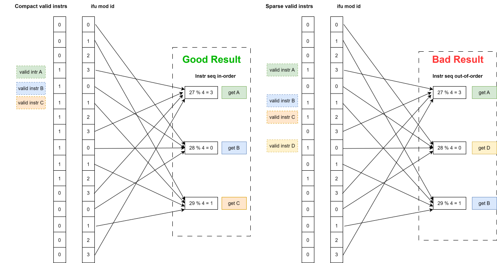
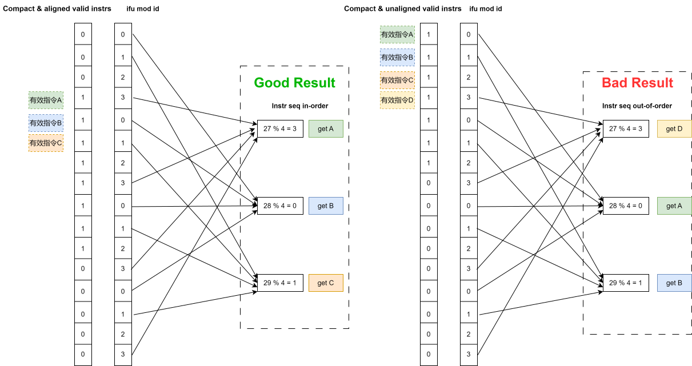
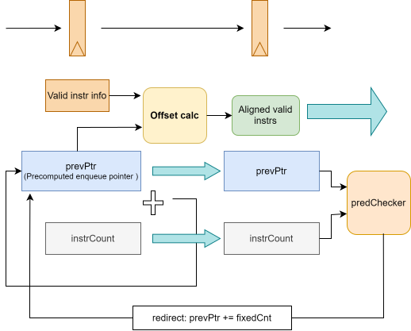

# IFU 指令紧密排列与对齐

## 功能描述

### 功能概述
IFU 在完成指令定界与预译码后，需要把有效指令压缩为紧密排列的顺序流，并按 IBuffer 的写入方式进行对齐，以降低入队时的选择复杂度和时序压力。

本页描述的是 IFU 内部的功能逻辑，而不是独立的 Chisel 子模块。在当前硬件实现中，对齐函数（如 `align` / `alignData`）定义于 `Helpers.scala`，并在 IFU 的 S1 流水级内联调用。

该逻辑的核心目标是：在保持指令顺序不变的前提下，将稀疏有效位压缩为连续有效流，并把第一条有效指令对齐到当前 IBuffer 的入队位置。

### 有效指令的紧密排布
IBuffer 是先进先出队列。`enqPtr` 表示 IBuffer 当前可入队的第一项 `entry` 位置，`enqPtr + 1` 表示第二项 `entry` 位置。若 IFU 向 IBuffer 提供稀疏的有效指令，则 IBuffer 的第一项可入队 `entry` 需从这些指令中选出第一条有效指令；第二项则需选出第二条。极端情况下，IFU 最多提供 32 条指令，IBuffer 的每一项都将面临 32 选 1 的选择压力。

IFU 和 IBuffer 可以通过约定降低这一选择压力。IBuffer 采用写分 Bank 策略：为 IBuffer 队列的每一项编号，得到 `ibuffer_mod_id = IBuffer 编号 % 4`；同时为 IFU 提供的入队指令编号，得到 `ifu_mod_id = IFU 编号 % 4`。IBuffer 的 `entry` 仅从满足 `ibuffer_mod_id === ifu_mod_id` 的项中选择，使选择规模从 32 选 1 降至 8 选 1。

这一方案的可行性依赖指令连续性。若 IBuffer 当前入队 `entry` 的 `ibuffer_mod_id = 3`，则下一项 `entry` 的 `ibuffer_mod_id = 0`。在不打乱指令顺序的前提下，IFU 送入的有效指令必须连续；稀疏的指令排布会破坏这一对应关系。下图展示了第一项要求，即 IFU 的输出指令须为连续的有效指令；第二张图展示了第二项要求。

### 对齐与前置计算
代价是 IFU 需引入相关计算逻辑，以筛选紧密排列的有效指令索引。相较于在 IBuffer 入队时对每条指令携带的数据进行筛选，IFU 计算指令索引所需逻辑更少。IFU 将有效指令紧密排列后，尽管仍有 32 个指令信息存储位置，但可以进行更精细的时钟门控。

在有效指令筛选的基础上，IFU 还需进行对齐：将第一条指令偏移至当前 IBuffer 入队指针 `enqPtr % 4` 对应的位置，因此最大偏移量为 3。有效指令对齐的关键是提前获取 `enqPtr` 的值。`enqPtr` 是有效指令数量的累加值，遇到后端重定向时复位为 0。IFU 能确定送入 IBuffer 的有效指令数量，也能接收后端重定向信号，因此可提前计算 `prevIBufferEnqPtr`，如下图所示：

此外，IFU 还会提前计算可能入队 IBuffer 的最大指令数量，信号名为 `prevInstrCount`。这使 IBuffer 能更准确地决定是否向 IFU 施加反压，避免因无法保证下一周期继续容纳 32 条指令而频繁反压。
