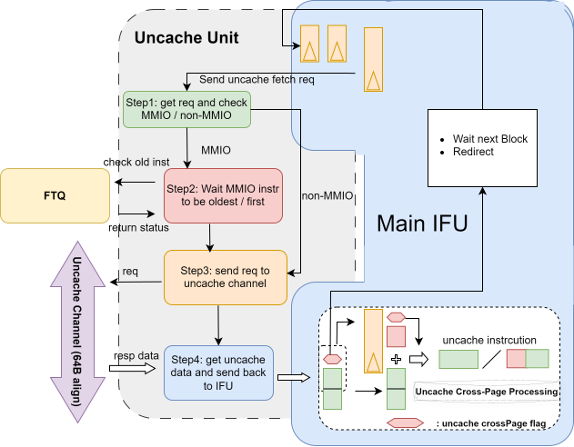

# IFU 子模块 IfuUncacheUnit

## 功能描述

### 功能概述
`uncache` 模块主要负责从 `uncache` 总线提取指令，并阻止 MMIO 指令的推测执行。受 PBMT 属性影响，部分非缓存指令数据允许推测执行，因此需对 MMIO 指令作特殊区分。

需要强调的是，`uncache` 指令数据来自 S3 级，因此任何在 S1、S2 级基于指令数据计算的结果均需重新审视。

### 关键处理逻辑
`uncache` 本身不处理跨页指令；遇到跨页的 `uncache` 指令时，将其拆分为两个预测块处理，这与缓存指令跨页的处理类似。

`uncache` 需要物理地址以向 `uncache` 总线发出取指请求；还需确认流入后端的指令是否均已执行完毕，以处理 MMIO 阻塞逻辑。它也需要 PMP 和 PBMT 的结果，以确认当前 `uncache` 请求是否为需阻止推测执行的 MMIO 请求。

对于处理器执行的第一条指令，由于不存在更旧的指令，可越过阻塞机制，直接向 `uncache` 总线发出取指请求。

`uncache` 总线每次均返回 64 字节对齐的数据。因此，当指令跨越 64 字节边界时，前端 `uncache` 通路会发送两次请求，IFU 无需感知。跨页时则不同：两个页面的物理地址理论上可能不连续，前端 `uncache` 通路无法发送两次请求，会返回 `crossPage` 状态标志，由 IFU 进行额外的拼接处理。

### uncache 指令的处理流程
- 第一步：`uncache` 状态机接收 IFU 的 `uncache` 请求，并判断是否为非 MMIO 请求。若是，直接向 `uncache` 通路发送请求并转至第三步；否则，等待 MMIO 指令成为最旧指令并转至第二步。
- 第二步：若 MMIO 指令是处理器执行的第一条指令或最旧指令，则转至第三步；否则持续等待。
- 第三步：若 `uncache` 通道接收请求，则转至第四步；否则继续等待。
- 第四步：若接收到 `uncache` 通道返回的数据，`uncache` 子模块将数据回传给 IFU 主体，由 IFU 主体处理；否则继续等待。
- 无条件冲刷：`uncache` 子模块接收 `Flush` 信号后，无论处于哪个步骤，均复位所有控制寄存器。不考虑 `uncache` 通道是否处理完毕，因为该通道也会接收 `Flush` 信号。

### IFU 接收 uncache 子模块信息后的处理
IFU 主体接收 `uncache` 子模块信息后，根据是否跨页分两种情况处理：

- 跨页：若预测器给出顺序取指结果，IFU 主体暂存半条指令的数据，等待下一个预测块完成 `uncache` 子模块流程后，拼接两个预测块的指令数据。若预测器给出跳转结果，IFU 同样暂存半条指令数据，但会立即发送重定向，从正确的下一个预测块获得另一半数据。
- 非跨页：一条指令可在一个预测块中取完。
- 当前 IFU 完成一条 `uncache` 指令的取指后，无论预测器是否给出顺序执行结果，均发送重定向并要求顺序执行。若需提高 `uncache` 取指速度，可将此作为后续优化点。

### 整体框图

