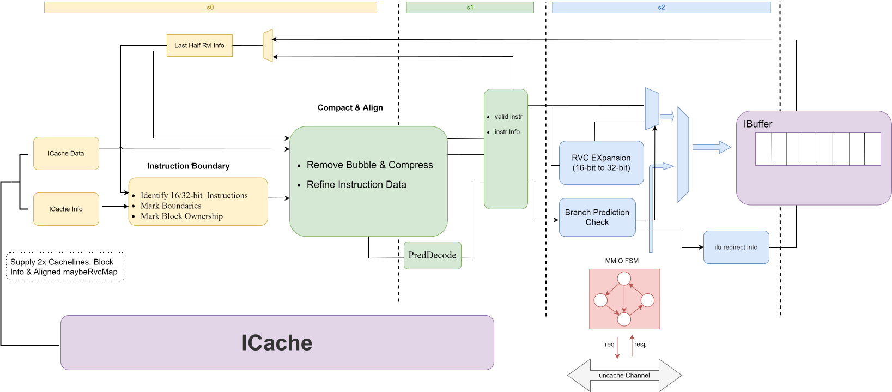

# 昆明湖 IFU 设计文档 {#sec:ifu-index}

- 版本：V3
- 状态：draft
- 日期：2026/08/25
- commit：[f91bdbb8c69e2ad9e041a7dcd92146f5a397d61c](https://github.com/OpenXiangShan/XiangShan/tree/f91bdbb8c69e2ad9e041a7dcd92146f5a397d61c)

## 术语说明 {#sec:ifu-glossary}

| 缩写 | 全称 | 描述 |
| --- | --- | --- |
| RVC | RISC-V Compressed Instructions | RISC-V 手册中 "C" 扩展规定的 16 位压缩指令 |
| RVI | RISC-V Integer Instructions | RISC-V 手册规定的 32 位基本整型指令 |
| IFU | Instruction Fetch Unit | 取指令单元 |
| FTQ | Fetch Target Queue | 取指目标队列 |
| PredChecker | Prediction Check Module | 分支预测结果检查器 |
| ICache | L1 Instruction Cache | 一级指令缓存 |
| IBuffer | Instruction Buffer | 指令缓冲 |
| CFI | Control Flow Instruction | 控制流指令 |
| InstrUncache | Instruction Ucache Module | 指令 uncache 取指处理单元 |

## 组成模块与相关功能 {#sec:ifu-submodules}

| 子模块 | 描述 |
| --- | --- |
| [InstrBoundary](instrBoundary.md) | 指令定界模块，负责分析指令块数据中每条指令的位置 |
| [RvcExpander](rvcExpander.md) | C 指令扩展，负责将 16 位压缩指令扩展为 32 位标准指令，并标记非法 C 指令 |
| [PredChecker](predChecker.md) | 预译码检查模块，结合预译码信息，及早纠正部分指令流 |
| [IfuUncacheUnit](ifuUncacheUnit.md) | uncache 指令取指处理单元 |
| [IfuTrigger](ifuTrigger.md) | Trigger 触发器检查模块 |
| [指令紧密排列与对齐](ifuAlign.md) | IFU 内联的指令压缩与 IBuffer 入队对齐逻辑 |

## 设计规格 {#sec:ifu-design-spec}

- **设计目的**：
  主要目标是从 ICache 的原始数据中提取出预测块范围内的每条有效指令数据。在该目标基础上存在一些附带好处：根据有效指令数据，可以提前发现部分分支指令的预测错误并及时纠正。目前功能划分上，IFU 还接管了 uncache 的取指逻辑，需要按需阻塞 uncache 取指，避免对外设造成读副作用。
- **吞吐与架构规格**：
  - 支持最高每周期 32 条指令的定界、对齐与预译码。
  - 支持 twoFetch 双预测块拼接处理，允许单周期处理最高 64 字节拼接预测块。
  - 支持将 16 位压缩指令（RVC）解压扩展为 32 位标准指令（RVI），并标记非法 C 指令。
  - 流水线划分：主供指通路经2拍延迟将有效指令送入 IBuffer（S0 级做 SRAM 数据定界前置，S1 级做 Compact 排列与预译码，S2 级当拍送出）；S3 级专用于在发现误预测时旁路计算重定向目标地址，避免打断流水线主路径。

## 参数列表 {#sec:ifu-params}

IFU 相关参数在 Scala 源码中定义于 FrontendParameters.scala 和 ifu/Parameters.scala：

| 参数 | 默认值 | 描述 | 要求 |
| --- | --- | --- | --- |
| FetchBlockSize | 64 | 取指数据块大小（Byte） | 2 的幂次（限制为 64B） |
| FetchBlockInstNum | 32 | 一个取指块按 2B 槽位划分时可容纳的最大指令数 | `FetchBlockSize / 2`；当前配置为 `64 / 2 = 32` |
| FetchPorts | 2 | 预测/取指端口数量（twoFetch 拼接） | 仅支持 1 或 2 |
| NumWriteBank | 4 | IBuffer 写入 Bank 数量 | 当前对齐逻辑按 `指令编号 % 4` 分 Bank |
| PcCutPoint | (VAddrBits/4)-1 | 预测块 PC 比较低位截断点 | $0 < \text{PcCutPoint} < \text{VAddrBits}$ |
| IfuAlignWidth | 4 | 指令对齐逻辑宽度 | `NumWriteBank`，当前为 4 |
| IBufferEnqueueWidth | 36 | IFU 向 IBuffer 入队的最大端口宽度 | `FetchBlockInstNum + NumWriteBank = 32 + 4` |

## 功能概述 {#sec:ifu-functional-overview}

IFU（Instruction Fetch Unit）位于前端分支预测（FTQ）和一级指令缓存（ICache）之后、指令缓冲（IBuffer）之前。在预测路径和 ICache 命中结果确定后，IFU 接收由 ICache 传递的与预测块对齐的 `maybeRvcMap` 信息以及两行 `cacheLine` 数据（每行 `cacheLine` 对应一个预测块；若预测块跨缓存行，ICache 会根据实际可能使用的范围将其融合为一行）。IFU 负责将这些指令数据进行抽取切分、定界、解压（C 指令扩展）、对齐并完成简单的预译码，随后送入 IBuffer 供后续译码阶段使用。

IFU 模块的存在会增加指令流路径上的恢复延迟，因此在满足时序约束情况下，要尽可能缩短 IFU 计算的耗时。IFU 区分了数据交付通路与重定向通路：交付通路由 S0 到 S2 拍，S3 级在捕获到预测错误时计算重定向目标地址。

{width=85%}

- **S0 级**：数据由 ICache SRAM 直出，进行数据寄存并完成 `InstrBoundary` 指令定界前置计算。
- **S1 级**：执行 `compact` 函数实现有效指令紧密对齐排序，并由内嵌的预译码 Helper 函数（`getJalOffset` / `getBrOffset` / `BranchAttribute.decode`）直接并行提取 CFI 指令跳转偏移与分支属性。
- **S2 级**：通过 `RvcExpander` 将 16 位 C 指令扩展为 32 位 I 指令，由 `PredChecker` 校验预测结果，缩减有效指令范围，并在当拍送入 IBuffer。
- **S3 级**：若 S2 级捕获到分支预测错误，将重定向计算解耦在 S3 级完成，随后向 FTQ 发起重定向。

## 功能详述 {#sec:ifu-functional-details}

### twoFetch 双预测块拼接机制 {#sec:ifu-two-fetch}

为了满足宽发射后端的吞吐需求，IFU 支持单周期接收并处理两个预测块（twoFetch）：

- **逻辑复用**：V3 架构限制两个预测块总长不超过 64 字节，IFU 将其拼接为一个大块，共用单套 64 字节预译码与定界通道，规避了独立双通道带来的 128 字节逻辑与面积/时序灾难。
- **跨块半条指令（Half-Instruction）处理**：若预测块末尾截断了 32 位指令，IFU 内部保留该半条与下一预测块拼接。在 twoFetch 模式下分别保留两个 16 位半条指令（half-RVI）记录，确保无论哪一个预测块发生冲刷均能按需恢复。

### 预译码与 C 指令扩展 {#sec:ifu-predecode-rvc}

- **预译码**：通过 `getJalOffset`、`getBrOffset` 及 `BranchAttribute.decode` 并行提取 CFI 指令特征与跳转 Offset。
- **C 指令扩展（RvcExpander）**：将 16 位 C 指令转换为 32 位 I 指令。对于非法 C 指令，输出 `ill` 标记并保持原始数据，以便后续流水线精确保留异常原因。

### 预译码检查（PredChecker）与早纠错 {#sec:ifu-predchecker}

`PredChecker` 在 S2 流水级对比预译码得出的实际指令特征与 FTQ 拿到的预测特征：
- 若结果一致，指令打包压入 IBuffer。
- 若发现预测器猜错（如目标地址不符或分支类型错误），在 S3 流水级计算重定向目标 PC 并反哺 FTQ，及时冲刷后续无效推测指令，大幅降低预测惩罚。

### Uncache 与 MMIO 指令取指管控 {#sec:ifu-uncache-mmio}

ICache 仅处理缓存（Cacheable）取指通道，并在地址翻译/属性检查阶段识别指令属性。当检测到 Uncache 取指时，需由位于 ICache 与 IBuffer 之间的 `IfuUncacheUnit` 接管处理：
- **普通 Uncache 取指**（如非 MMIO 的不可缓存页）：允许推测执行，但必须改走 Uncache 通道进行取指，而非缓存通道。
- **MMIO 取指**：由于与外围设备交互具有不可逆的物理副作用，禁止推测取指，需待指令达到非推测条件后由 `IfuUncacheUnit` 发起安全的非推测取指。

### 异常处理 {#sec:ifu-exception}

IFU 位于取指路径，汇集了取指阶段所有可能的异常来源，统一编码为 `ExceptionType`（None / Pf / Gpf / Af / Ill / Hwe）并随指令送入 IBuffer：

| 异常来源 | 检测位置 | 异常类型 |
| --- | --- | --- |
| ICache 元数据（ITLB 页错误、PMP 访问违例） | S0 级随 `icacheMeta` 传入 | Pf / Gpf / Af |
| ICache ECC/parity 校验 | S1 级合并（请求 fire 后一拍返回校验结果） | Hwe |
| RVC 非法指令扩展 | S2 级 `RvcExpander` 的 `ill` 输出 | Ill |
| uncache 通路 TileLink `corrupt` / `denied` | uncache 返回（Af = denied，Hwe = corrupt 且非 denied） | Af / Hwe |
| uncache 通路 RVC 扩展 | uncache 返回 | Ill |

ICache 异常作用于整个取指块，`exceptionMask` 只在第一条入队指令（对齐槽位 `s2_alignShiftNum`）置位；RVC `ill` 则精确标记发生非法的指令。`ExceptionType` 的定义参见 [@sec:icache-exception-special] [ICache 特殊情况处理](../ICache/index.md#sec:icache-exception-special) 一节关于异常的说明。

### 刷新与重定向机制 {#sec:ifu-redirect}

重定向分为 IFU 自身产生的重定向和接收自外界的重定向。IFU 自身产生的重定向需要刷新自身暂存的无效寄存器数据，并对 FTQ 发送重定向信号。重定向期间需要注意：一是向 FTQ 发送重定向时要避免无效 FTQ 数据再次进入 IFU；二是需将 half-RVI 信息正确送到各流水线寄存器；三是避免在 IBuffer 反压期间发生错误冲刷，导致有效信息未进入 IBuffer 即被刷掉。外界重定向则按需冲刷对应流水级即可。
