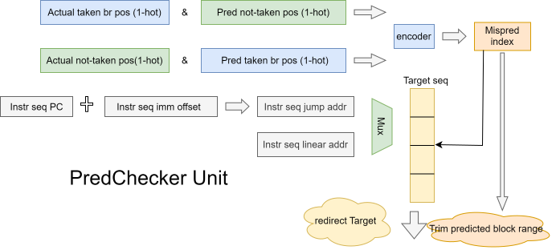

# IFU 子模块 PredChecker

## 功能描述

### 功能概述
PredChecker 负责检查易于发现的预测错误，以便及时纠正。越早发现预测错误，就越能尽早将指令流纠正回正确执行路径。IFU 阶段可以获取全部指令信息，但无法获得正确的寄存器信息。

### 预测可检查内容
- 预测方向：`jal`/`jalr` 指令必然跳转，普通指令必然不跳转（异常情况除外）。遇到此类情况，可裁剪预测块大小，避免处理器沿错误路径继续执行。
- 目的地址：普通指令必然顺序执行；还可计算 `jal` 指令和分支指令的目的地址，并在特定情况下推断 `jalr` 类函数返回指令的目的地址。
- 因此，IFU 具备一定的辅助预测能力。

### 实现权衡
对于预测块范围，应尽可能修正。对于目的地址，通常不进行修正，因为预测器给出的目的地址绝大概率正确。仅当发现预测块范围错误时，才提供 IFU 计算的目的地址。这是在实际收益与实现成本之间的折中：指令类型和位置均预测正确但目的地址错误的情况并非不存在，但发生概率较低。

### 整体框图
