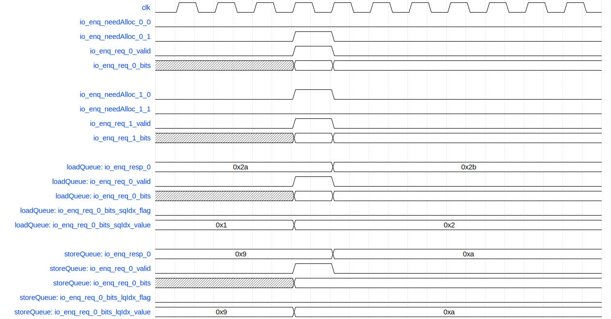

# 访存队列 LSQ

## 子模块列表

| 子模块 | 描述 |
| --- | --- |
| [VirtualLoadQueue](VirtualLoadQueue.md)   | TODO |
| [LoadQueueRAR](LoadQueueRAR.md)           | TODO |
| [LoadQueueRAW](LoadQueueRAW.md)           | TODO |
| [LoadQueueReplay](LoadQueueReplay.md)     | DONE |
| [LoadQueueUncache](LoadQueueUncache.md)   | TODO |
| [LoadExceptionBuffer](LqExceptionBuffer.md) | TODO |
| [StoreQueue](StoreQueue.md)               | DONE |

## 功能描述

LSQ包括了LoadQueue和StoreQueue两个部分，并做了一层wrapper，便于端口的连接。Lsqwrapper的作用主要只是连线。

  * LoadQueue

    * LoadQueueRAR: RAR违例检查队列

    * LoadQueueRAW：RAW违例检查队列

    * LoadQueueUncache: MMIO/Noncacheable load指令处理队列

    * LoadQueueReplay: Load指令调度重发队列

    * LoadExceptionBuffer: Load指令异常处理队列

    * VirtualLoadQueue: Load指令顺序维护队列

  * StoreQueue

#### 特性 1：更新Load指令的LqPtr和Store指令的SqPtr

* 由于时序的影响，LqPtr和SqPtr的分配被拆分为两部分，如图

  {#fig:LSQ-LsqEnqCtrl width=60%}

  * Dispatch阶段

    * 统计每条指令的LoadFlow或者StoreFlow数，并以累加的方式计算出LqPtr或者SqPtr

  * LSQ入队阶段

    * 根据LoadQueue或者StoreQueue维护的enqPtr以累加的方式计算出准确的LqPtr或者SqPtr

  * LsqEnqCtrl更新逻辑

    * 如果出现刷新流水线，则根据刷新Load或者Store指令数和commit数更新

    * 如果没有出现刷新流水线，但是有分配的请求，责根据enq和commit数更新

    * 否则，根据commit数更新

## 整体框图

{#fig:LSQ width=40%}

\newpage

## 接口时序

### Load指令和Store指令入队接口时序实例

{#fig:LSQ-LsqEnqCtrl-Timing width=90%}
