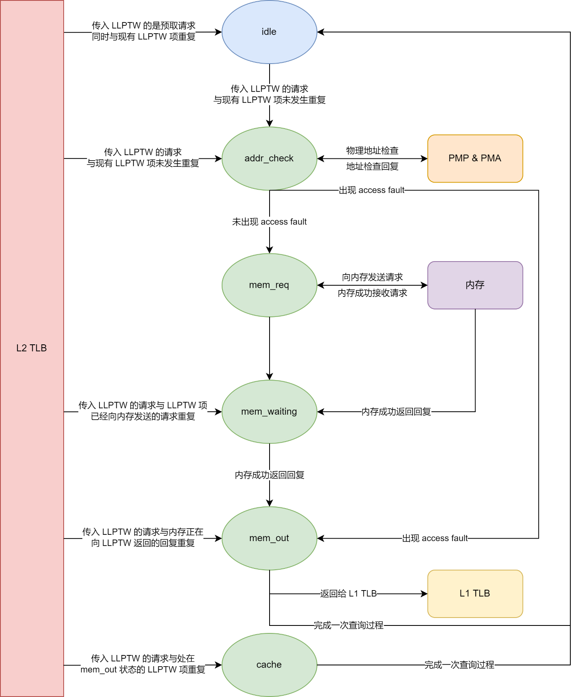
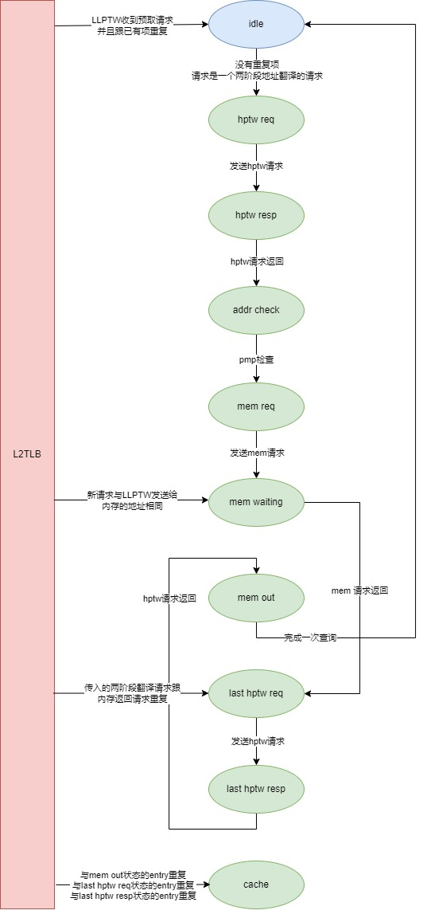

# 三级模块 Last Level Page Table Walker

Last Level Page Table Walker 指的是如下模块：

* LLPTW llptw

## 设计规格

1.  支持访问最后一级页表
2.  支持并行处理多项请求
3.  支持向内存发送 PTW 请求
4.  支持向 Page Cache 发送 refill 信号
5.  支持异常处理机制
6.  支持第二阶段翻译

## 功能

### 访问最后一级页表

Last Level Page Table Walker 的作用是访问最后一级页表，同时可以提高 Page Table Walker 的访问并行度。Page Table Walker 同时只能够处理一个请求，而 LLPTW 可以同时处理多个请求，如果多个请求之间存在重复，LLPTW 并不会合并重复的请求，而是将这些请求记录下来，共享访存的结果，避免重复访问内存。

LLPTW 可能接收 Page Cache 或 Page Table Walker 的请求。对于 Page Cache 的请求，需要满足命中二级页表、未命中第三级页表，且不是 bypass 请求。对于 Page Table Walker 的请求，由于已经满足只缺少最后一级页表，因此可以通过 LLPTW 访问内存。通过仲裁器将 Page Cache 和 Page Table Walker 的请求做仲裁，并送往 LLPTW。

Page Table Walker 和 LLPTW 共同合作，可以共同完成 Page Table Walk 的全流程。为了提高访存的并行度，LLPTW 为请求配置不同的 id，可以同时拥有多个 inflight 的请求。由于不同请求的前两级页表可能相同，同时考虑到前两级页表的 miss 概率比最后一级页表低，因此无需考虑提高前两级页表的访问并行度，只通过 Page Table Walker 处理单条请求，降低设计的复杂度。

### 并行处理多项请求

LLPTW 可以同时处理多个请求，并行处理的数量为 LLPTW 的项数。如果多个请求之间存在重复，LLPTW 并不会合并重复的请求，而是将这些请求记录下来，共享访存的结果，避免重复访问内存。LLPTW 的每一项通过状态机维护访问内存的状态，当 LLPTW 新接收一条请求时，会将新请求的地址和已有请求的地址进行比较，如果地址相同，则将已有请求的状态复制给新请求。因此这些地址相同的请求可以共享访存结果，避免重复访问请求。

### 向内存发送 PTW 请求

和 Page Table Walker 的行为类似，LLPTW 同样可以向内存发送 PTW 请求。LLPTW 会将重复的请求合并，共享访存结果，避免重复访问内存。由于内存每次返回的数据为 512 bits 较大，因此返回的结果并不会存储在 LLPTW 中。如果在 LLPTW 向内存发送的 PTW 请求得到结果时向 LLPTW 传入 PTW 请求，同时该请求的物理地址与内存返回的物理地址匹配，则将该请求发送给 Miss queue，等待下次访问 Page Cache。

### 向 Page Cache 发送 refill 信号

Last Level Page Table Walker 向 Page Cache 发送 refill 信号的逻辑也与 Page Table Walker 类似，这里不再赘述。

### 异常处理机制

Last Level Page Table Walker 中可能出现 access fault 异常，会交付给 L1 TLB，L1 TLB 根据请求来源交付处理。参见本文档的第 6 部分：异常处理机制。

### 支持第二阶段翻译

新增了 state_hptw_req、state_hptw_resp、state_last_hptw_req 和 state_last_hptw_resp 四个状态，当一个两阶段翻译请求进入 LLPTW 后，首先进行一次第二阶段翻译，获取三级页表的真实物理地址，然后进行地址检查，访存，得到三级页表后，返回之前还需要进行一次第二阶段翻译，获得最后的物理地址。

每个 entry 新增了 hptw resp 结构，用来保存每次第二阶段翻译的结果。在第一次第二阶段翻译，hptw 返回的时候，会检查所有项，如果有在同一个 cacheline 的访存请求已经发送，则直接进入 mem waiting 阶段。

LLPTW 新增了一些仲裁器用于第二阶段翻译。hyper_arb1，用于第一次第二阶段地址翻译，对应 hptw req 状态；hyper_arb2，用于第二次第二阶段地址翻译，对应 last hptw req 状态。hptw_req_arb 输入端为 hyper_arb1 和 hyper_arb2，输出为 LLPTW 的 hptw 请求的输出信号。

## 整体框图

虽然 Last Level Page Table Walker 可以并行处理多项对最后一级页表的访问，但内部的逻辑和 Page Table Walker 同样通过状态机实现。在此介绍状态机的状态转移图以及转移关系。关于 Last Level Page Table Walker 与其他 L2 TLB 中模块的连接关系，参见 5.3.3 节。

状态机的转移关系图如 [@fig:LLPTW-states] 所示，该状态机为非两阶段地址翻译的请求的状态转移情况。

{#fig:LLPTW-states}

在添加了虚拟化拓展后，LLPTW 接收到两阶段地址翻译请求后，状态机如 [@fig:LLPTW-allstage-states] 所示。

{#fig:LLPTW-allstage-states}

对于进入 LLPTW 的请求，并不都从 idle 状态开始，而是根据 LLPTW 中已有项的情况，分别可能进入 idle、addr_check、mem_waiting，mem_out，或 cache 状态。对于两阶段地址翻译的请求，则可能进入 hptw_req、cache、mem_waiting 和 last_hptw_req 状态。

* idle：初始状态，当结束一个 LLPTW 请求后回复为 idle 状态，表示 LLPTW 中的该项为空。当预取请求进入 LLPTW，同时该请求和其他 LLPTW 的请求重复时，不需接收该预取请求，保持 LLPTW 项为 idle。可能从三种情况返回 idle 状态：
    1. 当前为 mem_out 状态，PMP&PMA 检查出现 access fault，返回给 L1 TLB，状态转移为 idle 状态。
    2. 当前为 mem_out 状态，查询得到最后一级页表，返回给 L1 TLB，状态转移为 idle 状态。
    3. 当前为 cache 状态，想要查询的页表已经被写入 Page Cache 中，需要返回给 Page Cache 继续查询，状态转移为 idle 状态。
* hptw_req：当传入的请求是两阶段地址翻译请求的时候进入该状态。该状态会发送 hptw 请求给 L2TLB。
* hptw_resp：当 hptw 请求发送后，进入该状态，等待 hptw 请求返回。请求返回后，如果与已有处于 mem_waiting 的 LLPTW 项重复，则进入 mem_waiting，否则进入 addr_check。
* addr_check：当传入 LLPTW 的请求和 LLPTW 中现有的请求未发生重复时且该请求非两阶段翻译的请求，进入该状态；此外对于两阶段地址翻译的请求，当 hptw 请求返回后，也进入该状态，同时需要将物理地址发送给 PMP 模块进行 PMP&PMA 检查。PMP 模块需要当拍返回 PMP&PMA 检查结果，如果未出现 access fault，则进入 mem_req 状态，否则进入 mem_out 状态。
* mem_req：该状态已经完成了 PMP&PMA 检查，可以向内存（mem_arb）发送请求。对于每个 LLPTW 项，当 mem_arb 发送的内存访问请求对应的虚拟页号与 LLPTW 项中的虚拟页号相同时，进入 mem_waiting 状态，等待内存的回复。
* mem_waiting：当传入 LLPTW 的请求和 LLPTW 已经向内存发送的 PTW 请求对应的虚拟页号相同时，新请求的 LLPTW 项的状态设置为 mem_waiting。该状态等待内存的回复，当内存回复的页表项对应该 LLPTW 项时，对于非两阶段地址翻译的 LLPTW 项，状态转移为 mem_out，而对于两阶段地址翻译的 LLPTW 项，状态转移为 last_hptw_req。
* last_hptw_req：当传入 LLPTW 的请求和内存正在给 LLPTW 回复的请求对应的虚拟页号相同并且该请求为两阶段翻译的请求，当访存得到了最后的页表后，进入该状态，进行最后一次第二阶段地址翻译，发送 hptw 请求。
* last_hptw_resp：等待 hptw 请求返回。Hptw 请求返回后进入 mem_out 状态
* mem_out：当传入 LLPTW 的请求和内存正在给 LLPTW 回复的请求对应的虚拟页号相同时并且该请求非两阶段翻译请求，新请求的 LLPTW 项的状态设置为 mem_out。由于此时已经完成了三级页表的查找，因此向 L1 TLB 返回查询得到的虚拟地址以及页表项即可。另外，对于在 addr_check 状态产生 access fault 的情况，也需要返回给 L1 TLB，并向 L1 TLB 报告 access fault。成功将信息返回给 L1 TLB 后，状态转移为 idle。
* cache：当传入 LLPTW 的请求和正在处于 mem_out/last_hptw_req/last_hptw_resp 的 LLPTW 项的虚拟页号相同时，此时查询内存得到的页表项已经被写回 Cache，因此需要向 Cache 发送查询请求，新请求的 LLPTW 项的状态设置为 cache。当 Cache（实际上是 mq_arb）接收该请求后，状态转移为 idle。

## 接口时序

Last Level Page Table Walker 通过 valid-ready 方式与 L2 TLB 中的其他模块进行交互，涉及到的信号较为琐碎，且没有特别需要关注的时序关系，因此不再赘述。
