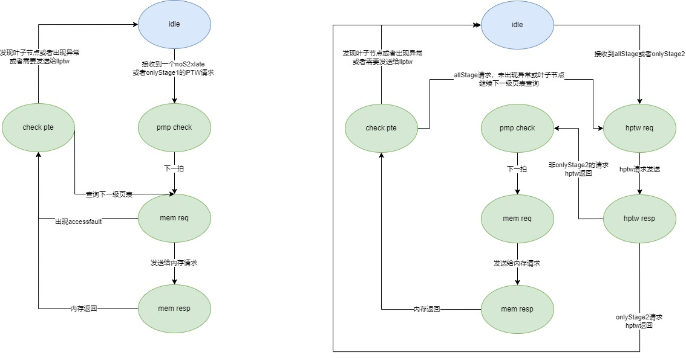

# 三级模块 Page Table Walker

Page Table Walker 指的是如下模块：

* PTW ptw

## 设计规格

1. 支持访问前两级页表
2. 支持向内存发送 PTW 请求
3. 支持向 LLPTW 转发 PTW 请求
4. 支持向 Page Cache 发送 refill 信号
5. 支持异常处理
6. 支持两阶段地址翻译

## 功能

### 访问前两级页表

Page Table Walker 的本质是一个状态机，逐级通过虚拟地址访问页表得到物理地址。Page Table Walker 只能同时处理一个请求，同时最多访问前两级页表，访存能力较弱。Page Table Walker 进行虚实地址转换的行为和手册描述类似，在访问内存之前需要对访问内存的物理地址进行 PMP 检查。如果 PMP 检查出错，则直接返回；否则向内存或 llptw 发送 PTW 请求。添加 H 拓展后，PTW 仍然负责第一阶段前两级页表的翻译，而前两级翻译中计算出的物理地址都需要进行一次第二阶段地址翻译，获得真正的物理地址后才能访存，并且支持了只有第二阶段翻译和只有第一阶段翻译的情况。在内存返回页表项时，同样需要做 PMP 检查。Page Table Walker 会持续进行以上操作，直至以下三种情况出现：

1. 访问到叶子节点（大页），直接返回给 L1 TLB（如果是 allStage 的翻译，在返回之前还要进行一次第二阶段翻译）。
2. 访问到二级页表，返回给 LLPTW，由 LLPTW 进行最后一级页表的访问
3. 访问出现 Page fault 或 Access fault

### 向内存或 llptw 发送 PTW 请求

当 Page Table Walker 访问前两级页表时，需要向内存发送 PTW 请求，当完成前两级页表的访问时，需要向 llptw 发送 PTW 请求。PTW 向内存发送的请求与 LLPTW 向内存发送的请求和 HPTW 向内存发送的请求在发往内存前需要通过仲裁，通过 TileLink 协议的 A 通道与 D 通道的 source 信号标记请求来源于 PTW 或 LLPTW 或 HPTW。

### 向 Page Cache 发送 refill 信号

当 Page Table Walker 向内存发送的 PTW 请求得到回复时，会向 Page Cache 发送 refill 请求。Mem 会将返回的页表项回填入 Page Cache，但 Page Table Walker 需要额外提供页表的虚拟页号、页表等级、页表类型等信息。根据翻译请求是否是两阶段地址翻译的请求，填入 Page Cache 的页表分为 noS2xlate 和 onlyStage1

### 异常处理机制

Page Table Walker 中可能出现 access fault 异常，会交付给 L1 TLB，L1 TLB 根据请求来源交付处理。参见本文档的第 6 部分：异常处理机制。

## 整体框图

Page Table Walker 的本质是一个 s/w 状态机分为请求和应答事件，每个状态用一对请求事件和应答事件表示，在此以常见的状态机的状态转移图以及转移关系来表示，方便理解。关于 Page Table Walker 与其他 L2 TLB 中模块的连接关系，参见 5.3.3 节。

状态机的转移关系图如 [@fig:PTW-states] 所示。

{#fig:PTW-states}

为了清楚表现状态，将不同类型请求分成两种类型状态机分别画出转移图。

对于 noS2xlate 或者 onlyStage1 请求的状态机（上图左边），状态机的各个状态的描述如下：

* idle：Page Table Walker 的初始状态，PTW 接受一个请求后进入 pmp check 状态。
* pmp check：该状态下将访问的物理地址发送给 PMP 模块做 PMP 和 PMA 检查，下一拍进入 mem req，PMP 模块当拍返回检查结果是否出现 access fault。
* mem req：根据检查结果，如果出现 access fault，则直接进入最后检查 check pte 状态（chisel 代码中为 mem_addr_update 信号有效表示 check pte），如果没有出现 access fault，则发送内存访问请求，并且进入 mem resp 状态。
* mem resp：该状态等待 mem 返回，返回后进入 check pte 状态。
* check pte：在该状态中，会检查当前请求，决定下一步的动作：
    1. 没有找到叶子节点也没有出现 access fault，此时的 level 为第一级页表，转移到 mem req 状态
    2. 出现 access fault，直接返回 L1TLB，状态转移 idle
    3. 发现二级页表，且不是叶子节点，则发送给 llptw
    4. 找到了叶子节点（大页），返回给 L1TLB

对于 allStage 和 onlyStage2 的请求：

* idle，接收到这两种类型请求后，会进入 hptw req 状态，直接开始第二阶段的翻译。
* hptw req：向 L2TLB 发送第二阶段翻译的请求，发送完毕后进入 hptw resp 状态。
* hptw resp：等待 hptw 请求返回，hptw 返回后，如果当前是个 onlyStage2 的请求，则直接进入 check pte 状态，否则进入 pmp check 状态。
* pmp check：该状态下将访问的物理地址发送给 PMP 模块做 PMP 和 PMA 检查，下一拍进入 mem req，PMP 模块当拍返回检查结果是否出现 access fault。
* mem req：根据检查结果，如果出现 access fault，则直接进入最后检查 check pte 状态（chisel 代码中为 mem_addr_update 信号有效表示 check pte），如果没有出现 access fault，则发送内存访问请求，并且进入 mem resp 状态。
* mem resp：该状态等待 mem 返回，返回后进入 check pte 状态。
* check pte：如果是非 onlyStage2 请求（也就是 allStage），并且没有找到叶子节点也没有出现 accessfault，则进入 hptw req 请求。如果没找到叶子节点，并且 level 已经是二级页表，则把请求发送给 llptw。如果此时 last s2xlate 信号有效，则表明返回之前还需要进行一次第二阶段的地址翻译（onlyStage2 请求则不需要）。如果此时找到了叶子节点，并且也进行了最后一次地址翻译，则返回给 L1TLB。

需要注意的是，PTW 也处理 stage1 命中的 allStage 请求，该请求进入后，进行一次第二阶段翻译后就直接返回 L1TLB。

## 接口列表

Page Table Walker 的信号列表可以归纳为以下几类：

1.  req：Page Table Walker 只接受 Page Cache 的请求，同时需要满足相应条件，参见 5.3.7 节中对 Page Cache 的介绍。
2.  resp：Page Table Walker 如果访问到大页或者 PMP&PMA 检查报错时，将相应信息返回给 L1 TLB。
3.  llptw：Page Table Walker 如果访问只剩最后一级页表或者 PMP&PMA 检查报错时，将相应信息返回给 L1 TLB。
4.  mem：Page Table Walker 需要访问内存时与内存的交互，涉及到 req 和 resp，Page Table Walker 和内存的握手信号也用来控制 Page Table Walker 状态机的转移关系。
5.  pmp：Page Table Walker 和 PMP 模块的交互，用于 PMP 和 PMA 检查。
6.  refill：Page Table Walker 访问内存得到结果后，需要将内存返回的结果以及相应信息回填入 Page Cache 中。
7.  hptw：Page Table Walker 得到客户机物理地址后，向 L2TLB 发送第二阶段翻译请求。并且 L2TLB 会发送查询结果给 PTW。

具体参见接口列表文档。

## 接口时序

Page Table Walker 通过 valid-ready 方式与 L2 TLB 中的其他模块进行交互，涉及到的信号较为琐碎，且没有特别需要关注的时序关系，因此不再赘述。
