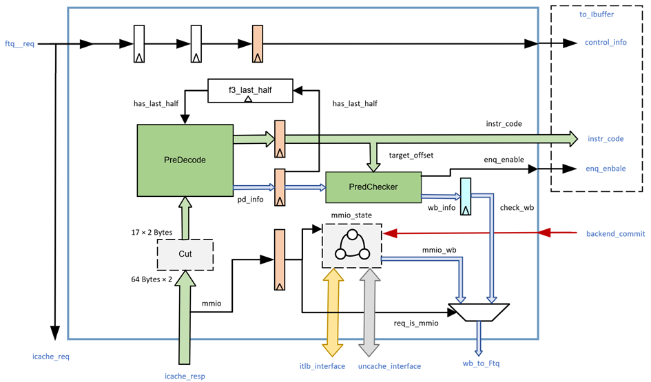
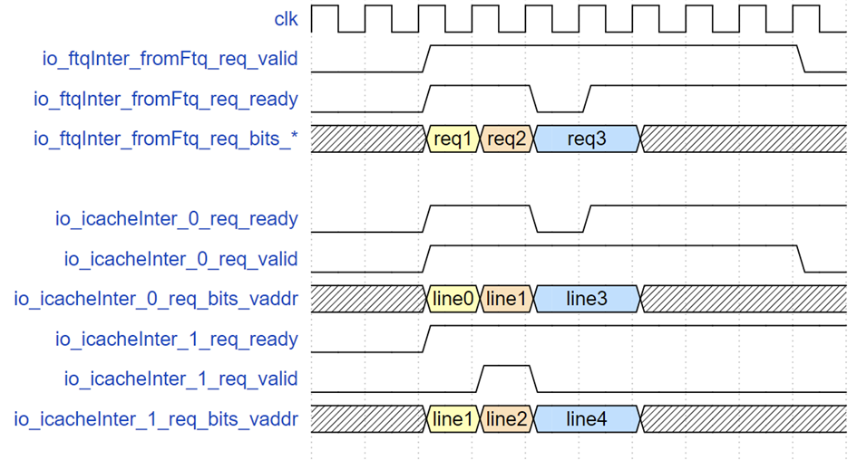
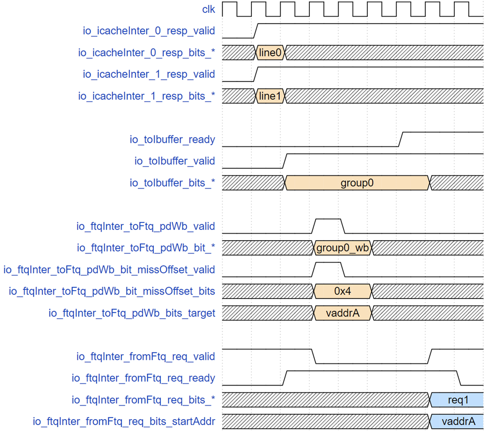
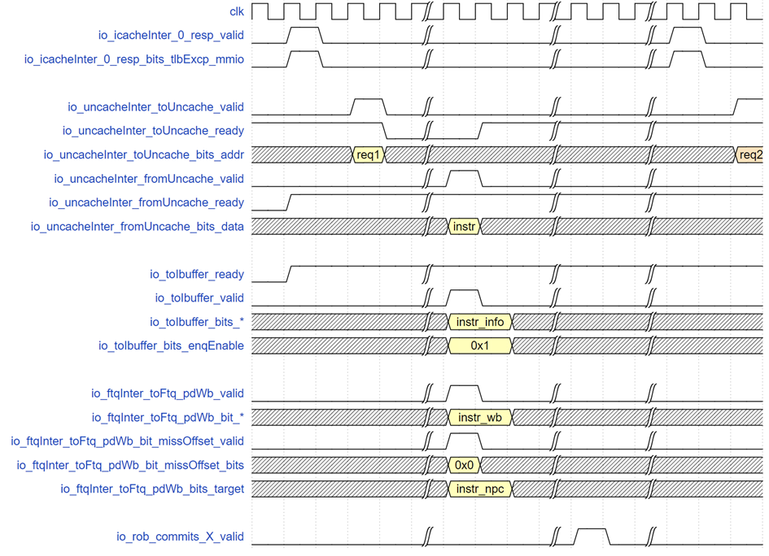

# 昆明湖IFU模块文档

## 术语说明

| 缩写         | 全称                                     | 描述                                    |
| ------------ | ---------------------------------------- | --------------------------------------- |
| CRU          | Clock Reset Unit                         | 时钟复位单元                            |
| RVC          | RISC-V Compressed Instructions           | RISC-V手册"C"扩展规定的16位长度压缩指令 |
| RVI          | RISC-V Integer Instructions              | RISC-V手册规定的32位基本整型指令        |
| IFU          | Instruction Fetch Unit                   | 取指令单元                              |
| FTQ          | Fetch Target Queue                       | 取指目标队列                            |
| PreDecode    | Predecoder Module                        | 预译码器                                |
| PredChecker  | Prediction Check Module                  | 分支预测结果检查器                      |
| ICache       | L1 Instruction Cache                     | 一级指令缓存                            |
| IBuffer      | Instruction Buffer                       | 指令缓冲                                |
| CFI          | Control Flow Instruction                 | 控制流指令                              |
| PC           | Program Counter                          | 程序计数器                              |
| ITLB         | Instruction Translation Lookaside Buffer | 指令地址转译后备缓冲器                  |
| InstrUncache | Instruction Ucache Module                | 指令MMIO处理单元                        |

## 功能描述

### 功能概述

FTQ将预测块请求分别发送到ICache和IFU模块，IFU等到来自ICache返回至多两个缓存行的指令码后，进行切分产生取指令请求范围限定的初始指令码，并送到预译码器进行预译码下一拍根据预译码信息修正有效指令范围，同时进行指令码扩展并将指令码及其他信息发送给IBuffer模块。当ICache查询地址属性发现是MMIO地址空间时，IFU需要将地址发送给MMIO处理单元取指令，这个时候处理器进入多周期顺序执行模式，IFU阻塞流水线直到收到来自ROB的提交信号时，IFU才允许下一个取指令请求的进行，同时IFU需要对跨页的MMIO地址空间32位指令做特殊处理（重发机制）。

### 分特性详细描述

#### 特性1：接受FTQ取指令请求

IFU接收来自FTQ以预测块为单位的取指令请求，包括预测块起始地址、起始地址所在cacheline的下一个cacheline开始地址、下一个预测块的起始地址、该预测块在FTQ里的队列指针、该预测块有无taken的CFI指令和该taken的CFI指令在预测块里的位置以及请求控制信号（请求是否有效和IFU是否ready）。每个预测块最多包含32字节指令码，最多为16条指令。

#### 特性2：双cacheline取指

当且仅当预测块的取指地址在cacheline的后半段时，为了满足一个预测块最多32字节的需要，IFU将从ICache中取回连续的两个cacheline，分别产生例外信息（page fault和access fault），如后述特性3进行切分。

#### 特性3：指令切分产生初始指令码

下一流水级（F1级），计算出预测块内每2字节的PC和其他一些信息，然后进入F2流水级等待ICache返回指令码，在F2级需要检查ICache返回的指令码和本流水级是否匹配（因为IFU的流水级会被冲刷而ICache不会）。然后根据ICache返回的缓存行例外信息产生每条指令的例外信息（page fault 和access fault），同时根据FTQ的taken信息计算一个跳转时指令有效范围jump_range（即此预测块从起始地址到第一条跳转地址的指令范围）和无跳转时指令有效范围ftr_range（即此预测块从起始地址到下一个预测块的起始地址）。为了时序相关的考虑，ICache的两个端口分别会返回miss和hit时候两个来源的缓存行，这个四个缓存行需要产生4种组合（0号端口的两个和1号端口的两个）同时进行预译码。F2会并行对返回的两个4种组合的cacheline数据进行切分：从64×2字节的数据中根据预测块的起始地址选择出17×2字节的初始指令码，并送到4个PreDecode模块进行预译码。

#### 特性4：产生预译码信息

PreDecode模块接受F2切分后的17个2字节初始指令码，一方面将这些初始指令码根据译码表进行预译码得到预译码信息，包括该指令是否是有效指令的开始、是否是RVC指令、是否是CFI指令、CFI指令类型（branch/jal/jalr/call/ret）、CFI指令的目标地址计算偏移等。输出的预译码信息中brType域的编码如下：

表1.2 CFI指令类型编码

| CFI指令类型 | 类型编码（ brType ） |
| ----------- | -------------------- |
| 非CFI指令   | 00                   |
| branch指令  | 01                   |
| jal指令     | 10                   |
| jalr指令    | 11                   |

#### 特性5：生成指令码和指令码扩展

产生预译码信息的同时将初始指令进行4字节组合（从起始地址开始，2字节做地址递增，地址开始的4字节作为一条32位初始指令码）产生每条指令的指令码

在产生指令码和预译码信息的下一拍（F3）将16条指令的指令码分别送到16个指令扩展器进行32位指令扩展（RVC指令根据手册的规定进行扩充，RVI保留指令码不变）。

#### 特性6：分支预测overriding冲刷流水线

当FTQ内未缓存足够预测块时，IFU可能直接使用简单分支预测器提供的预测地址进行取指，这种情况下，当精确预测器发现简单预测器错误时，需要通知IFU取消正在进行的取指请求。具体而言，当BPU的S2流水级发现错误时，需要冲刷IFU的F0流水级；当BPU的S3流水级发现错误时，需要冲刷IFU的F0/F1流水级（BPU的简单预测器在S1给出结果，最晚在S3进行overriding，因此IFU的F2/F3流水级一定是最好的预测，不需要冲刷；类似地，不存在BPU S2到IFU F1的冲刷）。

IFU在收到BPU发送的冲刷请求时，会将F0Ff1流水级上取指请求的指针与BPU发送的冲刷请求的指针进行比较，若冲刷的指针在取指的指针之前，说明当前取指请求在错误的执行路径上，需要进行流水线冲刷；反之，IFU可以忽略BPU发送的这一冲刷请求。

#### 特性7：分支预测错误提前检查

为了减少一些比较容易识别的分支预测错误的冲刷，IFU在F3流水级使用F2产生的预译码信息做前端的分支预测错误检查。预译码信息首先送到PredChecker模块，根据其中的CFI指令类型检查jal类型错误、ret类型错误、无效指令预测错误、非CFI指令预测错误，同时根据指令码计算16个转移目标地址，和预测的目标地址进行比对，检查转移目标地址错误，PredChecker将纠正jal类型错误ret错误的预测结果，并重新产生指令有效范围向量fixedRange（为1表示该条指令在预测块内），fixedRange在jump_range和ftr_range的基础上根据jal和ret的检查结果，把范围缩小到其实地址到没有检测出来的jal或者ret指令。下面是PredChecker模块对分支预测检查的错误类型：

- jal类型错误：预测块的范围内有jal指令，但是预测器没有对这条指令预测跳转；
- ret类型错误：预测块的范围内有ret指令，但是预测器没有对这条指令预测跳转；
- 无效指令预测错误：预测器对一条无效的指令（不在预测块范围/是一条32位指令中间）进行了预测；
- 非CFI指令预测错误：预测器对一条有效但是不是CFI的指令进行了预测；
- 转移目标地址错误：预测器给出的转移目标地址不正确。

#### 特性8：前端重定向

如果F3分支预测的检查结果显示这个预测块有特性7里所述的5种预测错误，那么IFU将在下一拍产生一个前端重定向，将除F3之外的流水级冲刷。FTQ以及预测器的冲刷将由IFU写会FTQ后由FTQ完成。

#### 特性9：将指令码和前端指令信息送到IBuffer

F3流水级最终得到经过扩展的32位指令码，以及16条指令中每条指令的例外信息、预译码信息、FTQ指针、其他后端需要的信息（比如经过折叠的PC）等。IFU除了常规的valid-ready控制信号外，还会给IBuffer两个特殊的信号：一个是16位的io_toIbuffer_bits_valid，标识预测块里有效的指令（为1说明是一条指令的开始，为0则是说明是一条指令的中间）。另一个是16位的io_toIbuffer_bits_enqEnable，这个在io_toIbuffer_bits_valid的基础上与上了被修正过的预测块的指令范围fixedRange。enqEnable为1表示这个2字节指令码是一条指令的开始且在预测块表示的指令范围内。

#### 特性10：指令信息和误预测信息写回FTQ

在F3的下一级WB级，IFU将指令PC、预译码信息、错误预测指令的位置、正确的跳转地址以及预测块的正确指令范围等信息写回FTQ，同时传递该预测块的FTQ指针用以区分不同请求。

#### 特性11：跨预测块32位指令处理

因为预测块的长度有限制，因此存在一条RVI指令前后两字节分别在两个预测块的情况。IFU首先在第一个预测块里检查最后2字节是不是一条RVI指令的开始，如果是并且该预测块没有跳转，那么就设置一个标识寄存器f3_lastHalf_valid，告诉接下来的预测块含有后半条指令。在F2预译码时，会产生两种不同的指令有效向量：

- 预测块起始地址开始即为一条指令的开始，以这种方式根据后续指令是RVC还是RVI产生指令有效向量
- 预测块起始地址是一条RVI指令的中间，以起始地址+2位一条指令的开始产生有效向量

在F3，根据是否有跨预测块RVI标识来决定选用哪种作为最终的指令有效向量，如果f3_lastHalf_valid为高则选择后一种（即这个预测块第一个2字节不是指令的开始）。如前面特性2所述，当且仅当起始地址在后半cacheline，就会向ICache取两个cacheline，因此即使这条跨预测块的RVI指令也跨cacheline，每个预测块都能拿到它的完整指令码。IFU所做的处理只是把这条指令算在第一个预测块里，而把第二个预测块的起始地址位置的2字节通过改变指令有效向量来无效掉。

#### 特性12：MMIO取指令

在处理器上电解复位时，由于内存初始化还未完成，因此处理器需要从flash存储里取指令运行，这种情况下需要IFU向MMIO总线发送宽度为64位的请求从flash地址空间取指令执行。同时IFU禁止对MMIO总线的推测执行，即IFU需要等到每一条指令执行完成得到准确的下一条指令地址之后才继续向总线发送请求。

处理器上电解复位后，从0x10000000地址开始取指令，IFU将这个FTQ请求传递给ICache，经过ITLB地址翻译得到物理地址，物理地址经过PMP查询是否属于MMIO空间。物理地址及其属性在F2和ICache的查询数据一同返回IFU。如果是MMIO地址空间的取指令请求，IFU将请求阻塞在F3。首先，IFU通过mmioCommitRead端口到FTQ查询，IF3预测块之前的指令是否都已提交，如果没有提交则阻塞等待前面的指令都提交完，否则将请求发送到InstrUncache模块，向MMIO总线发送请求，等到返回后根据地址从64位数据中截取指令码。并以每个预测块一条指令的形式（相当于只有起始地址的指令）发送到IBuffer。之后进入等待，直到ROB返回指令已提交的信号，CFI指令由后端发送给FTQ进行冲刷，而顺序指令则由IFU复用前端重定向通路刷新流水线，同时复用FTQ写回机制，把它当作一条错误预测的指令进行冲刷，重定向到该指令地址+2或者+4(根据这条指令是RVI还是RVC选择)。

#### 特性13：MMIO跨带宽指令重发机制

由于MMIO总线的带宽限制为64位，因此如果一条指令一次MMIO请求不能取得完整指令码，就需要增加地址进行重发。增加后的地址需要再次查询ITLB获得物理地址和PMP检查，再发送到InstruUncache模块。等到获得完整指令码之后，处理流程按照特性12所述的过程继续进行。

#### 特性14：Trigger实现对于PC的硬件断点功能

在IFU的FrontendTrigger模块里共4个Trigger，编号为0-3，每个Trigger的配置信息（断点类型、匹配地址等）保存在tdata寄存器中。

当软件向CSR寄存器tselect、tdata1/2写入特定的值时，CSR会向IFU发送tUpdate请求，更新FrontendTrigger内的tdata寄存器中的配置信息。目前前端的Trigger仅可以配置成PC断点（mcontrol(tdata1)寄存器的select位为0；当select=1时，该Trigger将永远不会命中，且不会产生异常）。

在取指时，IFU的F3流水级会向FrontendTrigger模块发起查询并在同一周期得到结果。后者会对取指块内每一条指令在每一个Trigger上做检查，当指令的PC和tdata2寄存器内容的关系满足mcontrol的match位所指示的关系（香山支持match位为0、2、3，对应等于、大于、小于）时，该指令会被标记为Trigger命中，随着执行在后端产生断点异常，进入M-Mode或调试模式。前端的Trigger支持Chain功能。当它们对应的Chain位被置时，只有当该Trigger和编号在它后面一位的Trigger同时命中，且timing配置相同时，处理器才会产生异常。

## 总体设计

### 整体框图

### 接口时序

#### FTQ请求接口时序示例

上图示意了三个FTQ请求的示例，req1只请求缓存行line0，紧接着req2请求line1和line2，当到req3时，由于指令缓存SRAM写优先，此时指令缓存的读请求ready被指低，req3请求的valid和地址保持直到请求被接收。

#### ICache返回接口以及到Ibuffer和写回FTQ接口时序示例

上图展示了指令缓存返回数据到IFU发现误预测直到FTQ发送正确地址的时序，group0对应的请求在f2阶段了两个缓存行line0和line1，下一拍IFU做误预测检查并同时把指令给Ibuffer，但此时后端流水线阻塞导致Ibuffer满，Ibuffer接收端的ready置低，goup0相关信号保持直到请求被Ibuffer接收。但是IFU到FTQ的写回在tio_toIbuffer_valid有效的下一拍就拉高，因为此时请求已经无阻塞地进入wb阶段，这个阶段锁存的了PredChecker的检查结果，报告group0第4（从0开始）个2字节位置对应的指令发生了错误预测，应该重定向到vaddrA，之后经过4拍（冲刷和重新走预测器流水线），FTQ重新发送给IFU以vaddrA为起始地址的预测块。

#### MMIO请求接口时序示例

上图展示了一个MMIO请求req1的取指令时序，首先ICache返回的tlbExcp信息报告了这是一条MMIO空间的指令（其他例外信号必须为低），过两拍IFU向InstrUncache发送请求，一段时间后收到响应和32位指令码，同拍IFU将这条指令作为一个预测块发送到Ibuffer，同时发送对FTQ的写回，复用误预测信号端口，重定向地址为紧接着下一条指令的地址。此时IFU进入等待指令执行完成。一段时间后rob_commits端口报告此条指令执行完成，并且没有后端重定向。则IFU重新发起下一条MMIO指令的取指令请求。
