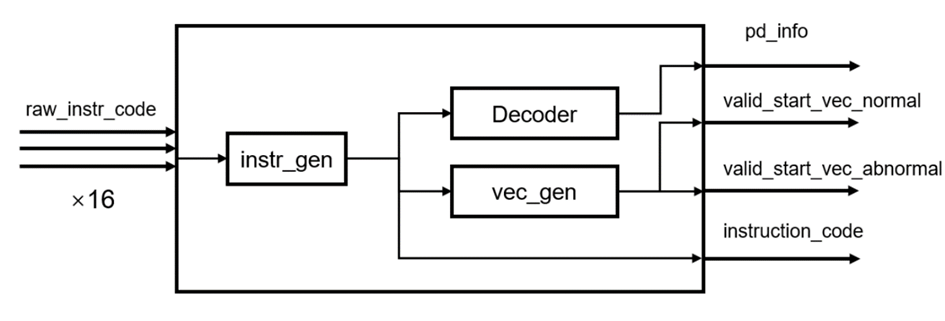
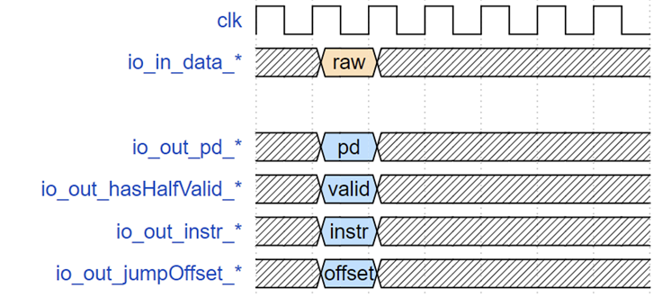
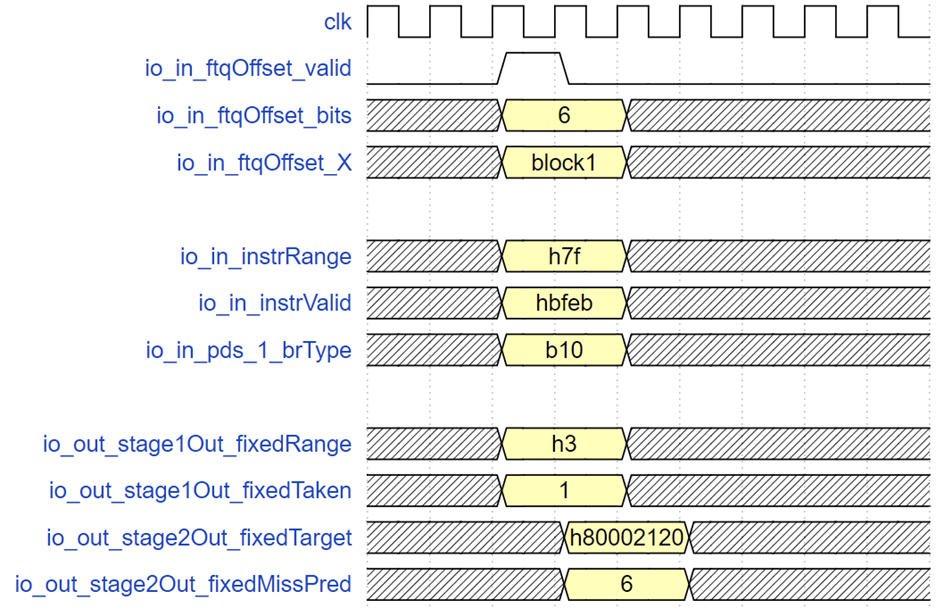

# IFU子模块PreDecoder
## 功能描述
### 功能概述
预译码器PreDeocoder接受初始指令码并进行指令码生成，每个指令码查询预译码表产生预译码信息，预译码信息包括该位置是否是有效指令开始、CFI指令类型、是否是RVC指令、是否是Call指令以及是否是Ret指令。预译码器会产生两种有效指令开始的向量，一种是默认第1个二字节必为有效指令开始，另一种是默认第2个二字节必为有效指令的开始，最终的选择在IFU端做。

### 分特性描述
#### 特性1：指令码生成(instr\_gen)

预译码器产生接受来自IFU完成指令切分的17×2字节的初始指令码，并以4字节为窗口，2字节为步进长度，从第1个2字节开始，直到第16个2字节，选出总共16个4字节的指令码。

#### 特性2：有效指令开始向量生成(vec\_gen)

预译码器在生成初始指令码的同时，生成16bit有效指令开始向量，这个向量每bit标识此位置的指令是一条有效指令的开始。生成逻辑为：

- 正常模式：默认第一个2字节为第一条指令开始。如果第n-1个2字节是有效指令开始且是RVC指令，或者第n-1个2字节不是有效指令开始（肯定是一条4字节指令的结尾2字节），那么第n个2字节即为有效指令开始。
- 非正常模式：默认第一个2字节为一条4字节指令的后半段，第一条有效指令从第二个2字节开始，后续生成逻辑和正常模式一样。

两种模式并行生成，最终由IFU内部是否有跨缓存行的RVI指令进行结果的选择。

#### 特性3：预译码信息生成(decoder)

预译码器根据指令码产生预译码信息，主要包括：是否是RVC指令、是否是CFI指令、CFI指令类型（branch/jal/jalr/call/ret）、CFI指令的目标地址计算偏移。CFI指令类型如表1.2所示。

## 整体框图

## 接口时序

由于PreDecode模块均为组合逻辑，因此输入和输出都在同一个时钟周期内

# IFU子模块PredChecker
## 功能描述
### 功能概述

分支预测检查器PredChecker接收来自IFU的预测块信息（包括预测跳转指令在预测块的位置、预测的跳转目标、预译码得到的指令信息、指令PC以及预译码得到的跳转目标偏移等），在模块内部检查五种类型的分支预测错误。模块内部分为两个流水线stage，分别输出信息，第一个stage输出给f3阶段，用于修正预测块的指令范围和预测结果。第二个stage输出给wb阶段，用于在发现分支预测错误时产生前端重定向以及写回给FTQ正确的预测信息。

### 分特性描述
#### 特性1：Jal指令预测错误检查

jal指令预测错误的条件是，预测块中有一条jal指令（由预译码信息给出），但是要么这个预测块没有预测跳转，要么找个预测块预测跳转的指令在这条jal指令之后（即这条jal指令没有被预测跳转）。

#### 特性2：Ret指令预测错误检查

ret指令预测错误的条件是，预测块中有一条ret指令（由预译码信息给出），但是要么这个预测块没有预测跳转，要么找个预测块预测跳转的指令在这条ret指令之后（即这条ret指令没有被预测跳转）。

#### 特性6：重新生成指令有效范围向量

PredChecker在检查出Jal/Ret指令预测错误时，需要重新生成指令有效范围向量，有效范围截取到Jal/Ret指令的位置，之后的bit全部置为0。需要注意的是，jal和ret指令的错误检查都会导致指令有效范围的缩短，所以需要重新生成指令有效范伟fixedRange，同时修复预测结果（即将原来的预测结果取消，把找个指令块的预测结果根据jal指令的位置重新生成）

#### 特性3：非CFI预测错误检查

非CFI预测错误的条件是被预测跳转的指令根据预译码信息显示不是一条CFI指令。

#### 特性4：无效指令预测错误检查

无效指令预测错误的条件是被预测的指令的位置根据预译码信息中的指令有效向量显示不是一条有效指令的开始。

#### 特性5：目标地址预测错误检查

目标地址预测错误的条件是，被预测的是一条有效的jal或者branch指令，同时预测的跳转目标地址和由指令码计算得到的跳转目标不一致。

#### 特性5：分级输出检查结果

以上PredChecker检查结果会分为两级分别输出，前面已经提到，Jal/Ret指令由于需要重新生成指令有效范围向量和重新指定预测位置，所以需要在错误产生的当拍（F3）直接输出结果到Ibuffer用于及时更正进入后端的指令。而由于时序的考虑，其他错误信息（比如五种错误的错误位置、正确的跳转地址等）则是等到下一拍（WB）阶段才返回给IFU做前端重定向。

#### 整体框图

#### 接口时序

如图，黄色代表同一个预测块在PredChecker里的检查过程，这个预测块的第6个字节位置被预测为跳转，改预测块原本的有效指令范围为h7f（即0000000001111111），指令有效向量为hbfeb（即1011111111101011），但是检查器发现该预测块第1个字节的位置（从0开始计数）是一条jal指令（brType值为b10），所以检查器首先在stage1将有效指令范围修改为h3，预测字节位置为1给F3来进行Ibuffer指令入队选择，同时在WB阶段将目标地址修正为h80002120，同时标记误预测位置为6，通知WB阶段做重定向
